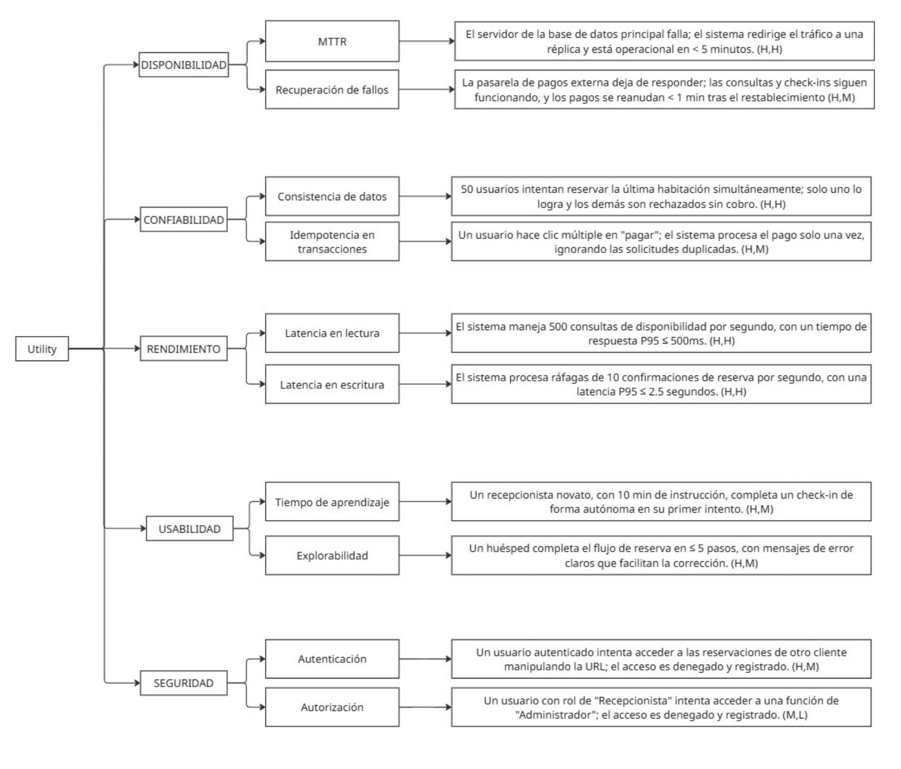

= Impulsores Arquitectónicos (ASRs) y Priorización
:doctype: book
:lang: es
:encoding: utf-8
:toclevels: 3
:sectnums:

== Árbol de Utilidades (Utility Tree)

Este capítulo describe los atributos de calidad prioritarios que guiarán el diseño del sistema, representados visualmente en el árbol de utilidades y detallados en los escenarios de calidad.

=== Árbol de Utilidades Consolidado

=== 3.2 Escenarios de Atributos de Calidad (ASRs)

A continuación, se detallan los escenarios prioritarios que servirán como criterio para evaluar el diseño arquitectónico. Cada escenario se describe utilizando estrictamente el formato de 6 partes definido por Bass, Clements & Kazman, alineando los estímulos y entornos a las tablas canónicas de cada atributo.

==== Confiabilidad (Reliability / Availability)

* *Definición:* Capacidad del sistema para mantener la integridad y continuidad del servicio ante condiciones de fallo o uso incorrecto. Se enfoca en prevenir que las fallas latentes se conviertan en fallos observables.
* *Importancia:* Crítica. La integridad de las transacciones (evitar dobles reservas) es el pilar de la confianza del negocio.

.Escenario CF-01: Gestión de Concurrencia (Integridad de Datos)
[cols="1,3"]
|===
| Parte del Escenario | Descripción

| **Fuente**
| Usuarios externos (vía Web/App).

| **Estímulo**
| Recepción simultánea de solicitudes de escritura conflictivas para el mismo recurso lógico (Misma habitación y fecha) en una ventana de tiempo de milisegundos (Race Condition).

| **Entorno**
| Operación normal bajo carga pico (High Load), donde la probabilidad de colisión es alta.

| **Artefacto**
| Gestor de Base de Datos (DBMS) y Control de Transacciones del sistema.

| **Respuesta**
| El sistema detecta el conflicto, serializa las transacciones mediante bloqueos (Locks) y permite completar solo la primera solicitud válida. Las subsecuentes son rechazadas controladamente.

| **Medida**
| Integridad de Inventario: **100%** (Invariante: Reservas <= Capacidad). Tasa de Dobles Reservas: **0%**.
|===

.Escenario CF-02: Transacción Idempotente (Tolerancia a Fallos de Tiempo)
[cols="1,3"]
|===
| Parte del Escenario | Descripción

| **Fuente**
| Huésped externo.

| **Estímulo**
| Recepción de eventos duplicados (Comisión) debido a reintentos del cliente por latencia de red (ej. 3 clicks en "Pagar").

| **Entorno**
| Operación con red de cliente inestable (pérdida de paquetes o timeouts).

| **Artefacto**
| API de Pagos y Módulo de Reservas.

| **Respuesta**
| El sistema identifica los eventos subsiguientes como duplicados mediante un identificador de idempotencia único. Omite el procesamiento de pago repetido y devuelve el estado de la primera transacción.

| **Medida**
| Exactitud Financiera: **0% de dobles cobros**. El sistema registra exactamente 1 cargo.
|===

==== Disponibilidad (Availability)

* *Definición:* El grado en que un sistema es operacional y accesible cuando se requiere su uso. Se centra en la recuperación ante fallas (Faults).
* *Importancia:* El hotel opera 24/7; el tiempo de inactividad impacta directamente ingresos y operación.

.Escenario DA-01: Recuperación de Falla Crítica (Failover)
[cols="1,3"]
|===
| Parte del Escenario | Descripción

| **Fuente**
| Hardware del Servidor de Base de Datos (Interno).

| **Estímulo**
| El servidor sufre una caída abrupta (Crash/Omission) y deja de responder a las solicitudes.

| **Entorno**
| Operación normal (Modo Producción).

| **Artefacto**
| Cluster de Base de Datos y Monitor de Salud (Health Check).

| **Respuesta**
| El sistema monitor detecta la omisión de respuesta, aísla el nodo fallido y promueve automáticamente una réplica a nodo Maestro (Failover).

| **Medida**
| Tiempo de Recuperación (MTTR): **< 5 minutos** hasta restablecer servicio completo.
|===

==== Rendimiento (Performance)

* *Definición:* El rendimiento relativo a la cantidad de recursos utilizados bajo condiciones determinadas (latencia y throughput).
* *Importancia:* Directamente ligado a la conversión de ventas y satisfacción del usuario (User Experience).

.Escenario RE-01: Latencia en Confirmación (Escritura)
[cols="1,3"]
|===
| Parte del Escenario | Descripción

| **Fuente**
| Usuarios externos.

| **Estímulo**
| Llegada estocástica de una ráfaga de transacciones de reserva (pico de 10 TPS).

| **Entorno**
| Operación en estado estable con carga media-alta (Steady state), recursos de CPU/RAM disponibles.

| **Artefacto**
| Core de Reservas y Pasarela de Pagos.

| **Respuesta**
| El sistema procesa la lógica de negocio, persiste los datos y confirma al usuario dentro de los márgenes de tiempo definidos.

| **Medida**
| Latencia: **P95 <= 2.5 segundos**. Jitter (variabilidad) bajo.
|===

.Escenario RE-02: Latencia en Búsqueda (Lectura)
[cols="1,3"]
|===
| Parte del Escenario | Descripción

| **Fuente**
| Usuarios externos y Agregadores.

| **Estímulo**
| Llegada periódica de alto volumen de consultas de disponibilidad (500 QPS).

| **Entorno**
| Operación normal.

| **Artefacto**
| API Gateway y Caché de Disponibilidad.

| **Respuesta**
| El sistema sirve la información de disponibilidad calculada previamente o cacheada para minimizar cómputo.

| **Medida**
| Latencia: **P95 <= 500 milisegundos**.
|===

==== Usabilidad (Usability)

* *Definición:* La capacidad del producto para ser aprendido y usado eficientemente.
* *Importancia:* Minimizar costos de capacitación ante la alta rotación de personal hotelero.

.Escenario US-01: Facilidad de Aprendizaje (Learnability)
[cols="1,3"]
|===
| Parte del Escenario | Descripción

| **Fuente**
| Recepcionista Novato (Usuario final).

| **Estímulo**
| El usuario intenta completar una tarea crítica y desconocida (Check-in) por primera vez para "aprender haciendo".

| **Entorno**
| Tiempo de ejecución (Runtime), tras haber recibido una instrucción teórica mínima (10 min).

| **Artefacto**
| Interfaz de Usuario (UI) del Módulo de Operaciones.

| **Respuesta**
| El sistema provee affordances claros, validación inmediata y previene errores críticos mediante confirmaciones.

| **Medida**
| Eficacia: Tarea completada exitosamente en el **primer intento**. Eficiencia: Tiempo total **< 2 minutos**.
|===

==== Seguridad (Security)

* *Definición:* Protección de la información contra acceso no autorizado, manteniendo confidencialidad, integridad y disponibilidad.
* *Importancia:* Protección legal de datos personales (PII) y financieros.

.Escenario SE-01: Control de Acceso (Autorización)
[cols="1,3"]
|===
| Parte del Escenario | Descripción

| **Fuente**
| Usuario legítimo identificado (Huésped A).

| **Estímulo**
| Intento de acceso no autorizado a un recurso de datos (Reserva de Huésped B) manipulando identificadores en la petición (IDOR).

| **Entorno**
| Operación Online, sistema accesible desde internet pública.

| **Artefacto**
| Middleware de Autorización y Datos de Reserva.

| **Respuesta**
| El sistema valida que el ID del recurso pertenezca al usuario autenticado. Al fallar la validación, bloquea la solicitud y audita el evento.

| **Medida**
| Resistencia al ataque: **100% bloqueado**. Detectabilidad: Evento registrado en log de seguridad.
|===

== Restricciones y preocupaciones

A continuación se documentan dos tipos de influencias en el diseño que limitan el espacio de soluciones posibles: las *Restricciones* (decisiones inamovibles) y las *Preocupaciones* (objetivos que guían el diseño).

=== Lista de Restricciones

[options="header", cols="1,3,1"]
|===
| ID | Restricción | Origen

| CON-1
| **Persistencia Relacional (RDBMS):** Se debe utilizar una base de datos relacional para el núcleo transaccional (Reservas/Pagos) para garantizar propiedades ACID (Atomicidad, Consistencia, Aislamiento, Durabilidad).
| Técnico

| CON-2
| **Canales Digitales:** La solución se implementará exclusivamente para entorno Web y Aplicación Móvil oficial. No se contemplan clientes de escritorio instalables (Rich Clients).
| Negocio

| CON-3
| **Modelo de Prepago:** El modelo de negocio exige el pago del 100% del costo de la estancia al momento de confirmar la reserva (Transacción Atómica).
| Negocio

| CON-4
| **Política de Overbooking:** El sistema debe permitir vender sistemáticamente un 10% por encima de la capacidad física real por tipo de habitación para mitigar *No-Shows*.
| Negocio

| CON-5
| **Delegación de Pagos (PCI-DSS):** El sistema **NO** procesará ni almacenará datos de tarjetas de crédito. Se integrará obligatoriamente con una Pasarela de Pagos Externa certificada para reducir el alcance de cumplimiento PCI.
| Técnico/Legal
|===

=== Lista de Preocupaciones (Concerns)

[options="header", cols="1,1,3"]
|===
| ID | Preocupación | Descripción del Objetivo

| CRN-1
| **Gestión de Concurrencia**
| (Race Conditions) Garantizar que el inventario se bloquee correctamente cuando múltiples clientes intentan reservar la misma habitación en el mismo milisegundo, evitando la sobreventa no planificada.

| CRN-2
| **Idempotencia Financiera**
| Asegurar que cada operación de cobro sea única. Si una solicitud de pago se recibe múltiples veces (ej. por error de red o reintento del usuario), el sistema debe procesar el cargo una sola vez.

| CRN-3
| **Resiliencia ante Picos**
| El sistema debe manejar aumentos súbitos de tráfico (Flash Crowds) degradando el servicio de forma grácil en lugar de sufrir una caída total (Crash).

| CRN-4
| **Coherencia de Precios**
| Garantía de integridad entre la búsqueda y el pago: el precio mostrado al cliente al seleccionar la habitación debe ser respetado al momento del cobro, incluso si las tarifas cambiaron en ese intervalo.

| CRN-5
| **Observabilidad**
| El sistema no puede ser una "caja negra". Debe generar logs estructurados y métricas en tiempo real para rastrear el ciclo de vida de cada transacción (Auditoría Técnica).

| CRN-6
| **Eficiencia de UI/UX**
| La interfaz de recepción debe ser operada eficientemente por personal novato y ejecutarse fluidamente en equipos de cómputo con recursos de hardware modestos (Slide 14).

| CRN-7
| **Privacidad (PII)**
| Protección estricta de la Información de Identificación Personal (PII) del huésped según regulaciones locales, separando datos sensibles de la lógica operativa general.
|===
