=== 2. Vista de Interacción de Componentes (Diagramas de Comunicación)

Esta sección detalla la fase de **Interacción** del proceso CBSE. El objetivo de estos diagramas de comunicación es validar que las especificaciones de componentes (interfaces, pre/postcondiciones) definidas en la sección anterior son suficientes para satisfacer las colaboraciones requeridas por los Casos de Uso (CU).

Cada diagrama modela el **Flujo Normal** del caso de uso, demostrando cómo las instancias de los componentes (ej. `:CmpGestionReservas`) colaboran para cumplir con los objetivos de negocio y las postcondiciones, asegurando la trazabilidad con los drivers arquitectónicos.

==== 2.1. CU-01: Consultar disponibilidad de habitaciones
image::img/CommunicationDiagrams/CommunicationCU1.png[alt="Diagrama de Comunicación CU-01: Consultar disponibilidad de habitaciones"]

---
==== 2.2. CU-02: Reservar una habitación
image::img/CommunicationDiagrams/CommunicationCU2.png[alt="Diagrama de Comunicación CU-02: Reservar una habitación"]

---
==== 2.3. CU-03: Realizar el pago de la reservación
image::img/CommunicationDiagrams/CommunicationCU3.png[alt="Diagrama de Comunicación CU-03: Realizar el pago de la reservación"]

---
==== 2.4. CU-04: Cancelar una reservación
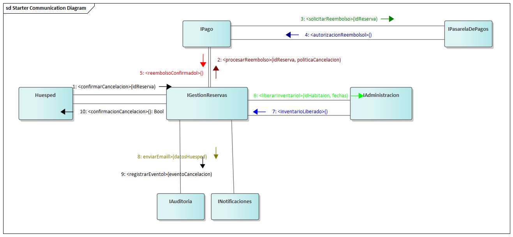

---
==== 2.5. CU-05: Crear cuenta de huésped
image::img/CommunicationDiagrams/CommunicationCU5.jpg[alt="Diagrama de Comunicación CU-05: Crear cuenta de huésped"]

---
==== 2.6. CU-06: Consultar mis reservaciones
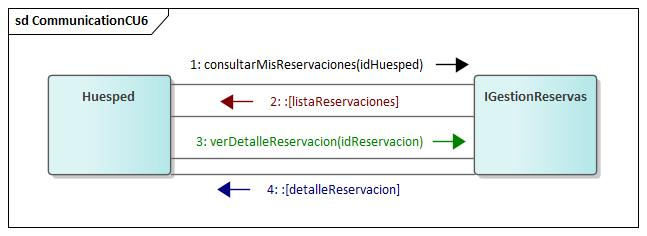

---
==== 2.7. CU-07: Registrar salida (Check-out)
image::img/CommunicationDiagrams/CommunicationCU7.jpg[alt="Diagrama de Comunicación CU-07: Registrar salida (Check-out)"]

---
==== 2.8. CU-08: Registrar llegada (check-in)
image::img/CommunicationDiagrams/CommunicationCU8.jpg[alt="Diagrama de Comunicación CU-08: Registrar llegada (check-in)"]

---
==== 2.9. CU-09: Cambiar de habitación a un huésped
image::img/CommunicationDiagrams/CommunicationCU9.jpg[alt="Diagrama de Comunicación CU-09: Cambiar de habitación a un huésped"]

---
==== 2.10. CU-10: Registrar consumo o servicio
image::img/CommunicationDiagrams/CommunicationCU10.jpg[alt="Diagrama de Comunicación CU-10: Registrar consumo o servicio"]

---
==== 2.11. CU-11: Buscar reserva de huésped
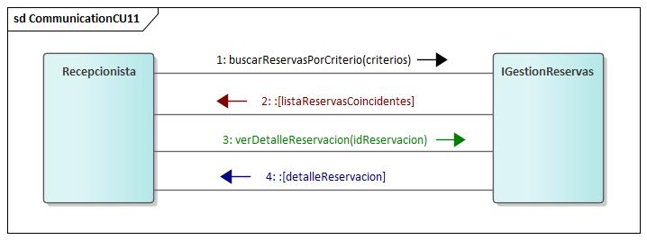

---
==== 2.12. CU-12: Consultar estado de habitación
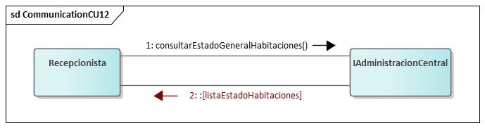

---
==== 2.13. CU-13: Registrar nuevo hotel
image::img/CommunicationDiagrams/CommunicationCU13.jpg[alt="Diagrama de Comunicación CU-13: Registrar nuevo hotel"]

---
==== 2.14. CU-14: Consultar información de hotel
image::img/CommunicationDiagrams/CommunicationCU14.jpg[alt="Diagrama de Comunicación CU-14: Consultar información de hotel"]

---
==== 2.15. CU-15: Actualizar información de hotel
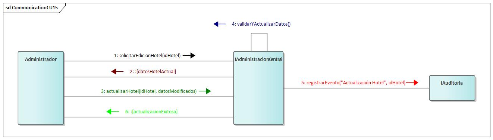

---
==== 2.16. CU-16: Desactivar hotel
image::img/CommunicationDiagrams/CommunicationCU16.jpg[alt="Diagrama de Comunicación CU-16: Desactivar hotel"]

---
==== 2.17. CU-17: Registrar tipo de habitación
image::img/CommunicationDiagrams/CommunicationCU17.jpg[alt="Diagrama de Comunicación CU-17: Registrar tipo de habitación"]

---
==== 2.18. CU-18: Consultar tipos de habitación
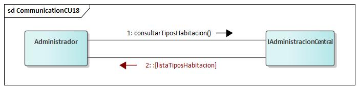

---
==== 2.19. CU-19: Actualizar tipo de habitación
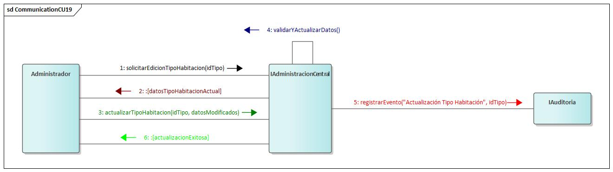

---
==== 2.20. CU-20: Desactivar tipo de habitación
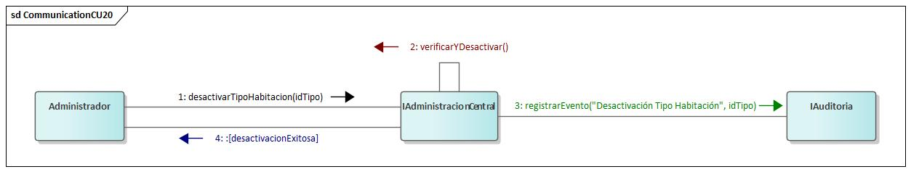

---
==== 2.21. CU-21: Registrar habitación
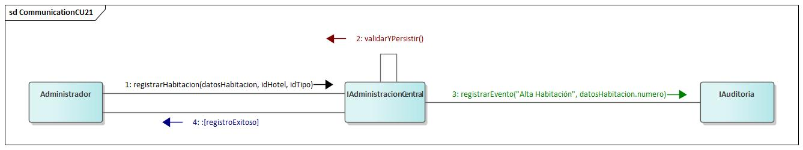

---
==== 2.22. CU-22: Consultar estado de habitación (Admin)
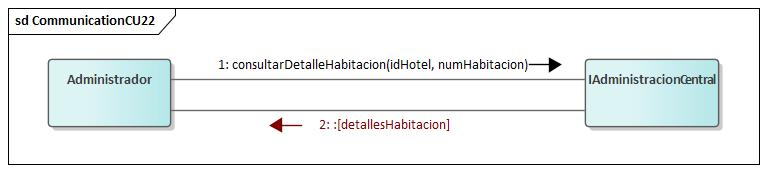

---
==== 2.23. CU-23: Actualizar estado de habitación
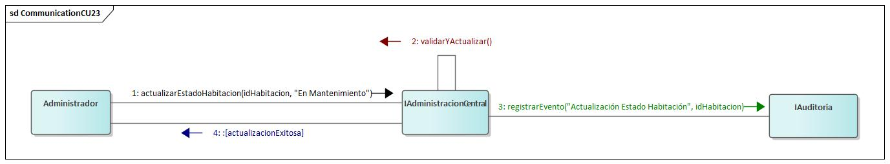

---
==== 2.24. CU-24: Desactivar habitación
image::img/CommunicationDiagrams/CommunicationCU24.jpg[alt="Diagrama de Comunicación CU-24: Desactivar habitación"]

---
==== 2.25. CU-25: Registrar cuenta de personal
image::img/CommunicationDiagrams/CommunicationCU25.jpg[alt="Diagrama de Comunicación CU-25: Registrar cuenta de personal"]

---
==== 2.26. CU-26: Consultar cuentas de personal
image::img/CommunicationDiagrams/CommunicationCU26.jpg[alt="Diagrama de Comunicación CU-26: Consultar cuentas de personal"]

---
==== 2.27. CU-27: Actualizar cuenta de personal
image::img/CommunicationDiagrams/CommunicationCU27.jpg[alt="Diagrama de Comunicación CU-27: Actualizar cuenta de personal"]

---
==== 2.28. CU-28: Dar de baja cuenta personal
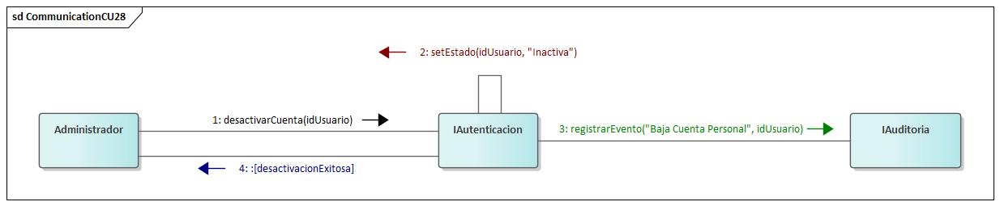

---
==== 2.29. CU-29: Gestionar tarifa base
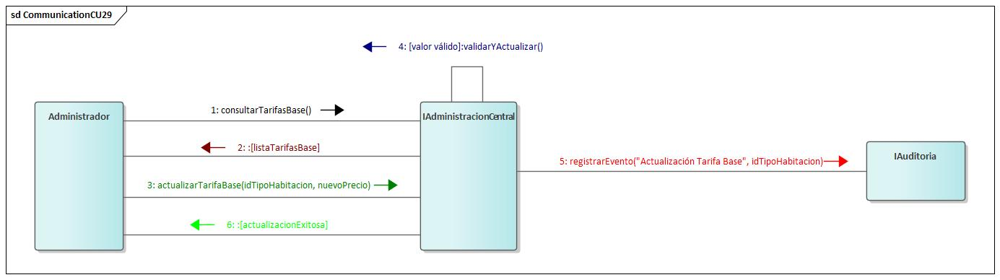

---
==== 2.30. CU-30: Gestionar precio por día
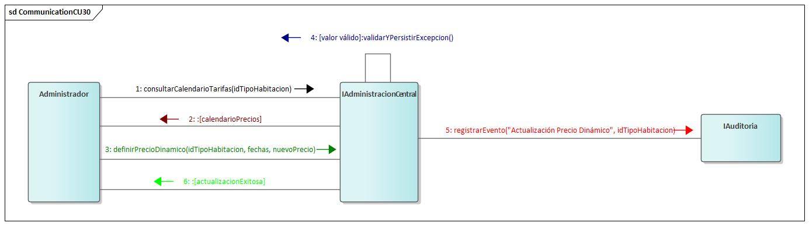

---
==== 2.31. CU-31: Consultar historial de tarifas
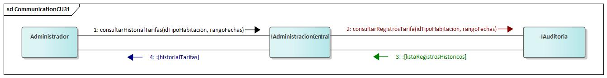

---
==== 2.32. CU-32: Gestionar política de overbooking
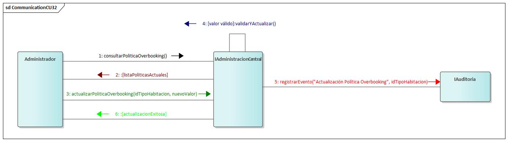

---
==== 2.33. CU-33: Gestionar política de cancelación
image::img/CommunicationDiagrams/CommunicationCU33.jpg[alt="Diagrama de Comunicación CU-33: Gestionar política de cancelación"]

---
==== 2.34. CU-34: Rastrear una transacción
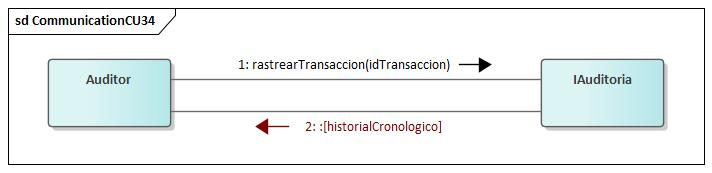
