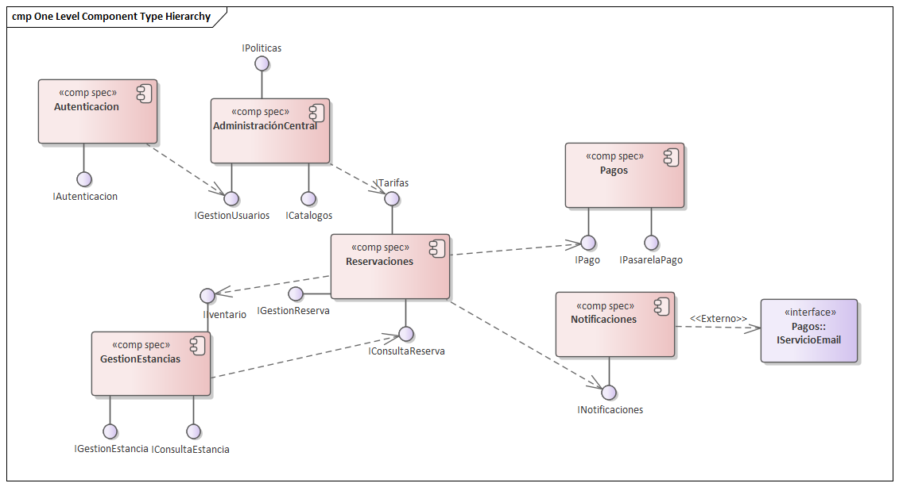
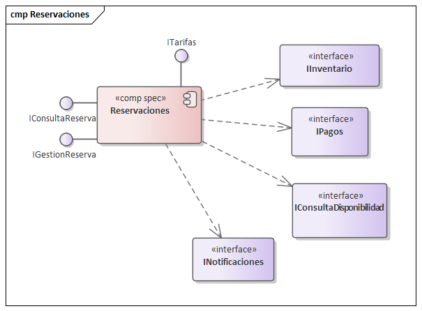
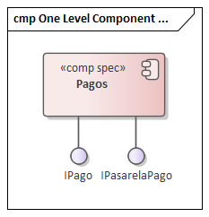

== Vista de Componentes (CBSD)

Esta vista define las especificaciones de los componentes de software (<<comp spec>>) que encapsulan la lógica de negocio del sistema, siguiendo el enfoque de Cheesman & Daniels.

=== 1. Diagrama General de Componentes

El siguiente diagrama muestra el ensamblaje de alto nivel de los componentes principales del sistema y sus dependencias directas.

=== 2. Especificación de Componentes

A continuación, se detalla la especificación (<<comp spec>>) de cada componente, mostrando sus interfaces provistas y requeridas.

==== 2.1. Componente: Reservaciones

* **Descripción:** Es el componente central transaccional, responsable de orquestar la consulta de disponibilidad, creación, confirmación y cancelación de reservas.
* **Justificación (Drivers):**
    * **CU-01, CU-02, CU-04:** Centraliza la lógica de negocio de reservaciones del huésped.
    * **ASR-Confiabilidad:** Debe asegurar la consistencia transaccional (ACID) para evitar dobles reservas.
    * **ASR-Modificabilidad:** Aísla la lógica de reserva de los pagos y el inventario.
* **Diagrama de Especificación:**

---
==== 2.2. Componente: Pagos

* **Descripción:** Encapsula toda la lógica de procesamiento de pagos y reembolsos, abstrayendo la pasarela de pago externa.
* **Justificación (Drivers):**
    * **ASR-Seguridad:** Crítico para el cumplimiento de PCI-DSS.
    * **ASR-Modificabilidad:** Permite cambiar de proveedor de pasarela de pago (ej. Stripe a PayPal) afectando únicamente a este componente.
* **Diagrama de Especificación:**

---
==== 2.3. Componente: GestionEstancias

* **Descripción:** Maneja el ciclo de vida del huésped en el hotel (check-in, check-out) y la gestión del inventario físico.
* **Justificación (Drivers):**
    * **CU-07, CU-08, CU-09:** Satisface los casos de uso principales del Recepcionista.
    * **ASR-Disponibilidad:** Debe estar altamente disponible en el front-desk del hotel.
* **Diagrama de Especificación:**

image::img/ComponentDiagrams/ComponentDiagramGestionEstancias.png[alt="Especificación del Componente GestionEstancias"]

---
==== 2.4. Componente: AdministracionCentral

* **Descripción:** Actúa como el "source of truth" para todos los datos maestros (hoteles, tipos de habitación, catálogos) y políticas de negocio (tarifas, overbooking).
* **Justificación (Drivers):**
    * **ASR-Consistencia:** Asegura que los 5,000 hoteles operen con las mismas tarifas y políticas.
* **Diagrama de Especificación:**

image::img/ComponentDiagrams/ComponentDiagramAdministracionCentral.png[alt="Especificación del Componente AdministracionCentral"]

---
==== 2.5. Componente: Autenticacion

* **Descripción:** Componente transversal dedicado a la identidad, autenticación (login) y autorización (roles) de todos los actores.
* **Justificación (Drivers):**
    * **ASR-Seguridad (SE-01, SE-02):** Centraliza el control de acceso y facilita la auditoría.
* **Diagrama de Especificación:**

image::img/ComponentDiagrams/ComponentDiagramAutenticacion.png[alt="Especificación del Componente Autenticacion"]

---
==== 2.6. Componente: Notificaciones

* **Descripción:** Componente desacoplado para manejar todas las comunicaciones salientes (email, SMS) con los huéspedes.
* **Justificación (Drivers):**
    * **ASR-Modificabilidad:** Permite cambiar de proveedor de email (ej. SendGrid a Mailgun) sin impacto en la lógica de negocio.
    * **ASR-Rendimiento:** Permite el envío asíncrono de notificaciones para no bloquear el flujo principal de reserva.
* **Diagrama de Especificación:**

image::img/ComponentDiagrams/ComponentDiagramNotificaciones.png[alt="Especificación del Componente Notificaciones"]