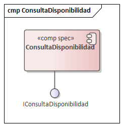
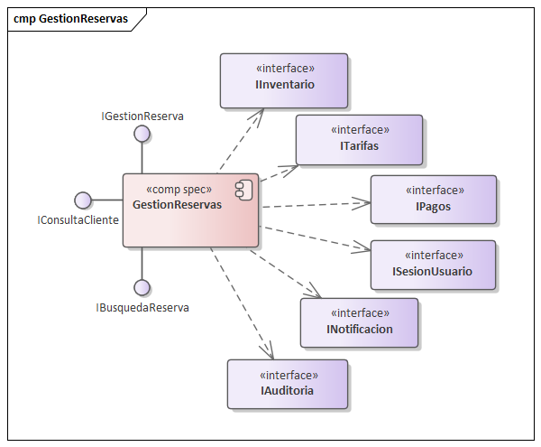
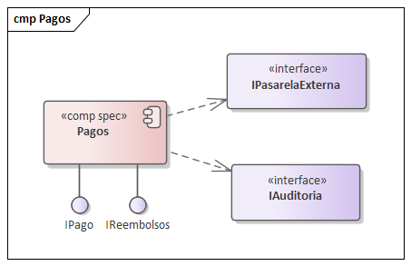
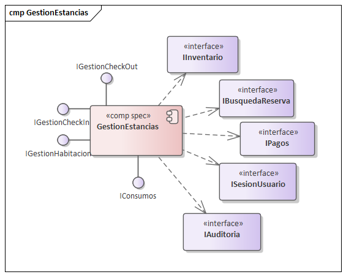
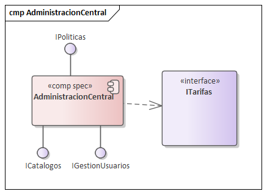
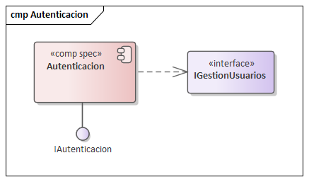
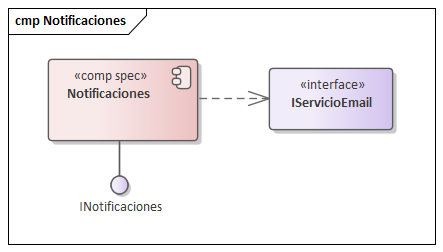
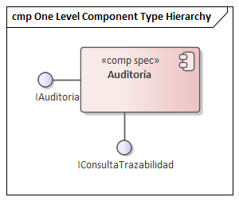

== Vista de Componentes (CBSD)

Esta vista define las especificaciones de los componentes de software (<<comp spec>>) que encapsulan la lógica de negocio del sistema, siguiendo el enfoque de Cheesman & Daniels. Esta iteración de diseño refina la lógica de negocio en componentes más cohesivos para satisfacer los ASRs de rendimiento y confiabilidad.

=== 1. Especificación de Componentes

A continuación, se detalla la especificación (<<comp spec>>) de cada componente, mostrando sus interfaces provistas y requeridas, junto con su justificación arquitectónica.

==== 1.1. Componente: ConsultaDisponibilidad

* **Descripción:** Componente optimizado para lectura, responsable de manejar todas las consultas de alto volumen sobre disponibilidad de habitaciones, tarifas y tipos de habitación.
* **Justificación (Drivers):**
    * **CU-01:** Satisface el caso de uso principal de búsqueda del huésped.
    * **ASR-Rendimiento (PE-01):** Al separar las lecturas masivas de las escrituras transaccionales, podemos optimizar y escalar este componente de forma independiente (ej. con cachés) para garantizar respuestas < 500ms.
    * **ASR-Escalabilidad:** Permite escalar horizontalmente solo el servicio de consultas, que recibirá la mayor carga de tráfico.
* **Diagrama de Especificación:**

---
==== 1.2. Componente: GestionReservas

* **Descripción:** Componente transaccional principal. Es responsable de la lógica de negocio de crear, confirmar (con pago), modificar y cancelar reservaciones.
* **Justificación (Drivers):**
    * **CU-02, CU-04, CU-07:** Maneja los flujos de negocio que modifican el estado de una reserva.
    * **ASR-Confiabilidad (CO-01):** Centraliza la lógica transaccional (ACID) para garantizar la consistencia y evitar dobles reservas o cobros (Objetivo de Negocio).
    * **ASR-Integridad de Datos:** Asegura que una reserva solo se confirme si el pago es exitoso y el inventario está bloqueado.
* **Diagrama de Especificación:**

---
==== 1.3. Componente: Pagos

* **Descripción:** Encapsula toda la lógica de procesamiento de pagos y reembolsos, abstrayendo la pasarela de pago externa.
* **Justificación (Drivers):**
    * **CU-03:** Satisface el caso de uso de pago.
    * **ASR-Seguridad (SE-03):** Crítico para el cumplimiento de PCI-DSS, aislando los datos de tarjetas de crédito del resto del sistema.
    * **ASR-Modificabilidad (MO-02):** Permite cambiar de proveedor de pasarela de pago afectando únicamente a este componente.
* **Diagrama de Especificación:**

---
==== 1.4. Componente: GestionEstancias

* **Descripción:** Maneja el ciclo de vida del huésped en el hotel (check-in, check-out, cambio de habitación) y la gestión del inventario físico.
* **Justificación (Drivers):**
    * **CU-07, CU-08, CU-09:** Satisface los casos de uso principales del Recepcionista.
    * **ASR-Disponibilidad (DA-02):** Debe estar altamente disponible en el front-desk del hotel.
    * **ASR-Usabilidad (US-01):** Las interfaces provistas deben ser simples para soportar un flujo de trabajo rápido del personal.
* **Diagrama de Especificación:**

---
==== 1.5. Componente: AdministracionCentral

* **Descripción:** Actúa como el "source of truth" para todos los datos maestros (hoteles, tipos de habitación, catálogos) y políticas de negocio (tarifas, overbooking).
* **Justificación (Drivers):**
    * **CU-11, CU-14:** Satisface los casos de uso de los Administradores.
    * **ASR-Consistencia:** Asegura que los 5,000 hoteles operen con las mismas tarifas y políticas.
    * **ASR-Mantenibilidad:** Centraliza la gestión de reglas de negocio.
* **Diagrama de Especificación:**

---
==== 1.6. Componente: Autenticacion

* **Descripción:** Componente transversal dedicado a la identidad, autenticación (login) y autorización (roles) de todos los actores del sistema.
* **Justificación (Drivers):**
    * **ASR-Seguridad (SE-01, SE-02):** Centraliza el control de acceso. Satisface los escenarios de "Acceso por Roles" y "Prevención de Acceso no Autorizado".
* **Diagrama de Especificación:**

---
==== 1.7. Componente: Notificaciones

* **Descripción:** Componente desacoplado para manejar todas las comunicaciones salientes (email, SMS) con los huéspedes.
* **Justificación (Drivers):**
    * **ASR-Modificabilidad:** Permite cambiar de proveedor de email (ej. SendGrid a Mailgun) sin impacto en la lógica de `GestionReservas`.
    * **ASR-Rendimiento:** Permite el envío asíncrono de notificaciones para no bloquear el flujo principal de reserva del usuario.
* **Diagrama de Especificación:**

---
==== 1.8. Componente: Auditoria

* **Descripción:** Componente transversal que provee una interfaz para el registro de eventos críticos de negocio y seguridad.
* **Justificación (Drivers):**
    * **ASR-Trazabilidad/Auditabilidad (AU-01):** Es el habilitador táctico para poder rastrear una transacción de reserva de principio a fin.
    * **ASR-Seguridad:** Provee el "rastro de papel" (logs de auditoría) requerido por los escenarios SE-01 y SE-02.
    * **ASR-Confiabilidad:** Permite el análisis post-mortem de fallos transaccionales.
* **Diagrama de Especificación:**

=== 2. Invariantes de Especificación de Componente

Las siguientes invariantes son reglas de consistencia interna que cada componente debe garantizar en todo momento. Complementan los contratos de interfaz (pre/post-condiciones) y son fundamentales para la robustez del sistema y el cumplimiento de ASRs como ASR-Consistencia y ASR-CF-01.

==== 2.1. Componente: ConsultaDisponibilidad

INV-CD-01: (Si se usa caché para ASR-RE-01) La caché de disponibilidad nunca debe tener una fecha de expiración (TTL) mayor al tiempo de actualización del inventario. El estado "leído" (consultado) nunca debe ser más reciente que el estado "escrito" (confirmado).

==== 2.2. Componente: GestionReservas

INV-GR-01: Una Reservacion en estado "Confirmada" DEBE tener exactamente un Pago asociado en estado "Aprobado" (garantiza ASR-Consistencia financiera).

INV-GR-02: Una Reservacion en estado "Confirmada" DEBE tener una entrada de inventario (en IInventario) que descuente la disponibilidad para el idTipoHabitacion y las fechas correspondientes (garantiza ASR-CF-01).

INV-GR-03: Una Reservacion en estado "Cancelada" NO DEBE tener una entrada de inventario que descuente la disponibilidad (el inventario debe estar liberado).

==== 2.3. Componente: Pagos

INV-PA-01: Un idReferencia (usado en IPagos.procesarPago) solo puede estar asociado a un Pago. Esto garantiza la idempotencia y el cumplimiento de ASR-CF-02 (0 dobles cobros).

INV-PA-02: Un Reembolso (creado por IReembolsos) solo puede existir si está asociado a un Pago en estado "Aprobado".

INV-PA-03: La suma de los montos de todos los Reembolso asociados a un Pago no puede ser mayor que el monto original del Pago.

==== 2.4. Componente: GestionEstancias

INV-GE-01: Una Estancia en estado "Activa" DEBE estar asociada a una Reservacion en estado "Confirmada".

INV-GE-02: Una Estancia en estado "Activa" DEBE estar asociada a una Habitacion (en IInventario) cuyo estado sea "Ocupada" (garantiza consistencia entre la estancia y el inventario físico).

INV-GE-03: Una Habitacion (en IInventario) en estado "Ocupada" DEBE estar asociada a una (y solo una) Estancia en estado "Activa".

INV-GE-04: Un Consumo (creado por IConsumos) solo puede asociarse a una Estancia en estado "Activa" (previene cargos a estancias ya finalizadas).

==== 2.5. Componente: AdministracionCentral

INV-AC-01: Una Habitacion (gestionada por IInventario) no puede existir si no está asociada a un TipoHabitacion y a un Hotel válidos (integridad referencial de catálogos).

INV-AC-02: Un PrecioPorDia (gestionado por ITarifas) no puede existir si no está asociado a una TarifaBase válida.

INV-AC-03: Un Hotel (gestionado por ICatalogoHotel) es la raíz de la jerarquía de inventario, tarifas y políticas. No puede eliminarse si tiene habitaciones o políticas activas asociadas.

INV-AC-04: Una cuenta de Personal (gestionada por IGestionPersonal) debe tener exactamente un Rol asignado.

==== 2.6. Componente: Autenticacion

INV-AU-01: Un Huesped y una cuenta de Personal no pueden compartir el mismo email (identificador único de usuario en el sistema).

INV-AU-02: Un TokenSesion (generado por ISesionUsuario.login) debe estar asociado a un (y solo un) usuario activo (sea Huesped o Personal).

==== 2.7. Componente: Notificaciones

INV-NO-01: Un mensaje (Email o SMS) encolado por INotificacion debe intentar enviarse al menos N veces (ej. 3 veces) antes de ser marcado como "Fallido" (garantiza la entrega "at-least-once" o un registro de fallo).

==== 2.8. Componente: Auditoria

INV-AD-01: Un RegistroAuditoria (creado por IAuditoria.registrarEvento) es inmutable. Una vez escrito, no puede ser modificado ni eliminado.