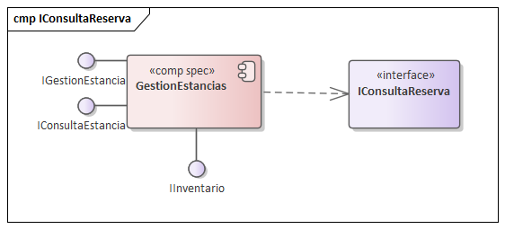

=== Vista de Implementación

==== Diagrama de especificación de componentes (v2 Hito 4)

Esta vista define las especificaciones de los componentes de software (<<comp spec>>) que encapsulan la lógica de negocio del sistema, siguiendo el enfoque de Cheesman & Daniels. Esta iteración de diseño refina la lógica de negocio en componentes más cohesivos para satisfacer los ASRs de rendimiento y confiabilidad.

===== Especificación de Componentes

A continuación, se detalla la especificación (<<comp spec>>) de cada componente, mostrando sus interfaces provistas y requeridas, junto con su justificación arquitectónica.

====== Componente: ConsultaDisponibilidad

* **Descripción:** Componente optimizado para lectura, responsable de manejar todas las consultas de alto volumen sobre disponibilidad de habitaciones, tarifas y tipos de habitación.
* **Justificación (Drivers):**
    * **CU-01:** Satisface el caso de uso principal de búsqueda del huésped.
    * **ASR-Rendimiento (PE-01):** Al separar las lecturas masivas de las escrituras transaccionales, podemos optimizar y escalar este componente de forma independiente (ej. con cachés) para garantizar respuestas < 500ms.
    * **ASR-Escalabilidad:** Permite escalar horizontalmente solo el servicio de consultas, que recibirá la mayor carga de tráfico.
* **Diagrama de Especificación:**

image::img/ComponentDiagrams/ComponentDiagramConsultaDisponibilidad.png[alt="Especificación del Componente ConsultaDisponibilidad"]

---
====== Componente: GestionReservas

* **Descripción:** Componente transaccional principal. Es responsable de la lógica de negocio de crear, confirmar (con pago), modificar y cancelar reservaciones.
* **Justificación (Drivers):**
    * **CU-02, CU-04, CU-07:** Maneja los flujos de negocio que modifican el estado de una reserva.
    * **ASR-Confiabilidad (CO-01):** Centraliza la lógica transaccional (ACID) para garantizar la consistencia y evitar dobles reservas o cobros (Objetivo de Negocio).
    * **ASR-Integridad de Datos:** Asegura que una reserva solo se confirme si el pago es exitoso y el inventario está bloqueado.
* **Diagrama de Especificación:**

image::img/ComponentDiagrams/ComponentDiagramGestionReservas.png[alt="Especificación del Componente GestionReservas"]

---
====== Componente: Pagos

* **Descripción:** Encapsula toda la lógica de procesamiento de pagos y reembolsos, abstrayendo la pasarela de pago externa.
* **Justificación (Drivers):**
    * **CU-03:** Satisface el caso de uso de pago.
    * **ASR-Seguridad (SE-03):** Crítico para el cumplimiento de PCI-DSS, aislando los datos de tarjetas de crédito del resto del sistema.
    * **ASR-Modificabilidad (MO-02):** Permite cambiar de proveedor de pasarela de pago afectando únicamente a este componente.
* **Diagrama de Especificación:**

image::img/ComponentDiagrams/ComponentDiagramPago.png[alt="Especificación del Componente Pagos"]

---
====== Componente: GestionEstancias

* **Descripción:** Maneja el ciclo de vida del huésped en el hotel (check-in, check-out, cambio de habitación) y la gestión del inventario físico.
* **Justificación (Drivers):**
    * **CU-07, CU-08, CU-09:** Satisface los casos de uso principales del Recepcionista.
    * **ASR-Disponibilidad (DA-02):** Debe estar altamente disponible en el front-desk del hotel.
    * **ASR-Usabilidad (US-01):** Las interfaces provistas deben ser simples para soportar un flujo de trabajo rápido del personal.
* **Diagrama de Especificación:**

---
====== Componente: AdministracionCentral

* **Descripción:** Actúa como el "source of truth" para todos los datos maestros (hoteles, tipos de habitación, catálogos) y políticas de negocio (tarifas, overbooking).
* **Justificación (Drivers):**
    * **CU-11, CU-14:** Satisface los casos de uso de los Administradores.
    * **ASR-Consistencia:** Asegura que los 5,000 hoteles operen con las mismas tarifas y políticas.
    * **ASR-Mantenibilidad:** Centraliza la gestión de reglas de negocio.
* **Diagrama de Especificación:**

image::img/ComponentDiagrams/ComponentDiagramAdministracionCentral.png[alt="Especificación del Componente AdministracionCentral"]

---
====== Componente: Autenticacion

* **Descripción:** Componente transversal dedicado a la identidad, autenticación (login) y autorización (roles) de todos los actores del sistema.
* **Justificación (Drivers):**
    * **ASR-Seguridad (SE-01, SE-02):** Centraliza el control de acceso. Satisface los escenarios de "Acceso por Roles" y "Prevención de Acceso no Autorizado".
* **Diagrama de Especificación:**

image::img/ComponentDiagrams/ComponentDiagramAutenticacion.png[alt="Especificación del Componente Autenticacion"]

---
====== Componente: Notificaciones

* **Descripción:** Componente desacoplado para manejar todas las comunicaciones salientes (email, SMS) con los huéspedes.
* **Justificación (Drivers):**
    * **ASR-Modificabilidad:** Permite cambiar de proveedor de email (ej. SendGrid a Mailgun) sin impacto en la lógica de `GestionReservas`.
    * **ASR-Rendimiento:** Permite el envío asíncrono de notificaciones para no bloquear el flujo principal de reserva del usuario.
* **Diagrama de Especificación:**

image::img/ComponentDiagrams/ComponentDiagramNotificaciones.png[alt="Especificación del Componente Notificaciones"]

---
====== Componente: Auditoria

* **Descripción:** Componente transversal que provee una interfaz para el registro de eventos críticos de negocio y seguridad.
* **Justificación (Drivers):**
    * **ASR-Trazabilidad/Auditabilidad (AU-01):** Es el habilitador táctico para poder rastrear una transacción de reserva de principio a fin.
    * **ASR-Seguridad:** Provee el "rastro de papel" (logs de auditoría) requerido por los escenarios SE-01 y SE-02.
    * **ASR-Confiabilidad:** Permite el análisis post-mortem de fallos transaccionales.
* **Diagrama de Especificación:**

image::img/ComponentDiagrams/ComponentDiagramAuditoria.png[alt="Especificación del Componente Auditoria"]

===== Invariantes de Especificación de Componente

Las siguientes invariantes son reglas de consistencia interna que cada componente debe garantizar en todo momento. Complementan los contratos de interfaz (pre/post-condiciones) y son fundamentales para la robustez del sistema y el cumplimiento de ASRs como ASR-Consistencia y ASR-CF-01.

====== Componente: ConsultaDisponibilidad

INV-CD-01: (Si se usa caché para ASR-RE-01) La caché de disponibilidad nunca debe tener una fecha de expiración (TTL) mayor al tiempo de actualización del inventario. El estado "leído" (consultado) nunca debe ser más reciente que el estado "escrito" (confirmado).

====== Componente: GestionReservas

INV-GR-01: Una Reservacion en estado "Confirmada" DEBE tener exactamente un Pago asociado en estado "Aprobado" (garantiza ASR-Consistencia financiera).

INV-GR-02: Una Reservacion en estado "Confirmada" DEBE tener una entrada de inventario (en IInventario) que descuente la disponibilidad para el idTipoHabitacion y las fechas correspondientes (garantiza ASR-CF-01).

INV-GR-03: Una Reservacion en estado "Cancelada" NO DEBE tener una entrada de inventario que descuente la disponibilidad (el inventario debe estar liberado).

====== Componente: Pagos

INV-PA-01: Un idReferencia (usado en IPagos.procesarPago) solo puede estar asociado a un Pago. Esto garantiza la idempotencia y el cumplimiento de ASR-CF-02 (0 dobles cobros).

INV-PA-02: Un Reembolso (creado por IReembolsos) solo puede existir si está asociado a un Pago en estado "Aprobado".

INV-PA-03: La suma de los montos de todos los Reembolso asociados a un Pago no puede ser mayor que el monto original del Pago.

====== Componente: GestionEstancias

INV-GE-01: Una Estancia en estado "Activa" DEBE estar asociada a una Reservacion en estado "Confirmada".

INV-GE-02: Una Estancia en estado "Activa" DEBE estar asociada a una Habitacion (en IInventario) cuyo estado sea "Ocupada" (garantiza consistencia entre la estancia y el inventario físico).

INV-GE-03: Una Habitacion (en IInventario) en estado "Ocupada" DEBE estar asociada a una (y solo una) Estancia en estado "Activa".

INV-GE-04: Un Consumo (creado por IConsumos) solo puede asociarse a una Estancia en estado "Activa" (previene cargos a estancias ya finalizadas).

====== Componente: AdministracionCentral

INV-AC-01: Una Habitacion (gestionada por IInventario) no puede existir si no está asociada a un TipoHabitacion y a un Hotel válidos (integridad referencial de catálogos).

INV-AC-02: Un PrecioPorDia (gestionado por ITarifas) no puede existir si no está asociado a una TarifaBase válida.

INV-AC-03: Un Hotel (gestionado por ICatalogoHotel) es la raíz de la jerarquía de inventario, tarifas y políticas. No puede eliminarse si tiene habitaciones o políticas activas asociadas.

INV-AC-04: Una cuenta de Personal (gestionada por IGestionPersonal) debe tener exactamente un Rol asignado.

====== Componente: Autenticacion

INV-AU-01: Un Huesped y una cuenta de Personal no pueden compartir el mismo email (identificador único de usuario en el sistema).

INV-AU-02: Un TokenSesion (generado por ISesionUsuario.login) debe estar asociado a un (y solo un) usuario activo (sea Huesped o Personal).

====== Componente: Notificaciones

INV-NO-01: Un mensaje (Email o SMS) encolado por INotificacion debe intentar enviarse al menos N veces (ej. 3 veces) antes de ser marcado como "Fallido" (garantiza la entrega "at-least-once" o un registro de fallo).

====== Componente: Auditoria

INV-AD-01: Un RegistroAuditoria (creado por IAuditoria.registrarEvento) es inmutable. Una vez escrito, no puede ser modificado ni eliminado.

==== Diagramas de especificación de interfaces (v2 Hito 4)

A continuación, se formaliza el contrato de especificación de cada interfaz provista por los componentes del sistema, siguiendo la metodología CBSE. Cada cláusula es normativa para la implementación y verificable.

===== Componente: Consulta Disponibilidad

====== Interface: IConsultaDisponibilidad

Esta interfaz, optimizada para ASR-RE-01 (Rendimiento), provee las operaciones para el CU-01.

image::img/interfaceDiagram/IConsultaDisponibilidad.jpg[Diagrama de Interfaz IConsultaDisponibilidad]

.Contrato de Operación: buscarDisponibilidad

Operación: buscarDisponibilidad(filtro: FiltroBusqueda): Lista<ResultadoDisponibilidad>

Pre-condiciones:

PRE-01: filtro no debe ser nulo.

PRE-02: filtro.fechaInicio debe ser cronológicamente anterior a filtro.fechaFin.

PRE-03: filtro.fechaInicio debe ser igual o posterior a la fecha actual del sistema.

Post-condiciones (Éxito):

POST-01: Retorna una Lista<ResultadoDisponibilidad> que coincide con el filtro (la lista puede ser vacía si no hay coincidencias).

POST-02: La latencia de la operación debe cumplir con ASR-RE-01 (500 QPS).

Post-condiciones (Fallo):

POST-ERR-01: Si PRE-01, PRE-02 o PRE-03 fallan, se debe retornar una excepción ArgumentoInvalidoException.

===== Componente: GestionReservas

====== Interface: IGestionReserva

Interfaz transaccional principal para crear (CU-02) y cancelar (CU-04) reservas, optimizada para ASR-CF-01 (Confiabilidad).

image::img/interfaceDiagram/IGestionReserva.jpg[Diagrama de Interfaz IGestionReserva]

.Contrato de Operación: crearReserva

Operación: crearReserva(idHuesped: string, idTipoHabitacion: string, fechas: RangoFechas, datosPago: DatosPago): Reservacion

Pre-condiciones:

PRE-01: El idHuesped debe corresponder a un usuario autenticado (requiere ISesionUsuario.validarToken).

PRE-02: Debe existir disponibilidad de inventario para idTipoHabitacion en fechas (requiere IInventario.verificarDisponibilidad).

PRE-03: Los datosPago deben ser válidos y el monto calculado (requiere ITarifas).

Post-condiciones (Éxito):

POST-01: Se invoca IPagos.procesarPago y este retorna un Pago con estado "Aprobado".

POST-02: Se crea una entidad Reservacion en estado "Confirmada".

POST-03: Se descuenta el inventario para idTipoHabitacion en fechas (garantizando ASR-CF-01 - 0 dobles reservas).

POST-04: Se encola una notificación de confirmación (requiere INotificacion.enviarEmail).

POST-05: Se emite un evento de auditoría "RESERVA_EXITOSA" (ASR-AU-01, requiere IAuditoria.registrarEvento).

POST-06: La operación retorna la entidad Reservacion creada.

Post-condiciones (Fallo):

POST-ERR-01: Si IPagos.procesarPago retorna "Rechazado", la operación debe abortar. No se debe crear la Reservacion y no se debe descontar el inventario. Se emite auditoría "RESERVA_PAGO_FALLIDO". Se retorna PagoRechazadoException.

.Contrato de Operación: cancelarReserva

Operación: cancelarReserva(idReserva: string, idHuesped: string): boolean

Pre-condiciones:

PRE-01: idReserva debe existir y pertenecer a idHuesped (requiere ISesionUsuario).

PRE-02: El estado de la Reservacion debe ser "Confirmada".

PRE-03: La política de cancelación debe permitir la anulación en la fecha actual (requiere IPoliticas de AdministracionCentral).

Post-condiciones (Éxito):

POST-01: El estado de la Reservacion se actualiza a "Cancelada".

POST-02: Se libera el inventario asociado (requiere IInventario.liberarInventario).

POST-03: Si PRE-03 determina que aplica reembolso, se invoca IReembolso.procesarReembolso.

POST-04: Se emite un evento de auditoría "RESERVA_CANCELADA".

POST-05: Retorna true.

Post-condiciones (Fallo):

POST-ERR-01: Si PRE-03 falla (política no lo permite), la operación retorna false. El estado de la Reservacion NO debe cambiar.

====== Interface: IConsultaCliente

Permite a un huésped consultar sus propias reservas (CU-06).

image::img/interfaceDiagram/IConsultaCliente.jpg[Diagrama de Interfaz IConsultaCliente]

.Contrato de Operación: obtenerMisReservas

Operación: obtenerMisReservas(idHuesped: string): Lista<Reservacion>

Pre-condiciones:

PRE-01: idHuesped debe corresponder al usuario autenticado en la sesión (requiere ISesionUsuario.validarToken).

Post-condiciones (Éxito):

POST-01: Retorna la lista (posiblemente vacía) de reservaciones (activas y pasadas) asociadas a ese Huesped.

Post-condiciones (Fallo):

POST-ERR-01: Si PRE-01 falla, se retorna AccesoDenegadoException (ASR-SE-01).

====== Interface: IBusquedaReserva

Permite al personal (Recepcionista) buscar reservas (CU-11).

image::img/interfaceDiagram/IBusquedaReserva.jpg[Diagrama de Interfaz IBusquedaReserva]

.Contrato de Operación: buscarReservaPorId

Operación: buscarReservaPorId(idReserva: string, idPersonal: string): Reservacion

Pre-condiciones:

PRE-01: El idPersonal (Recepcionista) debe estar autenticado y autorizado (requiere IAutorizacion).

Post-condiciones (Éxito):

POST-01: Retorna la Reservacion si se encuentra, o null si no existe.

Post-condiciones (Fallo):

POST-ERR-01: Si PRE-01 falla, se retorna AccesoDenegadoException (ASR-SE-02).

.Contrato de Operación: buscarReservaPorHuesped

Operación: buscarReservaPorHuesped(email: string, idPersonal: string): Lista<Reservacion>

Pre-condiciones:

PRE-01: El idPersonal (Recepcionista) debe estar autenticado y autorizado (requiere IAutorizacion).

Post-condiciones (Éxito):

POST-01: Retorna una lista (posiblemente vacía) de Reservacion asociadas al email del Huesped.

Post-condiciones (Fallo):

POST-ERR-01: Si PRE-01 falla, se retorna AccesoDenegadoException (ASR-SE-02).

===== Componente: Pagos

====== Interface: IPagos

Encapsula el procesamiento de cobros (CU-03, CU-08, CU-10), garantizando ASR-CF-02 (0 dobles cobros).

image::img/interfaceDiagram/IPagos.jpg[Diagrama de Interfaz IPagos]

.Contrato de Operación: procesarPago

Operación: procesarPago(monto: Dinero, idReferencia: string, datosPago: DatosPago): Pago

Pre-condiciones:

PRE-01: monto debe ser positivo.

PRE-02: idReferencia debe ser único (garantía de idempotencia para ASR-CF-02).

Post-condiciones (Éxito):

POST-01: Se conecta a IPasarelaExterna y esta aprueba la transacción.

POST-02: Retorna un objeto Pago con estado "Aprobado" y un idTransaccionPasarela.

POST-03: Se emite un evento de auditoría "PAGO_APROBADO" (requiere IAuditoria).

Post-condiciones (Fallo):

POST-ERR-01: Si la IPasarelaExterna rechaza el pago, retorna Pago con estado "Rechazado". Se emite auditoría "PAGO_RECHAZADO".

POST-ERR-02: Si PRE-02 falla (intento de doble cobro), retorna el Pago original si existe, sin re-procesar.

POST-ERR-03: Si la conexión con IPasarelaExterna falla (contingencia ASR-DA-02), retorna Pago con estado "Indeterminado" y se encola para revisión.

====== Interface: IReembolso

Procesa devoluciones de dinero (CU-04).

image::img/interfaceDiagram/IReembolso.jpg[Diagrama de Interfaz IReembolso]

.Contrato de Operación: procesarReembolso

Operación: procesarReembolso(idTransaccionOriginal: string, monto: Dinero): Reembolso

Pre-condiciones:

PRE-01: idTransaccionOriginal debe existir y corresponder a un Pago "Aprobado".

PRE-02: monto es positivo y menor o igual al monto original del Pago.

Post-condiciones (Éxito):

POST-01: Se conecta a IPasarelaExterna y esta aprueba la devolución.

POST-02: Retorna un objeto Reembolso con estado "Procesado".

POST-03: Se emite un evento de auditoría "REEMBOLSO_EXITOSO" (requiere IAuditoria).

Post-condiciones (Fallo):

POST-ERR-01: Si la pasarela rechaza la devolución, retorna Reembolso con estado "Fallido". Se emite auditoría "REEMBOLSO_FALLIDO".

===== Componente: GestionEstancias

====== Interface: IGestionCheckIn

Maneja el registro de entrada del huésped (CU-07).

image::img/interfaceDiagram/IGestionCheckIn.jpg[Diagrama de Interfaz IGestionCheckIn]

.Contrato de Operación: realizarCheckIn

Operación: realizarCheckIn(idReserva: string, idRecepcionista: string): Estancia

Pre-condiciones:

PRE-01: idRecepcionista debe estar autenticado y autorizado (requiere IAutorizacion).

PRE-02: idReserva debe existir, estar en estado "Confirmada" (requiere IBusquedaReserva).

PRE-03: La fecha de inicio de la reserva debe ser la fecha actual del sistema.

Post-condiciones (Éxito):

POST-01: Se crea una entidad Estancia en estado "Activa", asociada a la Reservacion.

POST-02: El estado de la Habitacion asignada se actualiza a "Ocupada" (requiere IInventario.actualizarEstadoHabitacion).

POST-03: Se emite un evento de auditoría "CHECKIN_EXITOSO" (requiere IAuditoria).

POST-04: Retorna la Estancia creada.

Post-condiciones (Fallo):

POST-ERR-01: Si PRE-02 o PRE-03 fallan, retorna CheckInInvalidoException. No se debe crear la Estancia.

====== Interface: IGestionCheckOut

Maneja el registro de salida del huésped (CU-08).

image::img/interfaceDiagram/IGestionCheckOut.jpg[Diagrama de Interfaz IGestionCheckOut]

.Contrato de Operación: realizarCheckOut

Operación: realizarCheckOut(idEstancia: string, idRecepcionista: string): Factura

Pre-condiciones:

PRE-01: idRecepcionista debe estar autenticado y autorizado (requiere IAutorizacion).

PRE-02: idEstancia debe existir y estar en estado "Activa".

PRE-03: La cuenta de la estancia (todos los Consumos) debe estar saldada (requiere IPagos).

Post-condiciones (Éxito):

POST-01: El estado de la Estancia se actualiza a "Finalizada".

POST-02: El estado de la Habitacion asociada se actualiza a "Limpieza" (requiere IInventario).

POST-03: Se genera una Factura final.

POST-04: Se emite un evento de auditoría "CHECKOUT_EXITOSO".

POST-05: Retorna la Factura generada.

Post-condiciones (Fallo):

POST-ERR-01: Si PRE-03 falla (cuenta no saldada), retorna CuentaPendienteException. El estado de la Estancia NO debe cambiar.

====== Interface: IGestionHabitacion

Maneja el cambio de habitación (CU-09) y la consulta de estados (CU-12).

image::img/interfaceDiagram/IGestionHabitacion.jpg[Diagrama de Interfaz IGestionHabitacion]

.Contrato de Operación: cambiarHabitacion

Operación: cambiarHabitacion(idEstancia: string, idHabitacionNueva: string, idRecepcionista: string): boolean

Pre-condiciones:

PRE-01: idRecepcionista debe estar autenticado y autorizado (requiere IAutorizacion).

PRE-02: idEstancia debe estar "Activa".

PRE-03: idHabitacionNueva debe ser válida y estar "Disponible" (requiere IInventario.consultarEstado).

Post-condiciones (Éxito):

POST-01: La Estancia se desasocia de la habitación antigua y se asocia a idHabitacionNueva.

POST-02: El estado de la habitación antigua pasa a "Limpieza" (requiere IInventario).

POST-03: El estado de idHabitacionNueva pasa a "Ocupada" (requiere IInventario).

POST-04: Se emite un evento de auditoría "CAMBIO_HABITACION".

POST-05: Retorna true.

Post-condiciones (Fallo):

POST-ERR-01: Si PRE-03 falla, retorna HabitacionNoDisponibleException.

.Contrato de Operación: consultarEstadoHabitaciones

Operación: consultarEstadoHabitaciones(idHotel: string, idRecepcionista: string): Lista<EstadoHabitacion>

Pre-condiciones:

PRE-01: idRecepcionista debe estar autenticado y autorizado (requiere IAutorizacion).

PRE-02: idHotel debe ser válido.

Post-condiciones (Éxito):

POST-01: Retorna la lista de estados de todas las habitaciones del hotel (optimizada para ASR-US-01).

====== Interface: IConsumos

Registra cargos adicionales a la estancia (CU-10).

image::img/interfaceDiagram/IConsumos.jpg[Diagrama de Interfaz IConsumos]

.Contrato de Operación: registrarConsumo

Operación: registrarConsumo(idEstancia: string, monto: Dinero, descripcion: string): Consumo

Pre-condiciones:

PRE-01: idEstancia debe estar "Activa".

PRE-02: monto debe ser positivo.

Post-condiciones (Éxito):

POST-01: Se crea un nuevo Consumo asociado a la Estancia.

POST-02: Se emite un evento de auditoría "CONSUMO_REGISTRADO".

POST-03: Retorna el Consumo creado.

Post-condiciones (Fallo):

POST-ERR-01: Si PRE-01 falla (estancia no activa), retorna EstanciaInactivaException.

===== Componente: AdministracionCentral

(Interfaces: IInventario, ITarifas, IPoliticas, ICatalogoHotel, IGestionPersonal)

image::img/interfaceDiagram/IInventario.jpg[Diagrama de Interfaz IInventario] image::img/interfaceDiagram/ITarifas.jpg[Diagrama de Interfaz ITarifas] image::img/interfaceDiagram/IPoliticas.jpg[Diagrama de Interfaz IPoliticas] image::img/interfaceDiagram/ICatalogoHotel.jpg[Diagrama de Interfaz ICatalogoHotel] image::img/interfaceDiagram/IGestionPersonal.jpg[Diagrama de Interfaz IGestionPersonal]

.Contrato Genérico para Operaciones CRUD (gestionar...)

Propósito: Satisfacer CUs 13-33. Garantizar ASR-Consistencia de datos maestros.

Pre-condiciones:

PRE-01: El usuario debe estar autenticado y tener el rol "Administrador" (requiere IAutorizacion.verificarPermiso('ROL_ADMIN')).

PRE-02: Los datos de entrada (DTO) deben ser válidos según las reglas de negocio (ej. monto positivo, fechas coherentes, ASR-Consistencia).

Post-condiciones (Éxito):

POST-01: La entidad (Hotel, Tarifa, Política, etc.) es creada, actualizada o eliminada en la "fuente de verdad".

POST-02: Se emite un evento de auditoría "ADMIN_GESTION_EXITOSA" (requiere IAuditoria).

Post-condiciones (Fallo):

POST-ERR-01: Si PRE-01 falla, se debe retornar AccesoDenegadoException (ASR-SE-02).

POST-ERR-02: Si PRE-02 falla (datos inválidos), se debe retornar ValidacionException.

===== Componente: Autenticacion

====== Interface: ISesionUsuario

Gestiona login, registro (CU-05, CU-25) y validación de tokens.

image::img/interfaceDiagram/ISesionUsuario.jpg[Diagrama de Interfaz ISesionUsuario]

.Contrato de Operación: login

Operación: login(credenciales: Credenciales): TokenSesion

Pre-condiciones:

PRE-01: Las credenciales no son nulas.

Post-condiciones (Éxito):

POST-01: Si las credenciales son válidas (requiere IGestionPersonal o consulta de Huésped), retorna un TokenSesion.

Post-condiciones (Fallo):

POST-ERR-01: Si son inválidas, retorna LoginFallidoException y se emite un evento de auditoría "LOGIN_FALLIDO" (requiere IAuditoria).

.Contrato de Operación: registrarHuesped

Operación: registrarHuesped(datos: Huesped): Huesped (CU-05)

Pre-condiciones:

PRE-01: El email en datos no debe existir previamente en el sistema.

Post-condiciones (Éxito):

POST-01: Se crea un nuevo Huesped en el sistema.

POST-02: Se emite un evento de auditoría "HUESPED_REGISTRADO".

POST-03: Retorna el Huesped creado.

Post-condiciones (Fallo):

POST-ERR-01: Si PRE-01 falla, retorna EmailDuplicadoException.

.Contrato de Operación: validarToken

Operación: validarToken(token: string): InfoUsuario

Pre-condiciones:

PRE-01: token no es nulo.

Post-condiciones (Éxito):

POST-01: Si el token es válido y no ha expirado, retorna la InfoUsuario (ID, Rol) asociada.

Post-condiciones (Fallo):

POST-ERR-01: Si el token es inválido o expirado, retorna TokenInvalidoException.

====== Interface: IAutorizacion

Verifica roles y permisos (ASR-SE-01, ASR-SE-02).

image::img/interfaceDiagram/IAutorizacion.jpg[Diagrama de Interfaz IAutorizacion]

.Contrato de Operación: verificarPermiso

Operación: verificarPermiso(infoUsuario: InfoUsuario, permisoRequerido: string): boolean

Pre-condiciones:

PRE-01: infoUsuario es válida (obtenida de ISesionUsuario.validarToken).

Post-condiciones:

POST-01: Retorna true si el rol en infoUsuario tiene el permisoRequerido.

POST-02: Retorna false si no tiene permiso.

POST-03: Si retorna false, se emite un evento de auditoría "ACCESO_DENEGADO_ROL" (ASR-SE-01, requiere IAuditoria).

===== Componente: Notificaciones

====== Interface: INotificacion

Abstracción para envío asíncrono de comunicaciones (optimizado para no bloquear al cliente).

image::img/interfaceDiagram/INotificacion.jpg[Diagrama de Interfaz INotificacion]

.Contrato de Operación: enviarEmail / enviarSMS

Operación: enviarEmail(email: Email): boolean / enviarSMS(sms: SMS): boolean

Pre-condiciones:

PRE-01: Los datos del email o sms están completos (destino, contenido).

Post-condiciones (Éxito):

POST-01: El mensaje se encola exitosamente para envío asíncrono (la operación no bloquea).

POST-02: La lógica de envío real se delega a IServicioEmailExterno o IServicioSmsExterno.

POST-03: Retorna true (significa "encolado", no "entregado").

Post-condiciones (Fallo):

POST-ERR-01: Si la cola de mensajería está caída, retorna false (o lanza ColaCaidaException).

===== Componente: Auditoria

====== Interface: IAuditoria

Recibe eventos de log de alta prioridad (ASR-AU-01).

image::img/interfaceDiagram/IAuditoria.jpg[Diagrama de Interfaz IAuditoria]

.Contrato de Operación: registrarEvento

Operación: registrarEvento(evento: RegistroAuditoria): void

Pre-condiciones:

PRE-01: evento no es nulo y contiene la información requerida (timestamp, actor, acción, idTrazabilidad).

Post-condiciones (Éxito):

POST-01: El evento se almacena de forma persistente y segura en el "sumidero" de auditoría.

POST-02: La operación es "fire-and-forget" y no debe lanzar excepciones al componente que la llama (debe manejar sus propios fallos internamente).

====== Interface: IConsultaTrazabilidad

Permite al actor Auditor rastrear transacciones (CU-34).

image::img/interfaceDiagram/IConsultaTrazabilidad.jpg[Diagrama de Interfaz IConsultaTrazabilidad]

.Contrato de Operación: rastrearTransaccion

Operación: rastrearTransaccion(idTrazabilidad: string, idAuditor: string): Lista<RegistroAuditoria>

Pre-condiciones:

PRE-01: El idAuditor debe estar autenticado y tener el rol "Auditor" (requiere IAutorizacion.verificarPermiso).

PRE-02: idTrazabilidad debe ser válido.

Post-condiciones (Éxito):

POST-01: Retorna una lista ordenada cronológicamente de todos los RegistroAuditoria que comparten el mismo idTrazabilidad.

Post-condiciones (Fallo):

POST-ERR-01: Si PRE-01 falla, retorna AccesoDenegadoException (ASR-SE-02).

==== Interacción de Componentes (Diagramas de Comunicación)

Esta sección detalla la fase de **Interacción** del proceso CBSE. El objetivo de estos diagramas de comunicación es validar que las especificaciones de componentes (interfaces, pre/postcondiciones) definidas en la sección anterior son suficientes para satisfacer las colaboraciones requeridas por los Casos de Uso (CU).

===== CU-01: Consultar disponibilidad de habitaciones

====== Consultar Disponibilidad
image::img/CommunicationDiagrams/CU-01/ConsultarDisponibilidad.png[alt="Diagrama de Comunicación: Consultar Disponibilidad"]

---

===== CU-02: Reservar una habitación

====== Validar Datos Huesped
image::img/CommunicationDiagrams/CU-02/ValidarDatosHuesped.png[alt="Diagrama de Comunicación: Validar Datos Huesped"]

---
====== Congelar Precio
image::img/CommunicationDiagrams/CU-02/CongelarPrecio.png[alt="Diagrama de Comunicación: Congelar Precio"]

---
====== Bloquear Habitacion
image::img/CommunicationDiagrams/CU-02/BloquearHabitacion.png[alt="Diagrama de Comunicación: Bloquear Habitacion"]

---

===== CU-03: Realizar el pago de la reservación

====== Solicitar Cobro
image::img/CommunicationDiagrams/CU-03/SolicitarCobro.png[alt="Diagrama de Comunicación: Solicitar Cobro"]

---
====== Proteger Datos
image::img/CommunicationDiagrams/CU-03/ProtegerDatos.png[alt="Diagrama de Comunicación: Proteger Datos"]

---
====== Finalizar Pago
image::img/CommunicationDiagrams/CU-03/FinalizarPago.png[alt="Diagrama de Comunicación: Finalizar Pago"]

---

===== CU-04: Cancelar una reservación

====== Solicitar Cancelacion
image::img/CommunicationDiagrams/CU-04/SolicitarCancelacion.png[alt="Diagrama de Comunicación: Solicitar Cancelacion"]

---
====== Procesar Reembolso
image::img/CommunicationDiagrams/CU-04/ProcesarReembolso.png[alt="Diagrama de Comunicación: Procesar Reembolso"]

---
====== Cancelar Habitaciones
image::img/CommunicationDiagrams/CU-04/CancelarHabitaciones.png[alt="Diagrama de Comunicación: Cancelar Habitaciones"]

---

===== CU-05: Crear cuenta de huésped

====== Validar Huesped
image::img/CommunicationDiagrams/CU-05/ValidarHuesped.png[alt="Diagrama de Comunicación: Validar Huesped"]

---
====== Crear Cuenta Huesped
image::img/CommunicationDiagrams/CU-05/CrearCuentaHuesped.png[alt="Diagrama de Comunicación: Crear Cuenta Huesped"]

---

===== CU-06: Consultar mis reservaciones

====== Consultar Reservas
image::img/CommunicationDiagrams/CU-06/ConsultarReservas.png[alt="Diagrama de Comunicación: Consultar Reservas"]

---

===== CU-07: Registrar salida (Check-out)

====== Calcular Consumos
image::img/CommunicationDiagrams/CU-07/CalcularConsumos.png[alt="Diagrama de Comunicación: Calcular Consumos"]

---
====== Finalizar Estancia
image::img/CommunicationDiagrams/CU-07/FinalizarEstancia.png[alt="Diagrama de Comunicación: Finalizar Estancia"]

---

===== CU-08: Registrar llegada (check-in)

====== Validar Llegada
image::img/CommunicationDiagrams/CU-08/ValidarLlegada.png[alt="Diagrama de Comunicación: Validar Llegada"]

---
====== Registrar Llegada
image::img/CommunicationDiagrams/CU-08/RegistrarLlegada.png[alt="Diagrama de Comunicación: Registrar Llegada"]

---

===== CU-09: Cambiar de habitación a un huésped

====== Cambiar Habitacion
image::img/CommunicationDiagrams/CU-09/CambiarHabitacion.png[alt="Diagrama de Comunicación: Cambiar Habitacion"]

---

===== CU-10: Registrar consumo o servicio

====== Registrar Consumo
image::img/CommunicationDiagrams/CU-10/RegistrarConsumo.png[alt="Diagrama de Comunicación: Registrar Consumo"]

---

===== CU-11: Buscar reserva de huésped

====== Consultar Reservas De Huesped
image::img/CommunicationDiagrams/CU-11/ConsultarReservasDeHuesped.png[alt="Diagrama de Comunicación: Consultar Reservas De Huesped"]

---

===== CU-12: Consultar estado de habitación

====== Obtener Estado Habitacion
image::img/CommunicationDiagrams/CU-12/ObtenerEstadoHabitacion.png[alt="Diagrama de Comunicación: Obtener Estado Habitacion"]

---

===== CU-13: Registrar nuevo hotel

====== Registrar Hotel
image::img/CommunicationDiagrams/CU-13/RegistrarHotel.png[alt="Diagrama de Comunicación: Registrar Hotel"]

---

===== CU-14: Consultar información de hotel

====== Consultar Hotel
image::img/CommunicationDiagrams/CU-14/ConsultarHotel.png[alt="Diagrama de Comunicación: Consultar Hotel"]

---

===== CU-15: Actualizar información de hotel

====== Obtener Datos Hotel
image::img/CommunicationDiagrams/CU-15/ObtenerDatosHotel.png[alt="Diagrama de Comunicación: Obtener Datos Hotel"]

---
====== Actualizar Hotel
image::img/CommunicationDiagrams/CU-15/ActualizarHotel.png[alt="Diagrama de Comunicación: Actualizar Hotel"]

---

===== CU-16: Desactivar hotel

====== Validar Desactivacion Hotel
image::img/CommunicationDiagrams/CU-16/ValidarDesactivacionHotel.png[alt="Diagrama de Comunicación: Validar Desactivacion Hotel"]

---
====== Desactivar Hotel
image::img/CommunicationDiagrams/CU-16/DesactivarHotel.png[alt="Diagrama de Comunicación: Desactivar Hotel"]

---

===== CU-17: Registrar tipo de habitación

====== Validar Nuevo Resgitro
image::img/CommunicationDiagrams/CU-17/ValidarNuevoResgitro.png[alt="Diagrama de Comunicación: Validar Nuevo Resgitro"]

---
====== Crear Tipo Habitacion
image::img/CommunicationDiagrams/CU-17/CrearTipoHabitacion.png[alt="Diagrama de Comunicación: Crear Tipo Habitacion"]

---

===== CU-18: Consultar tipos de habitación

====== Buscar Tipos Habitacion
image::img/CommunicationDiagrams/CU-18/BuscarTiposHabitacion.png[alt="Diagrama de Comunicación: Buscar Tipos Habitacion"]

---

===== CU-19: Actualizar tipo de habitación

====== Obtener Datos Tipo Habitacion
image::img/CommunicationDiagrams/CU-19/ObtenerDatosTipoHabitacion.png[alt="Diagrama de Comunicación: Obtener Datos Tipo Habitacion"]

---
====== Actualizar Tipo Habitacion
image::img/CommunicationDiagrams/CU-19/ActualizarTipoHabitacion.png[alt="Diagrama de Comunicación: Obtener Actualizar Tipo Habitacion"]

---

===== CU-20: Desactivar tipo de habitación

====== Validar Dependencias Tipo Habitacion
image::img/CommunicationDiagrams/CU-20/ValidarDependenciasTipoHabitacion.png[alt="Diagrama de Comunicación: Validar Dependencias Tipo Habitacion"]

---
====== Desactivar Tipo Habitacion
image::img/CommunicationDiagrams/CU-20/DesactivarTipoHabitacion.png[alt="Diagrama de Comunicación: Desactivar Tipo Habitacion"]

---

===== CU-21: Registrar habitación

====== Validar Unicidad Numero Habitacion
image::img/CommunicationDiagrams/CU-21/ValidarUnicidadNumeroHabitacion.png[alt="Diagrama de Comunicación: Validar Unicidad Numero Habitacion"]

---
====== Registrar Habitacion
image::img/CommunicationDiagrams/CU-21/RegistrarHabitacion.png[alt="Diagrama de Comunicación: Registrar Habitacion"]

---

===== CU-22: Consultar estado de habitación (Admin)

====== Obtener Estado Habitacion
image::img/CommunicationDiagrams/CU-22/ObtenerEstadoHabitacion.png[alt="Diagrama de Comunicación: Obtener Estado Habitacion"]

---

===== CU-23: Actualizar estado de habitación

====== Obtener Detalle Habitacion
image::img/CommunicationDiagrams/CU-23/ObtenerDetalleHabitacion.png[alt="Diagrama de Comunicación: Obtener Detalle Habitacion"]

---
====== Cambiar Estado Habitacion
image::img/CommunicationDiagrams/CU-23/CambiarEstadoHabitacion.png[alt="Diagrama de Comunicación: Cambiar Estado Habitacion"]

---

===== CU-24: Desactivar habitación

====== Validar Baja Habitacion
image::img/CommunicationDiagrams/CU-24/ValidarBajaHabitacion.png[alt="Diagrama de Comunicación: Validar Baja Habitacion"]

---
====== Desactivar Habitacion
image::img/CommunicationDiagrams/CU-24/DesactivarHabitacion.png[alt="Diagrama de Comunicación: Desactivar Habitacion"]

---

===== CU-25: Registrar cuenta de personal

====== Validar Disponibilidad Correo
image::img/CommunicationDiagrams/CU-25/ValidarDisponibilidadCorreo.png[alt="Diagrama de Comunicación: Validar Disponibilidad Correo"]

---
====== Registrar Cuenta Personal
image::img/CommunicationDiagrams/CU-25/RegistrarCuentaPersonal.png[alt="Diagrama de Comunicación: Registrar Cuenta Personal"]

---

===== CU-26: Consultar cuentas de personal

====== Obtener Detalle Personal
image::img/CommunicationDiagrams/CU-26/ObtenerDetallePersonal.png[alt="Diagrama de Comunicación: Obtener Detalle Personal"]

---
====== Buscar Personal
image::img/CommunicationDiagrams/CU-26/BuscarPersonal.png[alt="Diagrama de Comunicación: Buscar Personal"]

---

===== CU-27: Actualizar cuenta de personal

====== Iniciar Edicion Cuenta
image::img/CommunicationDiagrams/CU-27/IniciarEdicionCuenta.png[alt="Diagrama de Comunicación: Iniciar Edicion Cuenta"]

---
====== Actualizar Cuenta Personal
image::img/CommunicationDiagrams/CU-27/ActualizarCuentaPersonal.png[alt="Diagrama de Comunicación: Actualizar Cuenta Personal"]

---

===== CU-28: Dar de baja cuenta personal

====== Validar Desactivacion
image::img/CommunicationDiagrams/CU-28/ValidarDesactivacion.png[alt="Diagrama de Comunicación: Validar Desactivacion"]

---
====== Desactivar Cuenta
image::img/CommunicationDiagrams/CU-28/DesactivarCuenta.png[alt="Diagrama de Comunicación: Desactivar Cuenta"]

---

===== CU-29: Gestionar tarifa base

====== Obtener Tarifas Base
image::img/CommunicationDiagrams/CU-29/ObtenerTarifasBase.png[alt="Diagrama de Comunicación: Obtener Tarifas Base"]

---
====== Actualizar Tarifa Base
image::img/CommunicationDiagrams/CU-29/ActualizarTarifaBase.png[alt="Diagrama de Comunicación: Actualizar Tarifa Base"]

---

===== CU-30: Gestionar precio por día

====== Restaurar Tarifa Base
image::img/CommunicationDiagrams/CU-30/RestaurarTarifaBase.png[alt="Diagrama de Comunicación: Restaurar Tarifa Base"]

---
====== Obtener Calendario Tarifas
image::img/CommunicationDiagrams/CU-30/ObtenerCalendarioTarifas.png[alt="Diagrama de Comunicación: Obtener Calendario Tarifas"]

---
====== Asignar Tarifa Especial
image::img/CommunicationDiagrams/CU-30/AsignarTarifaEspecial.png[alt="Diagrama de Comunicación: Asignar Tarifa Especial"]

---

===== CU-31: Consultar historial de tarifas

====== Consultar Historial Tarifas
image::img/CommunicationDiagrams/CU-31/ConsultarHistorialTarifas.png[alt="Diagrama de Comunicación: Consultar Historial Tarifas"]

---

===== CU-32: Gestionar política de overbooking

====== Obtener Overbooking
image::img/CommunicationDiagrams/CU-32/RestaurarTarifaBase.png[alt="Diagrama de Comunicación: Obtener Overbooking"]

---
====== Actualizar Overbooking
image::img/CommunicationDiagrams/CU-32/ActualizarOverbooking.png[alt="Diagrama de Comunicación: Actualizar Overbooking"]

---

===== CU-33: Gestionar política de cancelación

====== Obtener Politicas Cancelacion
image::img/CommunicationDiagrams/CU-33/ObtenerPoliticasCancelacion.png[alt="Diagrama de Comunicación: Obtener Politicas Cancelacion"]

---
====== Actualizar Politica Cancelacion
image::img/CommunicationDiagrams/CU-33/ActualizarPoliticaCancelacion.png[alt="Diagrama de Comunicación: Actualizar Politica Cancelacion"]

---

===== CU-34: Rastrear una transacción

====== Obtener Trazabilidad
image::img/CommunicationDiagrams/CU-34/ObtenerTrazabilidad.png[alt="Diagrama de Comunicación: Obtener Trazabilidad"]

==== Vista de Despliegue

===== Topología de Infraestructura

La Vista de Despliegue describe el mapeo de los componentes de software sobre la infraestructura de hardware y entornos de ejecución virtualizados. Se ha seleccionado una topología de **N-Capas distribuida**, diseñada para soportar los requisitos de Alta Disponibilidad (**ASR-DA-01**) y Escalabilidad Elástica.
image::img/deploymentDiagram/DiagramaDespliegue.png[align="center", title="DiagramaDespliegue: Infraestructura N-Capas en AWS/Cloud"]

El diagrama de despliegue ilustra la siguiente distribución de nodos:

1.  **Nivel de Cliente (Front-end):**
    * Ejecución en el navegador del usuario (SPA - Single Page Application) o dispositivo móvil.
    * Se comunica exclusivamente vía HTTPS (TLS 1.3) con el Balanceador de Carga, garantizando la seguridad en tránsito.

2.  **Nivel de Entrega de Aplicaciones (DMZ):**
    * **Load Balancer (Nginx/AWS ALB):** Punto de entrada único. Distribuye el tráfico entrante entre los nodos de aplicación utilizando un algoritmo *Round-Robin* o *Least Connections*. Este componente es crítico para la táctica de **Escalamiento Horizontal**, permitiendo añadir o quitar servidores de aplicación transparentemente.
    * Terminación SSL: El descifrado de tráfico ocurre aquí para aliviar la carga de CPU de los servidores de aplicación.

3.  **Nivel de Aplicación (Cluster de Servicios):**
    * **Nodos de Aplicación (App Server Cluster):** Contenedores (Docker) orquestados (ej. Kubernetes o ECS) que alojan los componentes lógicos del sistema (`GestionReservas`, `Pagos`, etc.).
    * **Estrategia Stateless:** Estos nodos no almacenan estado de sesión. Esto permite que cualquier nodo atienda cualquier petición, facilitando la recuperación inmediata ante fallos (Failover) y el auto-escalado basado en métricas de CPU/Memoria (**ASR-RE-01**).

4.  **Nivel de Datos (Persistencia):**
    * **Cluster de Base de Datos (RDBMS):** Configuración Maestro-Esclavo (Primary-Replica).
        * *Nodo Maestro:* Recibe todas las escrituras (INSERT, UPDATE) para garantizar consistencia ACID.
        * *Réplicas de Lectura:* Sirven las consultas masivas de disponibilidad (CQRS), liberando al maestro de carga de lectura.
    * **Caché Distribuida (Redis):** Almacena sesiones de usuario y datos de acceso frecuente (catálogos) para reducir latencia.

===== Justificación de Decisiones de Infraestructura

====== Escalabilidad y Rendimiento
La separación física entre los servidores de aplicación y la base de datos permite escalar cada capa de forma independiente. Ante un evento de *Flash Crowd* (pico de tráfico), el orquestador puede instanciar dinámicamente más réplicas de los contenedores de aplicación (Escalamiento Horizontal) sin detener el servicio. El uso de réplicas de lectura en la base de datos aborda directamente el driver de rendimiento de búsquedas < 500ms.

====== Disponibilidad y Resiliencia
Para cumplir con el **ASR-DA-01** (Disponibilidad), se aplica la táctica de **Redundancia Activa**:
* Todos los componentes críticos (Web Servers, DB) están duplicados.
* Si un nodo de aplicación falla, el Load Balancer detecta la falta de respuesta (*Health Check*) y redirige el tráfico a los nodos sanos restantes.
* Si el nodo maestro de base de datos falla, se activa un proceso de *Failover* automático promoviendo una réplica a maestro.

====== Seguridad y PCI-DSS
Para satisfacer la restricción **CON-05**, la infraestructura segrega las redes:
* La base de datos reside en una subred privada, inaccesible desde internet. Solo los servidores de aplicación pueden comunicarse con ella.
* No se almacenan datos de tarjetas. La comunicación con la Pasarela de Pagos Externa se realiza directamente desde el cliente o mediante un túnel seguro desde el backend, sin persistir datos sensibles (PAN/CVV) en discos locales.

===== Mapeo de Componentes a Nodos
|===
| Nodo / Contenedor | Componentes Desplegados | Requisitos de Hardware (Estimado)

| Web Browser / Mobile App
| SPA (React/Angular), Assets estáticos
| N/A (Dispositivo Cliente)

| Application Server (Cluster)
| `GestionReservas`, `Pagos`, `Administracion`, `Auditoria`
| vCPU: 2, RAM: 4GB (Auto-scaling: 2-10 nodos)

| Database Primary
| Esquema `Core`, Tablas Transaccionales
| vCPU: 8, RAM: 32GB, SSD NVMe

| Database Replica
| Esquema `Lectura`, Vistas Materializadas
| vCPU: 4, RAM: 16GB
|===
