==== 5.4.2 Diagramas de especificación de interfaces

A continuación, se formaliza el contrato de cada interfaz provista por los componentes del sistema, siguiendo la metodología de Cheesman & Daniels. Cada diagrama `<<interface type>>` define las operaciones y su acoplamiento al modelo de información (clases de dominio y DTOs) que requiere para operar.

===== 1. Componente: Consulta Disponibilidad

====== 1.1. Interface: `IConsultaDisponibilidad`

Esta interfaz, optimizada para ASR-RE-01 (Rendimento), provee las operaciones para el CU-01.

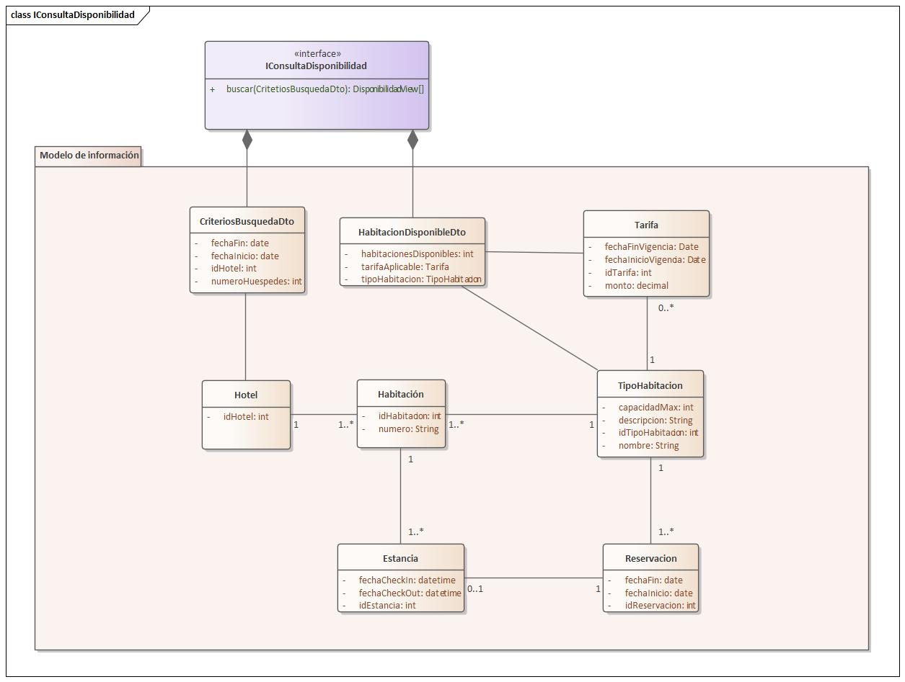

.Pre-condiciones y Post-condiciones
****
* **Operación:** `buscarDisponibilidad(filtro: FiltroBusqueda): Lista<ResultadoDisponibilidad>`
    * **Pre:** `filtro` no es nulo.
    * **Pre:** `filtro.fechaInicio` es anterior a `filtro.fechaFin`.
    * **Pre:** `filtro.fechaInicio` es igual or posterior a la fecha actual.
    * **Post:** Retorna una lista (posiblemente vacía) de `ResultadoDisponibilidad` que coinciden con el filtro.
    * **Post:** La respuesta se obtiene bajo el ASR-RE-01 (500 QPS).
****

===== 2. Componente: GestionReservas

====== 2.1. Interface: `IGestionReserva`

Interfaz transaccional principal para crear (CU-02) y cancelar (CU-04) reservas, optimizada para ASR-CF-01 (Confiabilidad).

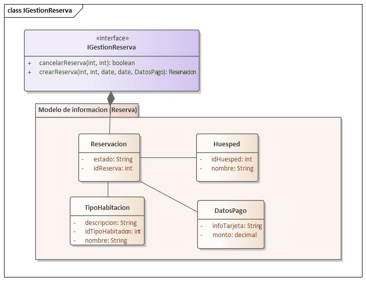

.Pre-condiciones y Post-condiciones
****
* **Operación:** `crearReserva(...)`
    * **Pre:** El `idHuesped` existe y está autenticado.
    * **Pre:** El `idTipoHabitacion` es válido y tiene disponibilidad confirmada (requiere `IInventario` y `ITarifas`).
    * **Pre:** El pago es procesado exitosamente (requiere `IPagos`).
    * **Post:** Se crea una `Reservacion` en estado "Confirmada".
    * **Post:** Se descuenta el inventario (garantía de 0 dobles reservas, ASR-CF-01).
    * **Post:** Se envía una notificación (requiere `INotificacion`).
    * **Post:** Se registra en auditoría (requiere `IAuditoria`).
* **Operación:** `cancelarReserva(...)`
    * **Pre:** La `idReserva` existe y pertenece al `idHuesped` (requiere `ISesionUsuario`).
    * **Pre:** La política de cancelación permite la anulación (requiere `IPoliticas` de `AdministracionCentral`).
    * **Post:** La `Reservacion` cambia a estado "Cancelada".
    * **Post:** Se libera el inventario (requiere `IInventario`).
    * **Post:** Se procesa el reembolso si aplica (requiere `IReembolsos`).
    * **Post:** Se registra en auditoría.
****

====== 2.2. Interface: `IConsultaCliente`

Permite a un huésped consultar sus propias reservas (CU-06).

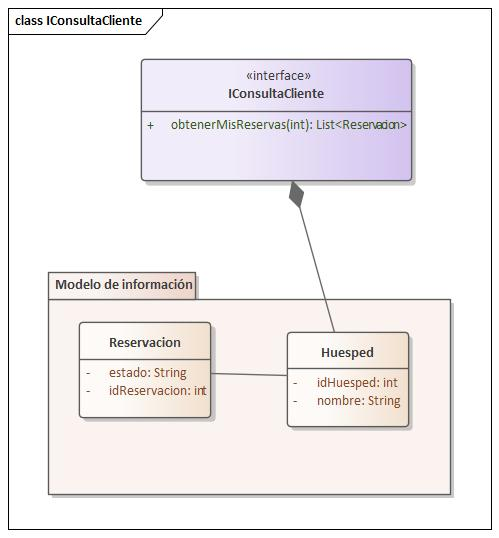

.Pre-condiciones y Post-condiciones
****
* **Operación:** `obtenerMisReservas(idHuesped: string)`
    * **Pre:** El `idHuesped` corresponde al usuario autenticado (requiere `ISesionUsuario`).
    * **Post:** Retorna la lista de reservaciones (activas y pasadas) asociadas a ese `Huesped`.
****

====== 2.3. Interface: `IBusquedaReserva`

Permite al personal (Recepcionista) buscar reservas (CU-11).

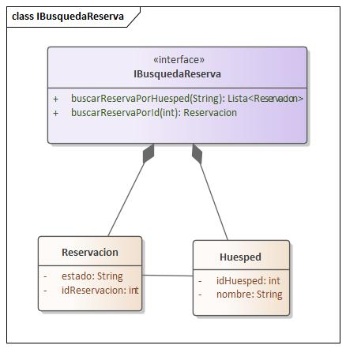

.Pre-condiciones y Post-condiciones
****
* **Operación:** `buscarReservaPorId(idReserva: string)`
    * **Pre:** El usuario (Recepcionista) está autenticado (requiere `ISesionUsuario`).
    * **Post:** Retorna la `Reservacion` si se encuentra, o nulo si no existe.
* **Operación:** `buscarReservaPorHuesped(email: string)`
    * **Pre:** El usuario (Recepcionista) está autenticado.
    * **Post:** Retorna una lista de `Reservacion` asociadas al email del `Huesped`.
****

===== 3. Componente: Pagos

====== 3.1. Interface: `IPagos`

Encapsula el procesamiento de cobros (CU-03, CU-08, CU-10), garantizando ASR-CF-02 (0 dobles cobros).

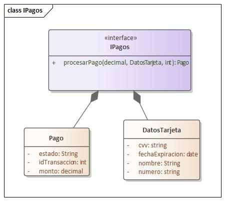

.Pre-condiciones y Post-condiciones
****
* **Operación:** `procesarPago(...)`
    * **Pre:** `monto` es positivo.
    * **Pre:** `idReferencia` es único (para evitar dobles cobros, ASR-CF-02).
    * **Pre:** Se puede establecer conexión con la `IPasarelaExterna`.
    * **Post:** Retorna un objeto `Pago` con el estado "Aprobado" o "Rechazado".
    * **Post:** Si falla la pasarela, se maneja la contingencia (ASR-DA-02).
    * **Post:** La transacción se registra en auditoría (requiere `IAuditoria`).
****

====== 3.2. Interface: `IReembolsos`

Procesa devoluciones de dinero (CU-04).

image::img/interfaceDiagram/IReembolsos.jpg[Diagrama de Interfaz IReembolsos]

.Pre-condiciones y Post-condiciones
****
* **Operación:** `procesarReembolso(...)`
    * **Pre:** `idTransaccionOriginal` existe y corresponde a un `Pago` aprobado.
    * **Pre:** `monto` es positivo y menor o igual al monto original.
    * **Pre:** Se puede establecer conexión con la `IPasarelaExterna`.
    * **Post:** Retorna un objeto `Reembolso` con el estado "Procesado" o "Fallido".
    * **Post:** Se registra en auditoría.
****

===== 4. Componente: GestionEstancias

====== 4.1. Interface: `IGestionCheckIn`

Maneja el registro de entrada del huésped (CU-07).

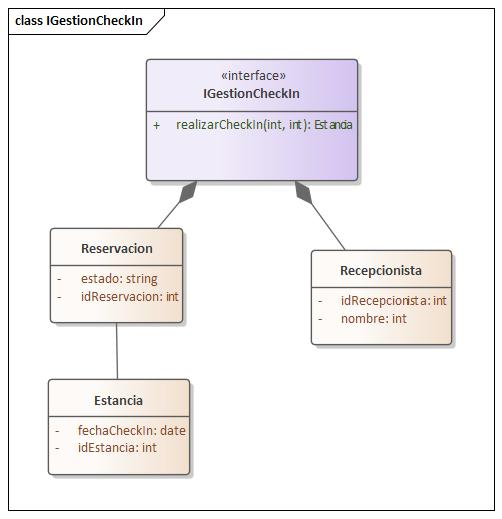

.Pre-condiciones y Post-condiciones
****
* **Operación:** `realizarCheckIn(...)`
    * **Pre:** El `idRecepcionista` corresponde a un usuario autenticado (requiere `ISesionUsuario`).
    * **Pre:** La `idReserva` existe, está "Confirmada" y es para el día actual (requiere `IBusquedaReserva`).
    * **Post:** Se crea una `Estancia` activa.
    * **Post:** El estado de la `Habitacion` asignada se actualiza a "Ocupada" (requiere `IInventario`).
    * **Post:** Se registra en auditoría (requiere `IAuditoria`).
****

====== 4.2. Interface: `IGestionCheckOut`

Maneja el registro de salida del huésped (CU-08).

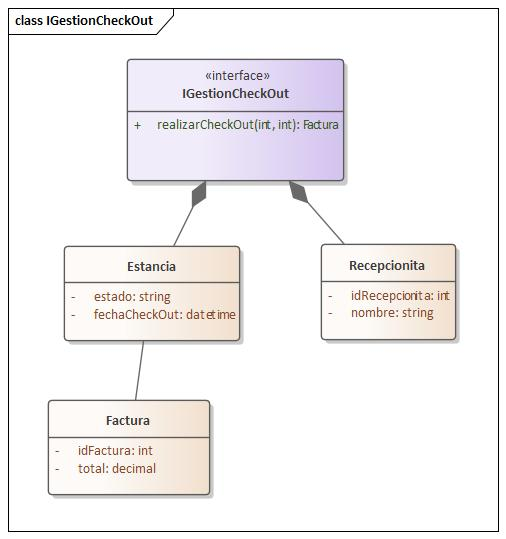

.Pre-condiciones y Post-condiciones
****
* **Operación:** `realizarCheckOut(...)`
    * **Pre:** El `idRecepcionista` está autenticado.
    * **Pre:** La `idEstancia` existe y está "Activa".
    * **Pre:** La cuenta de la estancia (consumos) está saldada (requiere `IPagos`).
    * **Post:** La `Estancia` cambia a estado "Finalizada".
    * **Post:** El estado de la `Habitacion` se actualiza a "Limpieza" (requiere `IInventario`).
    * **Post:** Se genera una `Factura` final.
    * **Post:** Se registra en auditoría.
****

====== 4.3. Interface: `IGestionHabitacion`

Maneja el cambio de habitación (CU-09) y la consulta de estados (CU-12).

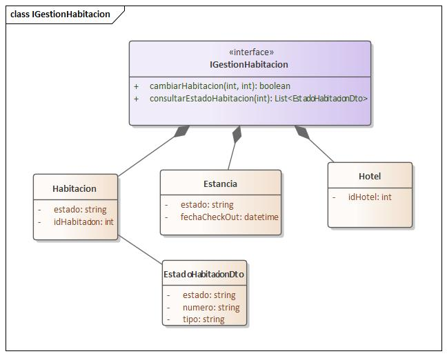

.Pre-condiciones y Post-condiciones
****
* **Operación:** `cambiarHabitacion(...)`
    * **Pre:** La `idEstancia` está "Activa".
    * **Pre:** La `idHabitacionNueva` es válida y está "Disponible" (requiere `IInventario`).
    * **Post:** La `Estancia` se asocia a la nueva `Habitacion`.
    * **Post:** El estado de la habitación antigua pasa a "Limpieza" y la nueva a "Ocupada" (requiere `IInventario`).
    * **Post:** Se registra en auditoría.
* **Operación:** `consultarEstadoHabitaciones(...)`
    * **Pre:** El `idHotel` es válido.
    * **Pre:** El Recepcionista está autenticado.
    * **Post:** Retorna la lista de estados de todas las habitaciones del hotel (ASR-US-01).
****

====== 4.4. Interface: `IConsumos`

Registra cargos adicionales a la estancia (CU-10).

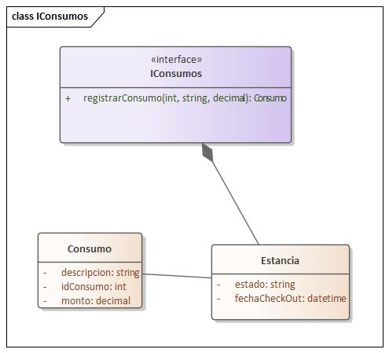

.Pre-condiciones y Post-condiciones
****
* **Operación:** `registrarConsumo(...)`
    * **Pre:** La `idEstancia` está "Activa".
    * **Pre:** `monto` es positivo.
    * **Post:** Se crea un nuevo `Consumo` asociado a la `Estancia`.
    * **Post:** Se registra en auditoría.
****

===== 5. Componente: AdministracionCentral

====== 5.1. Interface: `IInventario`

CRUD para habitaciones (CU-21..24) y tipos de habitación (CU-17..20).

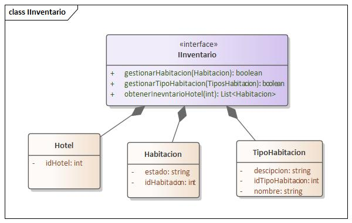

.Pre-condiciones y Post-condiciones
****
* **Operación:** `gestionarHabitacion(...)` / `gestionarTipoHabitacion(...)`
    * **Pre:** El usuario está autenticado y tiene rol de "Administrador" (requiere `ISesionUsuario`).
    * **Pre:** Los `datos` son válidos y consistentes (ASR-Consistencia).
    * **Post:** Se crea, actualiza o elimina la entidad en la "fuente de verdad".
    * **Post:** El cambio se registra en auditoría (requiere `IAuditoria`).
****

====== 5.2. Interface: `ITarifas`

CRUD para tarifas base (CU-29) y precios por día (CU-30).

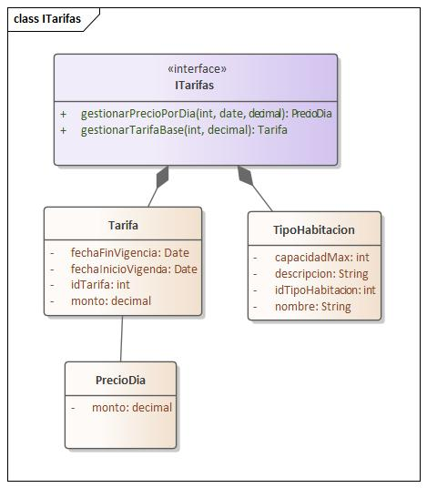

.Pre-condiciones y Post-condiciones
****
* **Operación:** `gestionarTarifaBase(...)` / `gestionarPrecioPorDia(...)`
    * **Pre:** El usuario es "Administrador" (requiere `ISesionUsuario`).
    * **Pre:** El `monto` o `precio` es positivo.
    * **Post:** La `Tarifa` o `PrecioDia` es actualizada (ASR-Consistencia).
    * **Post:** Se registra en auditoría.
****

====== 5.3. Interface: `IPoliticas`

CRUD para políticas de overbooking (CU-32) y cancelación (CU-33).

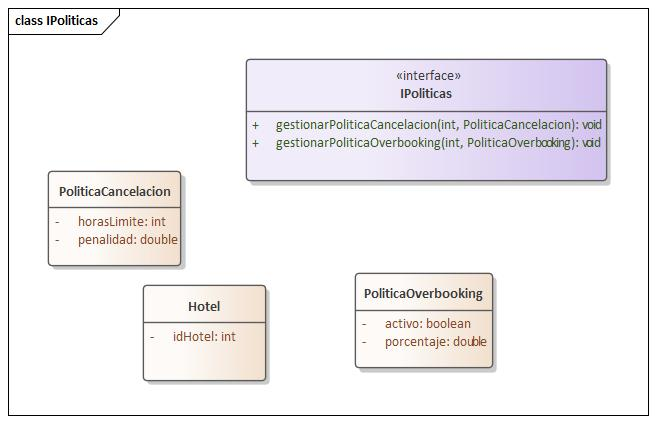

.Pre-condiciones y Post-condiciones
****
* **Operación:** `gestionarPoliticaOverbooking(...)` / `gestionarPoliticaCancelacion(...)`
    * **Pre:** El usuario es "Administrador".
    * **Pre:** Los datos de la `politica` son válidos.
    * **Post:** La política se actualiza para el `Hotel` especificado.
    * **Post:** Se registra en auditoría.
****

====== 5.4. Interface: `ICatalogoHotel`

CRUD para hoteles (CU-13..16).

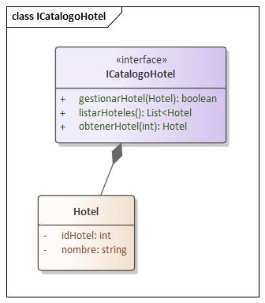

.Pre-condiciones y Post-condiciones
****
* **Operación:** `gestionarHotel(...)`
    * **Pre:** El usuario es "Administrador".
    * **Post:** El `Hotel` es creado, actualizado o eliminado.
    * **Post:** Se registra en auditoría.
****

====== 5.5. Interface: `IGestionPersonal`

CRUD para cuentas de personal (CU-25..28).

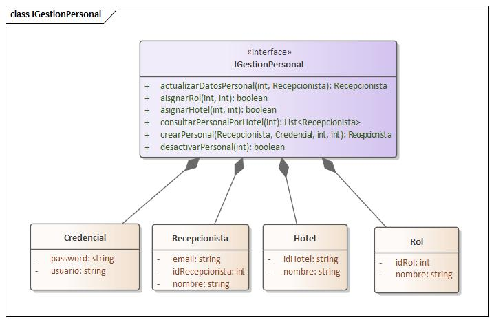

.Pre-condiciones y Post-condiciones
****
* **Operación:** `gestionarCuentaPersonal(...)`
    * **Pre:** El usuario es "Administrador".
    * **Post:** La cuenta de `Personal` es creada, actualizada o eliminada.
    * **Post:** Se registra en auditoría.
****

===== 6. Componente: Autenticacion

====== 6.1. Interface: `ISesionUsuario`

Gestiona login, registro (CU-05, CU-25) y validación de tokens.

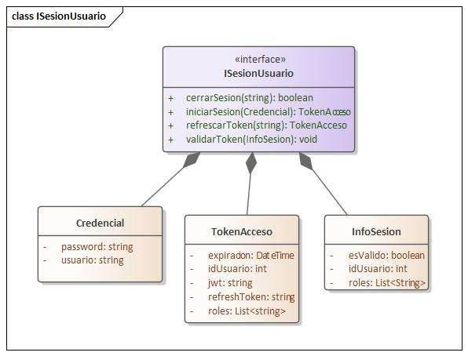

.Pre-condiciones y Post-condiciones
****
* **Operación:** `login(credenciales: Credenciales)`
    * **Pre:** Las `credenciales` no son nulas.
    * **Post:** Si las credenciales son válidas (requiere `IGestionPersonal` o consulta de Huésped), retorna un `TokenSesion`.
    * **Post:** Si son inválidas, retorna un error y registra el intento fallido en auditoría (requiere `IAuditoria`).
* **Operación:** `registrarHuesped(datos: Huesped)` (CU-05)
    * **Pre:** El email en `datos` no existe previamente.
    * **Post:** Se crea un nuevo `Huesped` en el sistema.
    * **Post:** Se registra en auditoría.
* **Operación:** `validarToken(token: string)`
    * **Pre:** `token` no es nulo.
    * **Post:** Si el `token` es válido y no ha expirado, retorna la `InfoUsuario` asociada.
****

====== 6.2. Interface: `IAutorizacion`

Verifica roles y permisos (ASR-SE-01, ASR-SE-02).

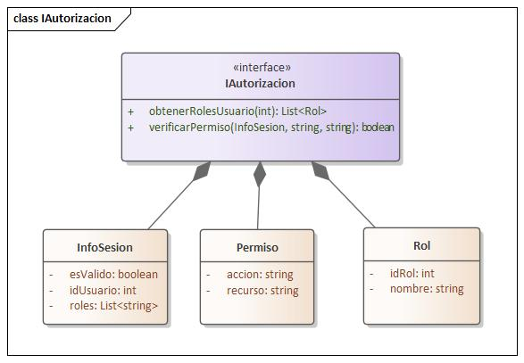

.Pre-condiciones y Post-condiciones
****
* **Operación:** `verificarPermiso(...)`
    * **Pre:** `infoUsuario` es válida (obtenida de `ISesionUsuario.validarToken`).
    * **Post:** Retorna `true` si el rol en `infoUsuario` tiene el `permiso` solicitado (requiere `IGestionPersonal` para consultar roles).
    * **Post:** Retorna `false` si no tiene permiso.
    * **Post:** Si retorna `false`, se registra el acceso denegado en auditoría (ASR-SE-01, requiere `IAuditoria`).
****

===== 7. Componente: Notificaciones

====== 7.1. Interface: `INotificacion`

Abstracción para envío asíncrono de comunicaciones (ASR-Rendimiento).

image::img/interfaceDiagram/INotificacion.jpg[Diagrama de Interfaz INotificacion]

.Pre-condiciones y Post-condiciones
****
* **Operación:** `enviarEmail(email: Email)` / `enviarSMS(sms: SMS)`
    * **Pre:** Los datos del `email` o `sms` están completos.
    * **Post:** El mensaje se encola para envío asíncrono (no bloquea el flujo principal).
    * **Post:** La lógica de envío real se delega a `IServicioEmailExterno` o `IServicioSmsExterno`.
    * **Post:** Retorna `true` si se encoló correctamente.
****

===== 8. Componente: Auditoria

====== 8.1. Interface: `IAuditoria`

Recibe eventos de log de alta prioridad de otros componentes.

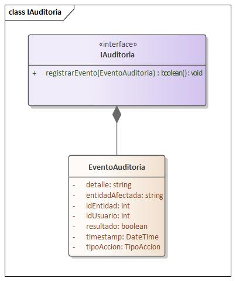

.Pre-condiciones y Post-condiciones
****
* **Operación:** `registrarEvento(evento: RegistroAuditoria)`
    * **Pre:** `evento` no es nulo y contiene la información requerida.
    * **Post:** El `evento` se almacena de forma persistente y segura en el "sumidero" de datos.
    * **Post:** La operación es de tipo "fire-and-forget" y no debe fallar.
****

====== 8.2. Interface: `IConsultaTrazabilidad`

Permite al actor Auditor rastrear transacciones (CU-34).

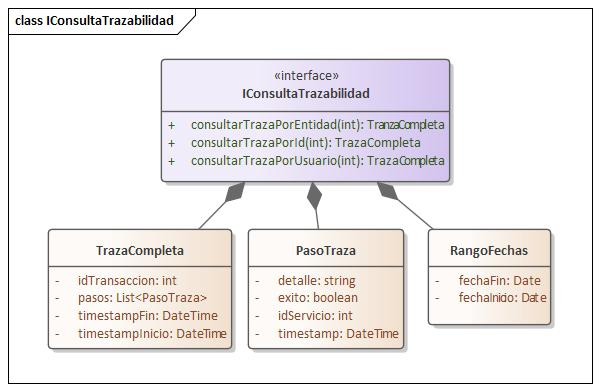

.Pre-condiciones y Post-condiciones
****
* **Operación:** `rastrearTransaccion(idTransaccion: string)`
    * **Pre:** El usuario está autenticado y tiene el rol "Auditor" (requiere `IAutorizacion`).
    * **Pre:** `idTransaccion` es válido.
    * **Post:** Retorna una lista ordenada cronológicamente de todos los `RegistroAuditoria` que comparten el mismo `idTransaccion` (CU-34).
****
