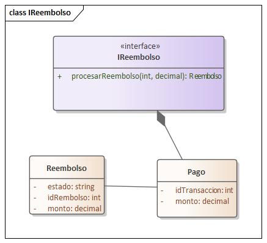

Excelente punto. Tienes toda la razón. Mi error en la respuesta anterior fue omitir las imágenes y simplificar demasiado; tu intuición es 100% correcta.

Vamos a hacer esto bien, de forma minuciosa y explícita, como lo requiere el Hito 4.

Respondiendo a tus preguntas primero:

"¿Debería ir en un nuevo adoc?"

No. Esto es el refinamiento del Hito 3. El artefacto (interfaceDiagram.adoc o donde lo tengas incluido) evoluciona. Simplemente reemplazas el contenido del Hito 3 (que era la v1) por esta nueva versión v2 (Hito 4). Es el mismo documento, pero madurado.

"¿Por qué eliminaste la referencia a la imagen?"

Error mío. Fui negligente al centrarme solo en el texto del contrato. La imagen es fundamental porque, según Cheesman & Daniels, el contrato de interfaz (texto) está vinculado al diagrama de interfaz (visual) y su modelo de información (clases/DTOs). La imagen debe permanecer.

🧩 Paso 1: Refinamiento de Contratos v2 (100% Completo)
Aquí está la corrección minuciosa y explícita de tu documento.

La diferencia clave entre el Hito 3 (v1) y el Hito 4 (v2) es:

v1 (Hito 3): Describe el "camino feliz" para validar que las interacciones son suficientes.

v2 (Hito 4): Especifica contractualmente el comportamiento completo, incluyendo firmas explícitas, cláusulas numeradas (PRE/POST) y, lo más importante, las Post-condiciones de Error (POST-ERR).

Aquí está tu documento, actualizado al 100% para el Hito 4.

==== 5.4.2 Diagramas de especificación de interfaces (v2 Hito 4)

A continuación, se formaliza el contrato de especificación de cada interfaz provista por los componentes del sistema, siguiendo la metodología CBSE. Cada cláusula es normativa para la implementación y verificable.

===== 1. Componente: Consulta Disponibilidad

====== 1.1. Interface: IConsultaDisponibilidad

Esta interfaz, optimizada para ASR-RE-01 (Rendimiento), provee las operaciones para el CU-01.

image::img/interfaceDiagram/IConsultaDisponibilidad.jpg[Diagrama de Interfaz IConsultaDisponibilidad]

.Contrato de Operación: buscarDisponibilidad

Operación: buscarDisponibilidad(filtro: FiltroBusqueda): Lista<ResultadoDisponibilidad>

Pre-condiciones:

PRE-01: filtro no debe ser nulo.

PRE-02: filtro.fechaInicio debe ser cronológicamente anterior a filtro.fechaFin.

PRE-03: filtro.fechaInicio debe ser igual o posterior a la fecha actual del sistema.

Post-condiciones (Éxito):

POST-01: Retorna una Lista<ResultadoDisponibilidad> que coincide con el filtro (la lista puede ser vacía si no hay coincidencias).

POST-02: La latencia de la operación debe cumplir con ASR-RE-01 (500 QPS).

Post-condiciones (Fallo):

POST-ERR-01: Si PRE-01, PRE-02 o PRE-03 fallan, se debe retornar una excepción ArgumentoInvalidoException.

===== 2. Componente: GestionReservas

====== 2.1. Interface: IGestionReserva

Interfaz transaccional principal para crear (CU-02) y cancelar (CU-04) reservas, optimizada para ASR-CF-01 (Confiabilidad).

image::img/interfaceDiagram/IGestionReserva.jpg[Diagrama de Interfaz IGestionReserva]

.Contrato de Operación: crearReserva

Operación: crearReserva(idHuesped: string, idTipoHabitacion: string, fechas: RangoFechas, datosPago: DatosPago): Reservacion

Pre-condiciones:

PRE-01: El idHuesped debe corresponder a un usuario autenticado (requiere ISesionUsuario.validarToken).

PRE-02: Debe existir disponibilidad de inventario para idTipoHabitacion en fechas (requiere IInventario.verificarDisponibilidad).

PRE-03: Los datosPago deben ser válidos y el monto calculado (requiere ITarifas).

Post-condiciones (Éxito):

POST-01: Se invoca IPagos.procesarPago y este retorna un Pago con estado "Aprobado".

POST-02: Se crea una entidad Reservacion en estado "Confirmada".

POST-03: Se descuenta el inventario para idTipoHabitacion en fechas (garantizando ASR-CF-01 - 0 dobles reservas).

POST-04: Se encola una notificación de confirmación (requiere INotificacion.enviarEmail).

POST-05: Se emite un evento de auditoría "RESERVA_EXITOSA" (ASR-AU-01, requiere IAuditoria.registrarEvento).

POST-06: La operación retorna la entidad Reservacion creada.

Post-condiciones (Fallo):

POST-ERR-01: Si IPagos.procesarPago retorna "Rechazado", la operación debe abortar. No se debe crear la Reservacion y no se debe descontar el inventario. Se emite auditoría "RESERVA_PAGO_FALLIDO". Se retorna PagoRechazadoException.

.Contrato de Operación: cancelarReserva

Operación: cancelarReserva(idReserva: string, idHuesped: string): boolean

Pre-condiciones:

PRE-01: idReserva debe existir y pertenecer a idHuesped (requiere ISesionUsuario).

PRE-02: El estado de la Reservacion debe ser "Confirmada".

PRE-03: La política de cancelación debe permitir la anulación en la fecha actual (requiere IPoliticas de AdministracionCentral).

Post-condiciones (Éxito):

POST-01: El estado de la Reservacion se actualiza a "Cancelada".

POST-02: Se libera el inventario asociado (requiere IInventario.liberarInventario).

POST-03: Si PRE-03 determina que aplica reembolso, se invoca IReembolso.procesarReembolso.

POST-04: Se emite un evento de auditoría "RESERVA_CANCELADA".

POST-05: Retorna true.

Post-condiciones (Fallo):

POST-ERR-01: Si PRE-03 falla (política no lo permite), la operación retorna false. El estado de la Reservacion NO debe cambiar.

====== 2.2. Interface: IConsultaCliente

Permite a un huésped consultar sus propias reservas (CU-06).

image::img/interfaceDiagram/IConsultaCliente.jpg[Diagrama de Interfaz IConsultaCliente]

.Contrato de Operación: obtenerMisReservas

Operación: obtenerMisReservas(idHuesped: string): Lista<Reservacion>

Pre-condiciones:

PRE-01: idHuesped debe corresponder al usuario autenticado en la sesión (requiere ISesionUsuario.validarToken).

Post-condiciones (Éxito):

POST-01: Retorna la lista (posiblemente vacía) de reservaciones (activas y pasadas) asociadas a ese Huesped.

Post-condiciones (Fallo):

POST-ERR-01: Si PRE-01 falla, se retorna AccesoDenegadoException (ASR-SE-01).

====== 2.3. Interface: IBusquedaReserva

Permite al personal (Recepcionista) buscar reservas (CU-11).

image::img/interfaceDiagram/IBusquedaReserva.jpg[Diagrama de Interfaz IBusquedaReserva]

.Contrato de Operación: buscarReservaPorId

Operación: buscarReservaPorId(idReserva: string, idPersonal: string): Reservacion

Pre-condiciones:

PRE-01: El idPersonal (Recepcionista) debe estar autenticado y autorizado (requiere IAutorizacion).

Post-condiciones (Éxito):

POST-01: Retorna la Reservacion si se encuentra, o null si no existe.

Post-condiciones (Fallo):

POST-ERR-01: Si PRE-01 falla, se retorna AccesoDenegadoException (ASR-SE-02).

.Contrato de Operación: buscarReservaPorHuesped

Operación: buscarReservaPorHuesped(email: string, idPersonal: string): Lista<Reservacion>

Pre-condiciones:

PRE-01: El idPersonal (Recepcionista) debe estar autenticado y autorizado (requiere IAutorizacion).

Post-condiciones (Éxito):

POST-01: Retorna una lista (posiblemente vacía) de Reservacion asociadas al email del Huesped.

Post-condiciones (Fallo):

POST-ERR-01: Si PRE-01 falla, se retorna AccesoDenegadoException (ASR-SE-02).

===== 3. Componente: Pagos

====== 3.1. Interface: IPagos

Encapsula el procesamiento de cobros (CU-03, CU-08, CU-10), garantizando ASR-CF-02 (0 dobles cobros).

image::img/interfaceDiagram/IPagos.jpg[Diagrama de Interfaz IPagos]

.Contrato de Operación: procesarPago

Operación: procesarPago(monto: Dinero, idReferencia: string, datosPago: DatosPago): Pago

Pre-condiciones:

PRE-01: monto debe ser positivo.

PRE-02: idReferencia debe ser único (garantía de idempotencia para ASR-CF-02).

Post-condiciones (Éxito):

POST-01: Se conecta a IPasarelaExterna y esta aprueba la transacción.

POST-02: Retorna un objeto Pago con estado "Aprobado" y un idTransaccionPasarela.

POST-03: Se emite un evento de auditoría "PAGO_APROBADO" (requiere IAuditoria).

Post-condiciones (Fallo):

POST-ERR-01: Si la IPasarelaExterna rechaza el pago, retorna Pago con estado "Rechazado". Se emite auditoría "PAGO_RECHAZADO".

POST-ERR-02: Si PRE-02 falla (intento de doble cobro), retorna el Pago original si existe, sin re-procesar.

POST-ERR-03: Si la conexión con IPasarelaExterna falla (contingencia ASR-DA-02), retorna Pago con estado "Indeterminado" y se encola para revisión.

====== 3.2. Interface: IReembolso

Procesa devoluciones de dinero (CU-04).

.Contrato de Operación: procesarReembolso

Operación: procesarReembolso(idTransaccionOriginal: string, monto: Dinero): Reembolso

Pre-condiciones:

PRE-01: idTransaccionOriginal debe existir y corresponder a un Pago "Aprobado".

PRE-02: monto es positivo y menor o igual al monto original del Pago.

Post-condiciones (Éxito):

POST-01: Se conecta a IPasarelaExterna y esta aprueba la devolución.

POST-02: Retorna un objeto Reembolso con estado "Procesado".

POST-03: Se emite un evento de auditoría "REEMBOLSO_EXITOSO" (requiere IAuditoria).

Post-condiciones (Fallo):

POST-ERR-01: Si la pasarela rechaza la devolución, retorna Reembolso con estado "Fallido". Se emite auditoría "REEMBOLSO_FALLIDO".

===== 4. Componente: GestionEstancias

====== 4.1. Interface: IGestionCheckIn

Maneja el registro de entrada del huésped (CU-07).

image::img/interfaceDiagram/IGestionCheckIn.jpg[Diagrama de Interfaz IGestionCheckIn]

.Contrato de Operación: realizarCheckIn

Operación: realizarCheckIn(idReserva: string, idRecepcionista: string): Estancia

Pre-condiciones:

PRE-01: idRecepcionista debe estar autenticado y autorizado (requiere IAutorizacion).

PRE-02: idReserva debe existir, estar en estado "Confirmada" (requiere IBusquedaReserva).

PRE-03: La fecha de inicio de la reserva debe ser la fecha actual del sistema.

Post-condiciones (Éxito):

POST-01: Se crea una entidad Estancia en estado "Activa", asociada a la Reservacion.

POST-02: El estado de la Habitacion asignada se actualiza a "Ocupada" (requiere IInventario.actualizarEstadoHabitacion).

POST-03: Se emite un evento de auditoría "CHECKIN_EXITOSO" (requiere IAuditoria).

POST-04: Retorna la Estancia creada.

Post-condiciones (Fallo):

POST-ERR-01: Si PRE-02 o PRE-03 fallan, retorna CheckInInvalidoException. No se debe crear la Estancia.

====== 4.2. Interface: IGestionCheckOut

Maneja el registro de salida del huésped (CU-08).

image::img/interfaceDiagram/IGestionCheckOut.jpg[Diagrama de Interfaz IGestionCheckOut]

.Contrato de Operación: realizarCheckOut

Operación: realizarCheckOut(idEstancia: string, idRecepcionista: string): Factura

Pre-condiciones:

PRE-01: idRecepcionista debe estar autenticado y autorizado (requiere IAutorizacion).

PRE-02: idEstancia debe existir y estar en estado "Activa".

PRE-03: La cuenta de la estancia (todos los Consumos) debe estar saldada (requiere IPagos).

Post-condiciones (Éxito):

POST-01: El estado de la Estancia se actualiza a "Finalizada".

POST-02: El estado de la Habitacion asociada se actualiza a "Limpieza" (requiere IInventario).

POST-03: Se genera una Factura final.

POST-04: Se emite un evento de auditoría "CHECKOUT_EXITOSO".

POST-05: Retorna la Factura generada.

Post-condiciones (Fallo):

POST-ERR-01: Si PRE-03 falla (cuenta no saldada), retorna CuentaPendienteException. El estado de la Estancia NO debe cambiar.

====== 4.3. Interface: IGestionHabitacion

Maneja el cambio de habitación (CU-09) y la consulta de estados (CU-12).

image::img/interfaceDiagram/IGestionHabitacion.jpg[Diagrama de Interfaz IGestionHabitacion]

.Contrato de Operación: cambiarHabitacion

Operación: cambiarHabitacion(idEstancia: string, idHabitacionNueva: string, idRecepcionista: string): boolean

Pre-condiciones:

PRE-01: idRecepcionista debe estar autenticado y autorizado (requiere IAutorizacion).

PRE-02: idEstancia debe estar "Activa".

PRE-03: idHabitacionNueva debe ser válida y estar "Disponible" (requiere IInventario.consultarEstado).

Post-condiciones (Éxito):

POST-01: La Estancia se desasocia de la habitación antigua y se asocia a idHabitacionNueva.

POST-02: El estado de la habitación antigua pasa a "Limpieza" (requiere IInventario).

POST-03: El estado de idHabitacionNueva pasa a "Ocupada" (requiere IInventario).

POST-04: Se emite un evento de auditoría "CAMBIO_HABITACION".

POST-05: Retorna true.

Post-condiciones (Fallo):

POST-ERR-01: Si PRE-03 falla, retorna HabitacionNoDisponibleException.

.Contrato de Operación: consultarEstadoHabitaciones

Operación: consultarEstadoHabitaciones(idHotel: string, idRecepcionista: string): Lista<EstadoHabitacion>

Pre-condiciones:

PRE-01: idRecepcionista debe estar autenticado y autorizado (requiere IAutorizacion).

PRE-02: idHotel debe ser válido.

Post-condiciones (Éxito):

POST-01: Retorna la lista de estados de todas las habitaciones del hotel (optimizada para ASR-US-01).

====== 4.4. Interface: IConsumos

Registra cargos adicionales a la estancia (CU-10).

image::img/interfaceDiagram/IConsumos.jpg[Diagrama de Interfaz IConsumos]

.Contrato de Operación: registrarConsumo

Operación: registrarConsumo(idEstancia: string, monto: Dinero, descripcion: string): Consumo

Pre-condiciones:

PRE-01: idEstancia debe estar "Activa".

PRE-02: monto debe ser positivo.

Post-condiciones (Éxito):

POST-01: Se crea un nuevo Consumo asociado a la Estancia.

POST-02: Se emite un evento de auditoría "CONSUMO_REGISTRADO".

POST-03: Retorna el Consumo creado.

Post-condiciones (Fallo):

POST-ERR-01: Si PRE-01 falla (estancia no activa), retorna EstanciaInactivaException.

===== 5. Componente: AdministracionCentral

(Interfaces: IInventario, ITarifas, IPoliticas, ICatalogoHotel, IGestionPersonal)

image::img/interfaceDiagram/IInventario.jpg[Diagrama de Interfaz IInventario] image::img/interfaceDiagram/ITarifas.jpg[Diagrama de Interfaz ITarifas] image::img/interfaceDiagram/IPoliticas.jpg[Diagrama de Interfaz IPoliticas] image::img/interfaceDiagram/ICatalogoHotel.jpg[Diagrama de Interfaz ICatalogoHotel] image::img/interfaceDiagram/IGestionPersonal.jpg[Diagrama de Interfaz IGestionPersonal]

.Contrato Genérico para Operaciones CRUD (gestionar...)

Propósito: Satisfacer CUs 13-33. Garantizar ASR-Consistencia de datos maestros.

Pre-condiciones:

PRE-01: El usuario debe estar autenticado y tener el rol "Administrador" (requiere IAutorizacion.verificarPermiso('ROL_ADMIN')).

PRE-02: Los datos de entrada (DTO) deben ser válidos según las reglas de negocio (ej. monto positivo, fechas coherentes, ASR-Consistencia).

Post-condiciones (Éxito):

POST-01: La entidad (Hotel, Tarifa, Política, etc.) es creada, actualizada o eliminada en la "fuente de verdad".

POST-02: Se emite un evento de auditoría "ADMIN_GESTION_EXITOSA" (requiere IAuditoria).

Post-condiciones (Fallo):

POST-ERR-01: Si PRE-01 falla, se debe retornar AccesoDenegadoException (ASR-SE-02).

POST-ERR-02: Si PRE-02 falla (datos inválidos), se debe retornar ValidacionException.

===== 6. Componente: Autenticacion

====== 6.1. Interface: ISesionUsuario

Gestiona login, registro (CU-05, CU-25) y validación de tokens.

image::img/interfaceDiagram/ISesionUsuario.jpg[Diagrama de Interfaz ISesionUsuario]

.Contrato de Operación: login

Operación: login(credenciales: Credenciales): TokenSesion

Pre-condiciones:

PRE-01: Las credenciales no son nulas.

Post-condiciones (Éxito):

POST-01: Si las credenciales son válidas (requiere IGestionPersonal o consulta de Huésped), retorna un TokenSesion.

Post-condiciones (Fallo):

POST-ERR-01: Si son inválidas, retorna LoginFallidoException y se emite un evento de auditoría "LOGIN_FALLIDO" (requiere IAuditoria).

.Contrato de Operación: registrarHuesped

Operación: registrarHuesped(datos: Huesped): Huesped (CU-05)

Pre-condiciones:

PRE-01: El email en datos no debe existir previamente en el sistema.

Post-condiciones (Éxito):

POST-01: Se crea un nuevo Huesped en el sistema.

POST-02: Se emite un evento de auditoría "HUESPED_REGISTRADO".

POST-03: Retorna el Huesped creado.

Post-condiciones (Fallo):

POST-ERR-01: Si PRE-01 falla, retorna EmailDuplicadoException.

.Contrato de Operación: validarToken

Operación: validarToken(token: string): InfoUsuario

Pre-condiciones:

PRE-01: token no es nulo.

Post-condiciones (Éxito):

POST-01: Si el token es válido y no ha expirado, retorna la InfoUsuario (ID, Rol) asociada.

Post-condiciones (Fallo):

POST-ERR-01: Si el token es inválido o expirado, retorna TokenInvalidoException.

====== 6.2. Interface: IAutorizacion

Verifica roles y permisos (ASR-SE-01, ASR-SE-02).

image::img/interfaceDiagram/IAutorizacion.jpg[Diagrama de Interfaz IAutorizacion]

.Contrato de Operación: verificarPermiso

Operación: verificarPermiso(infoUsuario: InfoUsuario, permisoRequerido: string): boolean

Pre-condiciones:

PRE-01: infoUsuario es válida (obtenida de ISesionUsuario.validarToken).

Post-condiciones:

POST-01: Retorna true si el rol en infoUsuario tiene el permisoRequerido.

POST-02: Retorna false si no tiene permiso.

POST-03: Si retorna false, se emite un evento de auditoría "ACCESO_DENEGADO_ROL" (ASR-SE-01, requiere IAuditoria).

===== 7. Componente: Notificaciones

====== 7.1. Interface: INotificacion

Abstracción para envío asíncrono de comunicaciones (optimizado para no bloquear al cliente).

image::img/interfaceDiagram/INotificacion.jpg[Diagrama de Interfaz INotificacion]

.Contrato de Operación: enviarEmail / enviarSMS

Operación: enviarEmail(email: Email): boolean / enviarSMS(sms: SMS): boolean

Pre-condiciones:

PRE-01: Los datos del email o sms están completos (destino, contenido).

Post-condiciones (Éxito):

POST-01: El mensaje se encola exitosamente para envío asíncrono (la operación no bloquea).

POST-02: La lógica de envío real se delega a IServicioEmailExterno o IServicioSmsExterno.

POST-03: Retorna true (significa "encolado", no "entregado").

Post-condiciones (Fallo):

POST-ERR-01: Si la cola de mensajería está caída, retorna false (o lanza ColaCaidaException).

===== 8. Componente: Auditoria

====== 8.1. Interface: IAuditoria

Recibe eventos de log de alta prioridad (ASR-AU-01).

image::img/interfaceDiagram/IAuditoria.jpg[Diagrama de Interfaz IAuditoria]

.Contrato de Operación: registrarEvento

Operación: registrarEvento(evento: RegistroAuditoria): void

Pre-condiciones:

PRE-01: evento no es nulo y contiene la información requerida (timestamp, actor, acción, idTrazabilidad).

Post-condiciones (Éxito):

POST-01: El evento se almacena de forma persistente y segura en el "sumidero" de auditoría.

POST-02: La operación es "fire-and-forget" y no debe lanzar excepciones al componente que la llama (debe manejar sus propios fallos internamente).

====== 8.2. Interface: IConsultaTrazabilidad

Permite al actor Auditor rastrear transacciones (CU-34).

image::img/interfaceDiagram/IConsultaTrazabilidad.jpg[Diagrama de Interfaz IConsultaTrazabilidad]

.Contrato de Operación: rastrearTransaccion

Operación: rastrearTransaccion(idTrazabilidad: string, idAuditor: string): Lista<RegistroAuditoria>

Pre-condiciones:

PRE-01: El idAuditor debe estar autenticado y tener el rol "Auditor" (requiere IAutorizacion.verificarPermiso).

PRE-02: idTrazabilidad debe ser válido.

Post-condiciones (Éxito):

POST-01: Retorna una lista ordenada cronológicamente de todos los RegistroAuditoria que comparten el mismo idTrazabilidad.

Post-condiciones (Fallo):

POST-ERR-01: Si PRE-01 falla, retorna AccesoDenegadoException (ASR-SE-02).