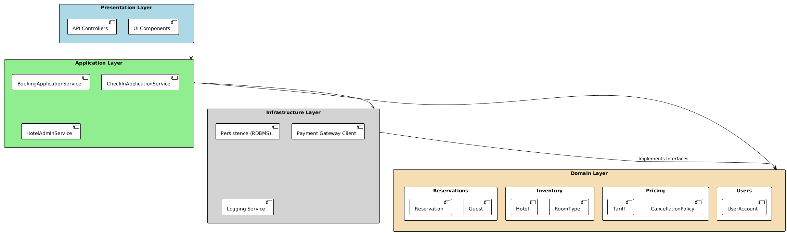
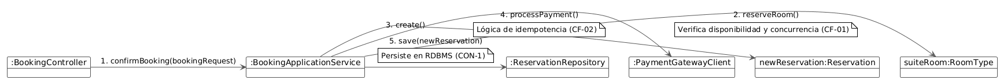

== 4.2 Vista Lógica

Esta vista describe la estructura estática del sistema, su descomposición en elementos lógicos principales y la asignación de responsabilidades funcionales. El objetivo es mostrar cómo la organización del código fuente satisface los impulsores arquitectónicos clave, especialmente la confiabilidad, el rendimiento y la mantenibilidad.

=== 4.2.1 Estilo Arquitectónico: Arquitectura en Capas con un Núcleo de Dominio

Para satisfacer los impulsores del sistema, se ha seleccionado un estilo de Arquitectura en Capas (Layered Architecture).
Este estilo organiza el sistema en capas horizontales, donde cada una tiene una responsabilidad específica y solo puede comunicarse con la capa inmediatamente inferior.
Esta decisión de diseño promueve una fuerte separación de preocupaciones, que es fundamental para la mantenibilidad a largo plazo.

Dentro de este estilo, el corazón del sistema se modela siguiendo los principios de Domain-Driven Design (DDD), aislando la lógica de negocio compleja en un Núcleo de Dominio explícito.
Esta combinación permite abordar de forma robusta la criticidad de las transacciones y la integridad de los datos, que son los mayores riesgos del proyecto.

.Diagrama de Paquetes - Vista Lógica

=== 4.2.2 Descripción de los Paquetes Lógicos

El sistema se descompone en las siguientes cuatro capas principales, cada una conteniendo paquetes que agrupan funcionalidades relacionadas:

==== 1. Presentation Layer (Capa de Presentación)

Responsabilidad: Gestionar toda la interacción con los actores del sistema (Huéspedes, Personal de Recepción, etc.). Es el punto de entrada para todas las solicitudes de usuario.

Contenido: Controladores de API REST, componentes de interfaz de usuario (para la web y la app móvil) y modelos de vista (DTOs - Data Transfer Objects) para la comunicación con el cliente.

Justificación: Aísla la tecnología de la interfaz del resto del sistema. Un cambio en la web no debe afectar la lógica de cómo se procesa una reserva. Esto satisface la preocupación por la facilidad de operación y permite que equipos de frontend y backend trabajen en paralelo.

==== 2. Application Layer (Capa de Aplicación)

Responsabilidad: Orquestar los casos de uso del sistema. No contiene lógica de negocio, sino que actúa como un coordinador: recibe solicitudes de la Capa de Presentación, invoca los objetos del dominio para ejecutar la tarea y utiliza la Capa de Infraestructura para la persistencia.

Contenido: Servicios de aplicación que mapean directamente a los casos de uso, como BookingApplicationService (para CU-02, CU-03, CU-04) o CheckInApplicationService (para CU-08).

Justificación: Mantiene los controladores de la capa de presentación delgados y libres de lógica de orquestación, mejorando la mantenibilidad y la claridad del código.

==== 3. Domain Layer (Capa de Dominio)

Responsabilidad: Contener toda la lógica, reglas y estado del negocio. Este es el corazón del software y es completamente independiente de cualquier otra capa. Aquí se implementa la lógica crítica para evitar dobles reservas y garantizar la consistencia de los precios.

Contenido: Se subdivide en módulos de negocio clave:
** Reservations: Contiene agregados como Reservation y Guest, y maneja el ciclo de vida de una reserva.
** Inventory: Modela los hoteles, tipos de habitación y habitaciones físicas. Es responsable de gestionar la disponibilidad y aplicar la política de overbooking del 10%.
** Pricing: Gestiona las tarifas base, los precios dinámicos por día y las políticas de cancelación.
** Users: Maneja las cuentas de huéspedes y personal del hotel.

Justificación: Esta capa es fundamental para la confiabilidad.
Al aislar la lógica de negocio, podemos probarla exhaustivamente sin depender de la base de datos o la interfaz de usuario.
Las reglas para evitar la concurrencia (CF-01) y asegurar la idempotencia (CF-02) se implementan y validan aquí, garantizando que el sistema sea correcto por diseño.

==== 4. Infrastructure Layer (Capa de Infraestructura)

Responsabilidad: Gestionar todas las comunicaciones con elementos externos y detalles técnicos. Esto incluye el acceso a la base de datos, la integración con la pasarela de pagos, el sistema de logging, etc.

Contenido:
** Persistence: Implementaciones de los repositorios definidos en el Dominio, utilizando un RDBMS como dicta la restricción CON-1.
** PaymentGateway: Cliente para comunicarse con el servicio de pagos externo (CON-5).
** Logging: Implementación de la infraestructura de observabilidad para la trazabilidad de auditoría.

Justificación: Desacopla el núcleo del sistema de las tecnologías específicas.
Si en el futuro se necesita cambiar de PostgreSQL a otro RDBMS, o usar una pasarela de pagos diferente, los cambios se limitan a esta capa, lo que maximiza la mantenibilidad y la flexibilidad.
También es clave para el rendimiento, ya que las optimizaciones de acceso a datos (por ejemplo, caching, connection pooling) se pueden implementar aquí sin afectar la lógica de negocio.

=== 4.2.3 Diagrama de Objetos: Flujo de Confirmación de Reserva

Para clarificar cómo colaboran los elementos de las distintas capas, a continuación se presenta un diagrama de objetos. Este diagrama muestra una "instantánea" de los objetos principales que existen en memoria y sus interacciones durante el proceso de confirmación de una reserva, correspondiente a los casos de uso **CU-02** y **CU-03**.

Este escenario es crucial porque debe satisfacer los atributos de calidad de **Confiabilidad (CF-01, CF-02)** y **Rendimiento (RE-02)**.

.Diagrama de Objetos - Confirmación de Reserva

==== Explicación del Flujo de Interacción:

1.  **Entrada (`:BookingController`)**: Un actor (huésped) envía una solicitud HTTP para reservar una habitación. Un objeto de la clase `BookingController` en la **Capa de Presentación** recibe esta solicitud. Contiene los datos de la reserva en un DTO (`bookingRequest`).

2.  **Orquestación (`:BookingApplicationService`)**: El controlador no contiene lógica, simplemente invoca al servicio de aplicación correspondiente, en este caso, una instancia de `BookingApplicationService`. Este objeto de la **Capa de Aplicación** es responsable de orquestar todo el caso de uso.

3.  **Lógica de Dominio (`:Reservation`, `:RoomType`)**:
    * El `BookingApplicationService` primero utiliza un repositorio para obtener la instancia del `RoomType` (tipo de habitación) que se desea reservar.
    * Luego, invoca un método en el objeto `:RoomType`, como `reserveRoom()`. Es este objeto de la **Capa de Dominio** el que contiene la lógica de negocio crítica para verificar la disponibilidad, aplicar la política de overbooking del 10% y manejar la concurrencia para evitar dobles reservas.
    * Si la reserva es posible, se crea una nueva instancia de `Reservation` con un estado inicial, por ejemplo, "PENDING_PAYMENT".

4.  **Infraestructura (`:PaymentGatewayClient`, `:ReservationRepository`)**:
    * El servicio de aplicación utiliza un objeto de la **Capa de Infraestructura**, el `:PaymentGatewayClient`, para procesar el pago. Este cliente es responsable de la comunicación con el sistema externo.
    * Una vez que el pago es exitoso, el `BookingApplicationService` utiliza otra implementación de infraestructura, el `:ReservationRepository`, para guardar el objeto `:Reservation` (ahora con estado "CONFIRMED") en la base de datos RDBMS.

Este diagrama clarifica cómo la **separación de capas** funciona en la práctica: cada objeto tiene una única responsabilidad y las dependencias fluyen en una sola dirección, protegiendo la lógica de negocio en el núcleo del dominio y satisfaciendo así los requisitos de mantenibilidad y confiabilidad.