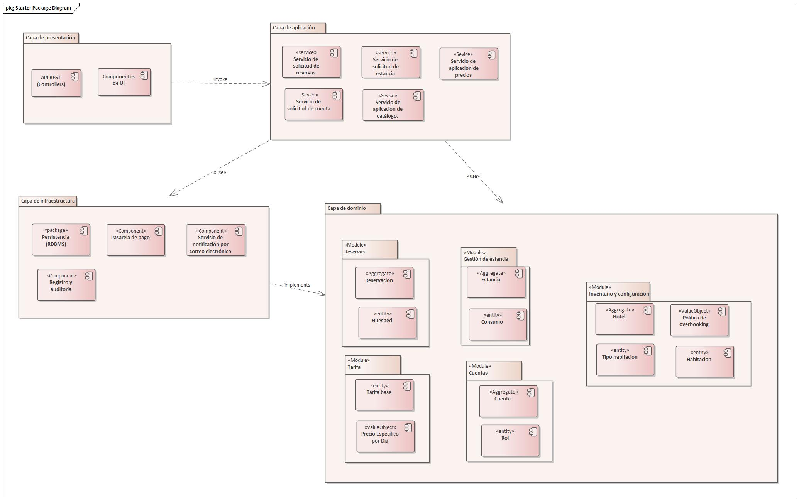

== 5.1 Vista Lógica

La Vista Lógica describe la estructura estática del sistema, descomponiéndolo en capas y módulos funcionales. Su propósito es ilustrar cómo la organización del código satisface los impulsores arquitectónicos de **Confiabilidad** (evitar errores lógicos) y **Mantenibilidad** (facilitar cambios futuros).

=== 5.1.1 Justificación del Estilo Arquitectónico

Se ha seleccionado una Arquitectura en Capas con un núcleo modelado mediante Domain-Driven Design (DDD). Esta decisión responde directamente a los impulsores más críticos del proyecto.

*Drivers (Impulsores):*
* **Confiabilidad (CF-01, CF-02):** La eliminación total de dobles reservas exige que las reglas de negocio (invariantes) sean probables de forma aislada, sin interferencia de la UI o la Base de Datos.
* **Mantenibilidad (CRN-6):** La restricción de usar RDBMS (CON-1) y Pasarela Externa (CON-5) implica dependencias tecnológicas fuertes. Necesitamos poder cambiarlas o actualizarlas sin reescribir la lógica de negocio.
* **Restricciones:** Integración con sistemas legados o externos (Pasarelas).

*Tácticas (Estrategia de Diseño):*
* **Separación de Preocupaciones (SoC):** Asignar responsabilidades únicas. La UI no calcula precios; el Dominio no envía correos.
* **Inversión de Dependencias (DIP):** Los módulos de alto nivel (Dominio) no dependen de módulos de bajo nivel (Infraestructura). Ambos dependen de abstracciones.
* **Aislamiento del Núcleo:** Proteger la lógica de negocio crítica (reglas de concurrencia, políticas de overbooking) de las dependencias externas (UI, BD, APIs).

*Patrones y Decisiones:*
* **Layered Architecture (4 Capas):** Presentación, Aplicación, Dominio, Infraestructura.
* **Repository Pattern:** Abstracción del acceso a datos (CON-1). El Dominio define la interfaz `IReservationRepository`, la Infraestructura la implementa con SQL.
* **Domain Model:** Uso de Agregados (Entities + Value Objects) para encapsular invariantes de negocio.

*Trade-offs (Análisis Costo-Beneficio):*
* *(Positivo) Alta Confiabilidad y Testeabilidad:* Al aislar la lógica de negocio en el Dominio (sin dependencias de UI o BD), podemos probar unitariamente las reglas de concurrencia (CF-01) y las políticas de negocio, garantizando la corrección.
* *(Positivo) Alta Mantenibilidad:* Es fácil cambiar la base de datos (CON-1) o la pasarela de pagos (CON-5) modificando solo la Capa de Infraestructura, sin tocar la lógica de negocio.
* *(Negativo) Sobrecarga de Código (Boilerplate):* Este estilo requiere más clases y mapeo de datos entre capas (ej. DTOs en Presentación vs. Entidades en Dominio), lo que incrementa la complejidad inicial del código.
* *(Negativo) Latencia Potencial:* Una solicitud debe atravesar múltiples capas, añadiendo una pequeña sobrecarga de rendimiento. Este trade-off es aceptable porque la Confiabilidad (CF-01, CF-02) es el atributo más crítico del sistema.

=== 5.1.2 Diagrama de Paquetes (Vista Lógica)

El siguiente diagrama muestra la descomposición en las cuatro capas principales y los módulos de dominio refinados, que reflejan mejor la funcionalidad descrita en los casos de uso.

=== 5.1.3 Descripción de los Paquetes Lógicos (Capas)

. *Presentation Layer (Capa de Presentación)*
+
*Responsabilidad:* Gestionar toda la interacción con los actores del sistema (Huéspedes, Personal de Recepción, etc.). Es el punto de entrada para todas las solicitudes, exponiendo una API REST.
*Contenido:* Controladores (Controllers), Modelos de Vista (DTOs - Data Transfer Objects).
*Justificación (Driver -> Táctica):* El driver de Mantenibilidad se satisface con la táctica de Separación de Preocupaciones. Esta capa aísla la tecnología de la API (HTTP, JSON) del resto del sistema.

. *Application Layer (Capa de Aplicación)*
+
*Responsabilidad:* Orquestar los casos de uso del sistema. No contiene lógica de negocio, sino que actúa como un coordinador: recibe solicitudes de Presentación, invoca los objetos del Dominio para ejecutar la tarea y utiliza la Infraestructura para la persistencia y otras operaciones de I/O. También es responsable de coordinar la consistencia transaccional de los casos de uso, delegando los detalles técnicos a la infraestructura.
*Contenido:* Servicios de Aplicación (ej. BookingApplicationService para CU-02, StayApplicationService para CU-08).
*Justificación (Driver -> Táctica):* Satisface la Mantenibilidad al aplicar Separación de Preocupaciones, manteniendo los controladores delgados y la lógica de orquestación fuera del Dominio.

. *Domain Layer (Capa de Dominio)*
+
*Responsabilidad:* Contener toda la lógica, reglas y estado del negocio. Este es el corazón del software y es independiente de cualquier otra capa. Aquí se implementa la lógica crítica para evitar dobles reservas (CF-01), aplicar la política de overbooking (CON-4) y asegurar la coherencia de precios (CRN-4). El dominio define contratos (interfaces) como IReservationRepository e IPaymentGateway, que representan dependencias externas necesarias para cumplir las reglas de negocio.
*Contenido:* Se subdivide en módulos de negocio (Bounded Contexts) refinados:
** *Booking (Reservaciones):* Maneja el ciclo de vida de una reserva antes del check-in (CU-01 a CU-04).
** *Stay Management (Gestión de Estancias):* Maneja el ciclo de vida de una estancia después del check-in (CU-07 a CU-10).
** *Inventory & Config (Inventario y Configuración):* Modela el inventario físico (Hoteles, Habitaciones) y las políticas que lo gobiernan (Overbooking, Cancelación) (CU-13 a CU-24, CU-32, CU-33).
** *Pricing (Tarifas):* Gestiona las tarifas base y los precios dinámicos por día (CU-29 a CU-31).
** *Accounts (Cuentas):* Maneja las cuentas de huéspedes y personal del hotel (CU-05, CU-25 a CU-28).
*Justificación (Driver -> Táctica):* El driver de Confiabilidad se satisface mediante el Aislamiento del Núcleo. Al aislar esta lógica, podemos probarla exhaustivamente sin depender de la base de datos o la interfaz de usuario, garantizando que el sistema sea correcto por diseño.

. *Infrastructure Layer (Capa de Infraestructura)*
+
*Responsabilidad:* Gestionar todas las comunicaciones con elementos externos y detalles técnicos.
*Contenido:* Implementaciones de los repositorios definidos en el Dominio (usando el RDBMS que exige CON-1), clientes para APIs externas (como la pasarela de pago de CON-5), y servicios de logging (para CRN-5).
*Justificación (Driver -> Táctica):* Satisface la Mantenibilidad y las Restricciones (CON-1, CON-5) mediante la Inversión de Dependencias. Si se cambia de proveedor de pagos, los cambios se limitan a esta capa.

== 5.2 Modelo de Conceptos de Negocio

El Modelo de Conceptos de Negocio define el vocabulario común y las reglas estáticas que gobiernan el sistema. Según *Cheesman & Daniels*, este artefacto es la fuente de verdad para la identificación de componentes y datos. Se centra exclusivamente en el "Qué" (entidades, atributos de negocio y relaciones) ignorando el "Cómo" (tablas, claves foráneas, métodos).

=== 5.2.1 Diagrama de Clases Conceptual

El siguiente diagrama UML ilustra las entidades del dominio.

image::img/conceptModel/conceptModel.jpg[Diagrama de clases conceptual, width=900]

=== 5.2.2 Descripción de Conceptos Clave

A continuación se definen semánticamente los agregados mostrados en el diagrama, alineados con el Glosario (Hito 1).

==== A. Gestión de Inventario y Catálogo
El núcleo del negocio distingue entre el producto comercializable y el activo físico.

* **Hotel:** La unidad de negocio principal. Agrupa habitaciones y políticas.
* **Tipo de Habitación:** Categoría comercializable (ej. "Suite Junior", "Doble Standard"). Es el objeto de la *Reserva*. Define la capacidad base y las amenidades.
* **Habitación:** El activo tangible (ej. "Habitación 305"). Es el objeto de la *Estancia*. Posee un estado operativo (Limpia, Sucia, En Mantenimiento).
* **Política de Overbooking:** Regla de negocio que define el margen de sobreventa permitido (10% según CON-4) para un Tipo de Habitación específico.

==== B. Gestión de Reservas y Precios
Maneja la relación contractual con el cliente antes de su llegada.

* **Reservación:** Contrato que garantiza la disponibilidad de una unidad de un Tipo de Habitación para un rango de fechas determinado.
** *Invariante Crítico:* Una reservación confirmada no asigna una habitación física específica; únicamente compromete inventario a nivel de tipo.
* **Tarifa Diaria:** Precio específico para un *Tipo de Habitación* en una fecha concreta. Permite la estrategia de precios dinámicos.
* **Pago:** Registro transaccional del cobro. Dado el requisito de "Pago Completo" (CON-3), una reserva no nace confirmada sin un pago asociado exitoso.

==== C. Gestión de Estancias (Operación)
Maneja la ocupación real en el hotel.

* **Estancia:** Representa el periodo en que el huésped ocupa el hotel. Se crea durante el proceso de *Check-in*.
** *Relación Crítica:* Vincula una `Reservación` abstracta con una `Habitación Física` concreta.
* **Consumo:** Cargos adicionales (Bar, Restaurante) generados durante la estancia.
* **Huésped:** La persona titular del contrato.
* **Disponibilidad Diaria:** Para representar explícitamente el consumo de inventario por noche, el modelo incorpora el concepto de DisponibilidadDiaria, el cual permite controlar la asignación de cupos por tipo de habitación y fecha, habilitando políticas de overbooking y evitando dobles reservas bajo concurrencia.

=== 5.2.3 Reglas de Negocio Explícitas en el Modelo

1.  **Separación Reserva/Estancia:** Una `Reservación` puede existir sin `Estancia` (antes de llegar), pero una `Estancia` debe originarse de una `Reservación` (o Walk-in convertido a reserva inmediata).
2.  **Asignación Tardía:** La `Habitación` se asigna a la `Estancia`, no a la `Reservación`. Esto permite optimizar el tablero de ocupación hasta el último minuto.
3.  **Overbooking Controlado:** La cantidad de `Reservaciones` activas para una fecha puede exceder el conteo de `Habitaciones` hasta el límite definido por la `Política de Overbooking`.
4.  **Unidad de reserva:** Cada Reservación corresponde exactamente a un solo Tipo de Habitación y a una sola unidad de inventario, simplificando el control de disponibilidad y garantizando consistencia bajo concurrencia.

