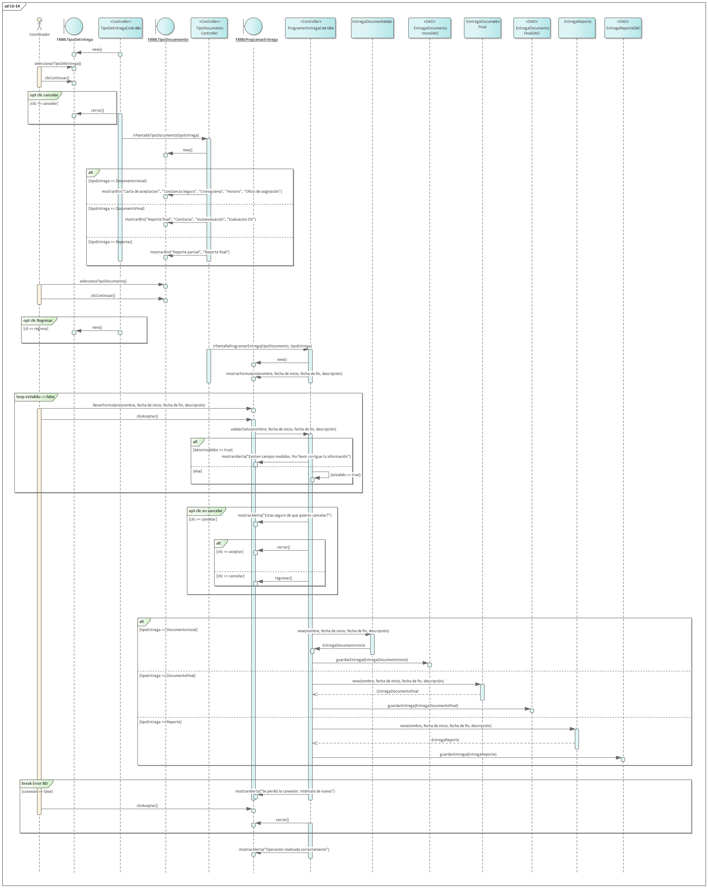

=== Vista de Procesos

==== Introducción al Modelo de Concurrencia

La Vista de Procesos aborda los aspectos dinámicos de la arquitectura, centrándose en cómo el sistema maneja la concurrencia, la sincronización y el flujo de ejecución para satisfacer los atributos de calidad críticos de Rendimiento (**ASR-RE-01**) y Confiabilidad (**ASR-CF-01**).

El sistema *ArchiHotel* adopta un modelo de concurrencia basado en hilos por solicitud (*Thread-per-Request*) sobre una arquitectura de servidores de aplicaciones *stateless* (sin estado). Este enfoque permite que múltiples instancias del servidor procesen solicitudes de manera paralela, delegando la gestión del estado transaccional a la base de datos y la gestión de la sesión a un almacén distribuido o tokens autocontenidos (JWT).

==== Análisis de Flujos Críticos

A continuación, se describen los procesos de ejecución para los escenarios más exigentes del sistema, detallando las estrategias de sincronización y consistencia.

===== Proceso de Creación de Reserva (Transaccionalidad Estricta)

Este es el flujo más crítico del sistema, gobernado por la regla de negocio de "Cero Dobles Reservas".

* **Inicio de Transacción:** El proceso inicia cuando el `API Gateway` recibe una solicitud `POST /reservas`. El contenedor de servlets asigna un hilo de trabajo del *pool* disponible.
* **Orquestación Sincrónica:** El componente `GestionReservas` actúa como orquestador. Invoca secuencialmente la validación de inventario y la creación de la reserva. Esta comunicación es **sincrónica** porque el cliente requiere una confirmación inmediata (éxito o fallo) para proceder al pago.
* **Manejo de Concurrencia (Race Conditions):** Para mitigar el riesgo de condiciones de carrera donde dos usuarios intentan reservar la misma habitación simultáneamente (Driver **CRN-1**), se implementa una estrategia de **Bloqueo Pesimista** (*Pessimistic Locking*) en la base de datos.
** Al consultar el inventario, el hilo de ejecución emite una sentencia `SELECT ... FOR UPDATE`, bloqueando las filas de la tabla `Inventario` correspondientes a la habitación y fechas solicitadas.
** Cualquier otro hilo que intente acceder a estas mismas filas será puesto en espera (*Wait*) hasta que la transacción original se confirme (*Commit*) o se revierta (*Rollback*).
* **Timeout y Deadlocks:** Para evitar bloqueos indefinidos, se configura un *timeout* de transacción de 5 segundos. Si el bloqueo no puede adquirirse en ese tiempo, se lanza una excepción de `ConcurrencyFailure`, retornando un error controlado al usuario.
* **Integridad ACID:** La creación de la reserva y el decremento del inventario ocurren dentro de una única frontera transaccional atómica. O suceden ambos, o no sucede ninguno.

===== Proceso de Consulta de Disponibilidad (Lectura Optimizada)

A diferencia de la reserva, este proceso prioriza la velocidad y el rendimiento (**ASR-RE-01**) sobre la consistencia inmediata.

* **Paralelismo en Lectura:** Las solicitudes de búsqueda son manejadas por el componente `ConsultaDisponibilidad`. Dado que se aplica el patrón **CQRS** (Segregación de Responsabilidad de Consultas y Comandos), estas lecturas se dirigen a nodos de réplica de base de datos o a una caché distribuida (Redis).
* **Sin Bloqueos:** Las operaciones de lectura utilizan un nivel de aislamiento `READ COMMITTED` sin bloqueos, permitiendo una alta concurrencia (500+ QPS) sin degradar el rendimiento de las transacciones de escritura.
* **Consistencia Eventual:** Se acepta una ventana de inconsistencia de milisegundos. El sistema "promete" disponibilidad en la búsqueda, pero la "garantiza" únicamente en el proceso de escritura (descrito anteriormente).

===== Proceso de Check-In (Orquestación de Estado)

Este flujo representa un cambio crítico de estado en el ciclo de vida del servicio, donde la reserva lógica se convierte en una ocupación física.

image::img/sequenceDiagrams/RegistrarCheckIn.png[align="center", title="Diagrama de Secuencia: Registrar Check-In"]

* **Validación de Pre-condiciones:** El proceso inicia validando que la reserva exista, esté en estado `CONFIRMADA` y que la fecha actual coincida con la fecha de entrada (`CheckInDate`).
* **Atomicidad Multi-Entidad:** A diferencia de una reserva simple, el Check-In requiere coordinar actualizaciones en tres entidades distintas dentro de una sola transacción ACID:
  1. **Reserva:** Cambia de estado `CONFIRMADA` a `CHECKED_IN` (para evitar doble uso).
  2. **Habitación:** Cambia de estado `LIMPIEZA/DISPONIBLE` a `OCUPADA` (bloqueo físico).
  3. **Estancia:** Se crea un nuevo registro de `Estancia` que agrupará los consumos futuros.
* **Manejo de Excepciones:** Si la habitación asignada originalmente está en mantenimiento (incidente de última hora), el sistema lanza una `HabitacionNoDisponibleException`, desencadenando el flujo alternativo de "Reasignación de Habitación" antes de continuar.

==== Patrones de Interacción y Comunicación

El sistema utiliza dos estilos de comunicación para desacoplar procesos:

1.  **Sincrónico (REST/HTTPS):** Utilizado para todas las interacciones directas con el usuario (UI) donde la latencia es crítica y se espera respuesta inmediata (ej. Login, Búsqueda, Confirmación).
2.  **Asincrónico (Messaging/Event-Driven):** Utilizado para procesos secundarios que no deben bloquear el hilo principal del usuario, cumpliendo con la táctica de *Defer Binding*.
    * *Ejemplo:* Al confirmarse una reserva, el componente `GestionReservas` publica un evento `ReservaCreada` en el bus de mensajes.
    * Los componentes `Notificaciones` (envío de email) y `Auditoria` (registro de log) se suscriben a este evento y lo procesan en paralelo, en hilos de ejecución separados (Background Workers). Esto mejora la latencia percibida por el usuario final.

==== Justificación del Estilo Arquitectónico

La elección de una arquitectura orientada a servicios con gestión de concurrencia pesimista en puntos críticos y optimista/sin bloqueo en lecturas es la única viable para satisfacer las restricciones opuestas del proyecto: integridad financiera absoluta (evitar sobreventas) y alta disponibilidad para búsquedas masivas.
