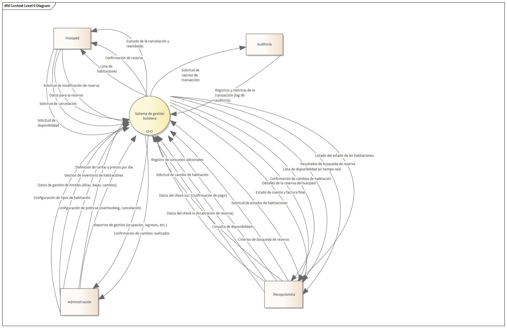
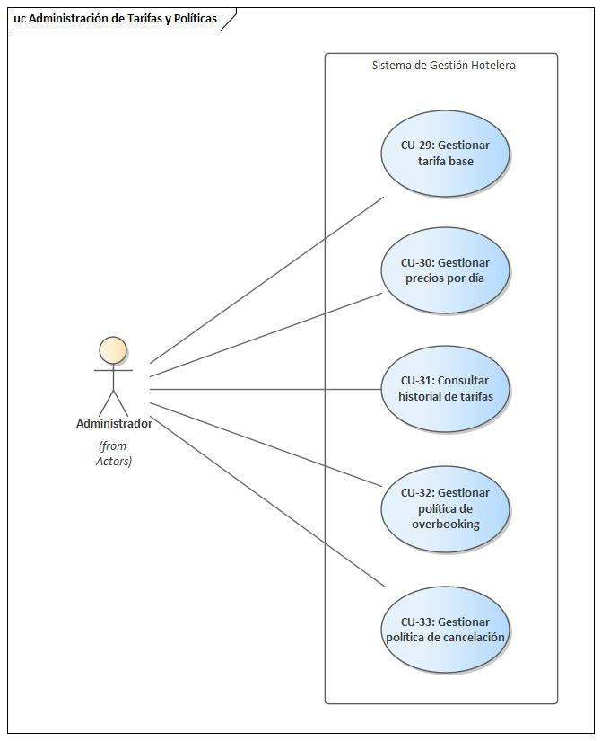
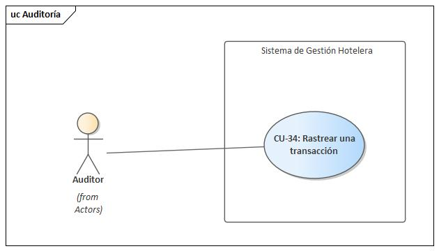

= Definición de Requerimientos.
:doctype: book
:lang: es
:encoding: utf-8
:toclevels: 3
:sectnums:

== Definición de Requerimientos

Este capítulo sienta las bases para el diseño arquitectónico del sistema. Primero, se justifica la necesidad del proyecto describiendo el problema de negocio y la oportunidad estratégica que representa. Luego, se formalizan las fronteras del diseño, identificando a los interesados clave y sus preocupaciones, las cuales servirán como la entrada principal para la metodología de Diseño Guiado por Atributos (ADD).

=== Planteamiento del Problema

La cadena hotelera, con una vasta operación que abarca más de 5,000 hoteles y un inventario superior a 1,000,000 de habitaciones, enfrenta un desafío crítico que limita su potencial de crecimiento y eficiencia operativa. La situación actual se caracteriza por una infraestructura tecnológica fragmentada, donde cada hotel depende de una solución local de reservaciones. Este modelo descentralizado ha generado un ecosistema propenso a inconsistencias, errores y una marcada falta de control centralizado, afectando negativamente tanto la experiencia del cliente como la rentabilidad del negocio.

La problemática central se manifiesta en fallos operativos recurrentes que impactan directamente en la confianza del cliente y en los ingresos. Entre los problemas más graves se encuentran las dobles reservas y los dobles cobros, incidentes que el sistema debe eliminar por completo para garantizar la fiabilidad. Además, la heterogeneidad de los sistemas actuales provoca una curva de aprendizaje pronunciada para el personal de recepción, dificultando que los empleados novatos alcancen la autonomía rápidamente y comprometiendo la agilidad en el servicio. La falta de una visión unificada del inventario también impide la implementación de estrategias de precios coherentes, generando desconfianza en el cliente cuando el precio mostrado al inicio de la reserva no coincide con el cobro final. Esta desorganización operativa no solo incrementa los costos, sino que también daña la reputación de la marca.

Más allá de resolver estos problemas operativos, existe una importante oportunidad de negocio sin explotar. La gestión de reservaciones, actualmente vista como un costo operativo, puede transformarse en una poderosa ventaja competitiva. Un sistema unificado permitiría a la administración implementar estrategias avanzadas, como precios dinámicos y políticas de ocupación optimizadas, para maximizar los ingresos. Específicamente, la capacidad de gestionar de forma controlada una política de *overbooking* del 10% por tipo de habitación representa una vía directa para maximizar la capacidad de venta sin riesgo de sobreventa accidental. La centralización del control sobre tarifas y políticas desde un único punto es fundamental para capitalizar esta oportunidad y responder con agilidad a las condiciones del mercado.

Por lo tanto, se justifica la creación de una plataforma de reservaciones centralizada y robusta. Este proyecto no solo busca mitigar los riesgos financieros y operativos inherentes al sistema actual, sino también posicionar a la cadena hotelera para un crecimiento sostenible. La nueva solución abordará la necesidad crítica de consistencia en los datos, reducirá drásticamente los errores en las reservaciones y mejorará la eficiencia operativa. Al unificar el inventario y simplificar los procesos, el sistema no solo mejorará la satisfacción del cliente, sino que se convertirá en una herramienta estratégica para la maximización de ingresos por ocupación, asegurando el liderazgo de la cadena en un mercado competitivo.

=== Alcance y Propósito del Diseño
Este apartado formaliza el alcance, las fronteras y el propósito del diseño arquitectónico para el nuevo Sistema de Reservaciones centralizado. Su objetivo es establecer un entendimiento común entre todos los interesados (stakeholders) sobre los límites del sistema, sus responsabilidades y las metas que se persiguen. Siguiendo la metodología Attribute-Driven Design (ADD), este análisis es el primer paso crucial, ya que las metas de negocio y las preocupaciones de los interesados, aquí descritas, servirán como la entrada principal para identificar y priorizar los impulsores arquitectónicos (Architectural Drivers), especialmente los atributos de calidad que darán forma a la estructura del software.

==== Diagrama de Contexto del Sistema

==== Fronteras del Sistema
Las fronteras definen qué funcionalidades y responsabilidades pertenecen al sistema a construir y cuáles quedan fuera o son gestionadas por sistemas externos. El diagrama de contexto visualiza estas fronteras, mostrando al Sistema de Reservaciones como el componente central que interactúa con usuarios y sistemas externos, pero que no los incluye.

===== Dentro del Alcance (In-Scope)
El sistema es responsable de todas las funcionalidades necesarias para la gestión centralizada del ciclo de vida de las reservaciones en los más de 5,000 hoteles de la cadena. El alcance general incluye:

* *Gestión de Reservaciones y Estancias:* Proporciona el flujo completo desde la consulta de disponibilidad hasta la confirmación de la reserva con pago inmediato. También gestiona las operaciones en el hotel, como el check-in, check-out y cambios de habitación.
* *Gestión de Catálogo y Tarifas (Backoffice):* Ofrece una interfaz para que la administración gestione el inventario de hoteles, habitaciones y sus tipos, así como las tarifas asociadas.
* *Administración Centralizada de Políticas:* Permite a los administradores configurar de manera centralizada las tarifas diarias y las políticas estratégicas de negocio, como el límite de overbooking del 10%.
* *Registro de Operaciones:* Incluye el registro de consumos adicionales durante la estancia del huésped (ej. desayunos) y la generación de logs para cada transacción con fines de auditoría.
* **Auditoría:** Generación de logs inmutables para trazabilidad financiera.

La primera versión (MVP) se centrará en el núcleo crítico del negocio para acelerar la entrega de valor, abarcando exclusivamente el flujo completo de reserva (disponibilidad -> confirmación -> pago) y las operaciones esenciales de recepción (check-in y check-out).

===== Fuera del Alcance (Out-of-Scope)
Para mantener el enfoque y la viabilidad del proyecto, las siguientes funcionalidades se excluyen explícitamente del alcance inicial y se consideran para futuras versiones:

* *Búsquedas Avanzadas y Recomendaciones:* No se incluirán filtros de búsqueda complejos ni motores de recomendación personalizados.
* *Integraciones con Terceros:* Se pospone la integración con agencias de viaje en línea (OTAs), sistemas de contabilidad externos o programas de fidelidad.
* *Funcionalidades Operativas Extendidas:* Tareas como la programación de personal de limpieza o la facturación electrónica no forman parte del alcance actual.

Además, el sistema dependerá de una pasarela de pagos externa para el procesamiento de transacciones con tarjeta de crédito. Se asume que este es un servicio robusto y fiable, por lo que el diseño se centrará en la correcta integración con dicha pasarela, pero no en la construcción de la lógica de procesamiento de pagos en sí misma.

==== Identificación y Análisis de Interesados (*Stakeholders*)

A continuación, se detallan los interesados y sus preocupaciones clave, que son la fuente de los requisitos de calidad del sistema.

|===
| Stakeholder | Preocupaciones Clave (Concerns)

| **Huésped** | **Confianza y Fiabilidad:** Garantía absoluta de que no ocurrirán dobles reservas ni dobles cobros. **Experiencia de Usuario (UX):** Un proceso de reserva rápido, con P95 ≤ 500ms en consultas y no más de 5 pasos.

| **Personal de Recepción** | **Facilidad de Uso y Eficiencia:** El sistema debe ser tan intuitivo que un novato pueda realizar un check-in de forma autónoma tras 10 minutos de instrucción. **Rendimiento:** La interfaz debe ser ágil para no generar filas en el mostrador.

| **Administración de la Cadena** | **Control Centralizado y Maximización de Ingresos:** Capacidad de gestionar tarifas y la política de overbooking del 10% de forma fiable desde un único punto. **Disponibilidad:** El sistema debe operar 24/7 para no perder ingresos.

| **Auditores** | **Trazabilidad e Integridad:** Cada transacción debe ser rastreable y consistente. El sistema debe generar logs inmutables para cada operación financiera o de inventario.

| **Equipo de Diseño y Desarrollo** | **Cumplimiento de ASRs:** Diseñar una arquitectura que satisfaga métricas exigentes como P95 ≤ 2.5s en confirmaciones con picos de 10 TPS. **Manejo de Concurrencia:** Evitar condiciones de carrera que lleven a dobles reservas. **Mantenibilidad:** La arquitectura debe ser modular para facilitar la evolución futura del sistema.

| **Líderes de Negocio** | **Mitigación de Riesgos y Alineación Estratégica:** La arquitectura debe ser resiliente, manejar picos de tráfico de forma controlada y asegurar la visión del proyecto: transformar la gestión de reservas en una ventaja competitiva.
|===

=== Diagramas de Casos de Uso
Los siguientes diagramas detallan las funcionalidades principales del sistema, agrupadas por los módulos de negocio más importantes que interactúan con los actores clave (Huésped, Recepcionista, Administrador y Auditor).

==== Gestión de Cuentas y Políticas

image::img/UCdiagrams/AdministracionDeCuentasDePersonal.jpg[Diagrama CU: Administración de Cuentas de Personal, width=600, align=center]

===== Gestión de Operaciones
image::img/UCdiagrams/GestionDeEstancias.jpg[Diagrama CU: Gestión de Estancias (Check-in/out), width=600, align=center]

image::img/UCdiagrams/GestionDeHabitaciones.jpg[Diagrama CU: Gestión de Habitaciones, width=600, align=center]

image::img/UCdiagrams/GestionDeHoteles.jpg[Diagrama CU: Gestión de Hoteles, width=600, align=center]

===== Flujo Principal
image::img/UCdiagrams/ReservacionesYCuentasDeHuesped.jpg[Diagrama CU: Reservaciones y Cuentas de Huésped, width=600, align=center]

=== Descripciones de casos de uso.

Casos de Uso (Huésped)
[#CU-01]
==== CU-01: Consultar disponibilidad de habitaciones

ID:: CU-01
Nombre:: Consultar disponibilidad de habitaciones
Autor:: Aldo Antonio Campos Gómez
Fecha de actualización:: 01-oct-25
Descripción:: Este caso de uso permite que el HUÉSPED logre identificar opciones de alojamiento viables mediante el ingreso de criterios de búsqueda (destino, fechas, ocupación) y la consulta en tiempo real al inventario. El resultado es una lista de tipos de habitación disponibles con tarifas calculadas y garantizadas listas para la selección.
Actor(es):: HUÉSPED
Disparador:: El HUÉSPED accede al módulo de reservaciones y solicita iniciar una búsqueda.
Precondiciones::
PRE-01: El catálogo de Hoteles, Tipos de Habitación y Tarifas están activos y vigentes en el sistema.
PRE-02: El sistema tiene acceso a las políticas de precios dinámicos y reglas de ocupación.
Flujo Normal::
. El Sistema muestra el formulario de búsqueda solicitando: Destino, Fecha de Entrada, Fecha de Salida y Cantidad de Personas (Adultos/Niños).
. El HUÉSPED introduce los criterios de búsqueda requeridos y confirma la solicitud.
. El Sistema valida que los datos sean lógicos (fechas coherentes, destino existente, capacidad máxima). (Ver FA 3.1).
. El Sistema consulta el inventario aplicando la Política de Overbooking. (Ver EX-01)
. El Sistema calcula la tarifa total dinámica por noche y filtra los resultados disponibles. (Ver FA 5.1) (Ver EX-01).
. El Sistema presenta la lista de Tipos de Habitación disponibles, mostrando imágenes, descripción y el precio total exacto.
. El HUÉSPED selecciona un Tipo de Habitación específico de la lista.
. Termina CU.
Flujos Alternos::
FA 3.1 Datos Inválidos
. El Sistema detecta inconsistencias (ej. Fecha Salida < Fecha Entrada, o número de huéspedes excede política global).
. El Sistema marca los campos erróneos y muestra un mensaje explicativo al HUÉSPED.
. Se regresa al paso 2 del Flujo Normal.
+
FA 5.1 Sin Disponibilidad
. El Sistema determina que no hay habitaciones que cumplan los criterios (incluso aplicando el margen de Overbooking).
. El Sistema notifica la falta de disponibilidad exacta y sugiere fechas alternativas cercanas o tipos de habitación superiores.
. Se regresa al paso 2 del Flujo Normal (permitiendo modificar criterios).
Excepciones::
EX-01 Sin conexión con la base de datos
. El sistema muestra al HUÉSPED el mensaje de error de conexión con la base de datos
. El HUÉSPED cierra el mensaje
. Termina CU
Postcondiciones::
POST-01: El sistema retiene el contexto de selección para el inicio del proceso de reserva (input del CU-02).
Reglas de negocio::
RN-01 Política de Overbooking: Se permite vender hasta un 10% adicional de la capacidad física real.
RN-02 Precios Dinámicos: El cálculo debe realizarse en el momento de la consulta basándose en la ocupación actual y temporada.
RN-03 Coherencia de Precios: El precio mostrado en este paso es inmutable si el cliente procede a reservar en la misma sesión (TTL de sesión).

[#CU-02]
==== CU-02: Reservar una Habitación

ID:: CU-02
Nombre:: Reservar una Habitación
Autor:: Aldo Antonio Campos Gómez
Fecha de actualización:: 01-oct-25
Descripción:: Este caso de uso permite que el HUÉSPED logre formalizar la intención de compra mediante la captura de datos personales, la validación final de disponibilidad en tiempo real y el bloqueo de inventario. El resultado es una transacción de reserva inicializada, con inventario retenido y precio congelado, lista para el procesamiento del pago.
Actor(es):: HUÉSPED
Disparador:: El HUÉSPED confirma su selección de habitación desde el catálogo o resultados de búsqueda.
Precondiciones::
PRE-01: Existe una selección de habitación activa en la sesión del usuario.
PRE-02: El sistema de tarifas ha calculado un precio total preliminar.
Flujo Normal::
. El Sistema solicita la información del titular de la reserva (Nombre, Apellidos, Correo, Teléfono).
. El HUÉSPED ingresa los datos solicitados y confirma la operación.
. El Sistema ejecuta una verificación de disponibilidad e intenta realizar el Bloqueo de Inventario para las fechas seleccionadas. (Ver FA 3.1)
. El Sistema congela el precio final y genera un identificador de transacción temporal. (Ver RN-02)
. El Sistema presenta el resumen de la reserva (Fechas, Habitación, Precio Total, Datos del Huésped) y solicita proceder al pago.
. El HUÉSPED verifica la información y selecciona la opción de pagar.
. Se Incluye al CU-03: Procesar Pago.
. El Sistema confirma la creación definitiva de la reserva y notifica al usuario el código de confirmación. (Ver EX-01)
. Termina CU.
Flujos Alternos::
FA 3.1 Conflicto de Concurrencia (Overbooking/Race Condition)
. El sistema detecta que el inventario seleccionado ya no está disponible.
. El sistema notifica al HUÉSPED que la habitación se ha agotado durante el proceso.
. Se regresa al paso 1 del flujo normal.
Excepciones::
EX-01 Sin conexión con la base de datos
. El sistema muestra al HUÉSPED el mensaje de error de conexión con la base de datos
. El HUÉSPED cierra el mensaje
. Termina CU
Postcondiciones::
POST-01: Se crea un registro de Reserva en estado "Confirmada" asociado al HUÉSPED.
POST-02: El inventario correspondiente (Habitación/Fecha) queda marcado como "Ocupado" de forma permanente para esa transacción.
Reglas de negocio::
RN-01: El sistema debe garantizar que el bloqueo del inventario sea atómico.
RN-02: El precio mostrado al inicio del flujo debe ser exactamente el mismo cobrado al final, independientemente de cambios de tarifa ocurridos durante los minutos de captura de datos.

[#CU-03]
==== CU-03: Hacer pago con tarjeta

ID:: CU-03
Nombre:: Hacer pago con tarjeta
Autor:: Aldo Antonio Campos Gómez
Fecha de actualización:: 01-oct-25
Descripción:: Este caso de uso permite que el HUÉSPED logre perfeccionar el contrato de reservación mediante la autorización segura de fondos y la conciliación transaccional. El resultado es una obligación financiera liquidada y el derecho de uso de la habitación garantizado.
Actor(es):: Huésped
Disparador:: El CU-02 invoca este proceso una vez que el usuario confirma su intención de reservar.
Precondiciones::
PRE-01: Existe una transacción de reserva en estado "Pendiente de Pago" con un monto congelado.
PRE-02: El temporizador de "Bloqueo de Inventario" no ha expirado (la habitación sigue retenida temporalmente).
Flujo Normal::
. El Sistema recupera los métodos de pago asociados al HUÉSPED.
. El HUÉSPED selecciona un método de pago y confirma la operación. (Ver FA 2.1)
. El Sistema envía la solicitud de cobro a la PASARELA DE PAGOS incluyendo el monto, la moneda y la llave de idempotencia.
. La PASARELA DE PAGOS procesa y retorna una confirmación de "Autorizado" con un código de autorización. (Ver EX-01)
. El Sistema registra el éxito financiero, cambia el estado de la reserva de "Pendiente" a "Pagada" y cambia el bloqueo de inventario a ocupación definitiva. (Ver FA 5.1)
. El Sistema genera el comprobante digital de la transacción.
. El HUESPED cierra la operación.
. Termina CU.
Flujos Alternos::
FA 2.1 Sin tarjetas registradas
. El HUESPED selecciona la opción de agregar un nuevo método de pago.
. El Sistema solicita los datos necesarios
. El HUESPED ingresa los datos correspondientes.
. Se regresa al paso 1 del flujo normal.
+
FA 5.1 Pago Rechazado (Fondos insuficientes / Fraude)
. La PASARELA DE PAGOS retorna un código de rechazo.
. El Sistema informa al HUÉSPED el motivo (si es público) y solicita un método de pago alternativo.
. Regresa al paso 1 del Flujo Normal.
Excepciones::
EX-01 Sin conexión con la base de datos
. El sistema muestra al HUÉSPED el mensaje de error de conexión con la base de datos
. El HUÉSPED cierra el mensaje
. Termina CU
+
EX-02 Fallo de comunicación con la PASARELA DE PAGOS
. El sistema muestra un mensaje de error notificando que no pudo conectarse con la pasarela de pagos y solicita al huésped intentar nuevamente más tarde
. El HUÉSPED cierra la operación.
. Termina el CU
Postcondiciones::
POST-01 (Conciliación): Existe un registro de transacción financiera vinculado unívocamente a la Reserva y al código de autorización externo.
POST-02: El estado de la reserva es "Confirmada".
Reglas de negocio::
RN-02 Transacción Única: El sistema debe garantizar que cada intento de cobro a la pasarela de pago sea procesado solo una vez para evitar dobles cobros.

[#CU-04]
==== CU-04: Cancelar una reservación

ID:: CU-04
Nombre:: Cancelar una reservación
Autor:: Aldo Antonio Campos Gómez
Fecha de actualización:: 01-oct-25
Descripción:: Este caso de uso permite que el HUÉSPED logre disolver el contrato de servicio y recuperar fondos aplicables mediante la identificación segura de la reserva y la aceptación de penalizaciones. El resultado es la liberación inmediata del inventario para su reventa y la programación del reembolso financiero según políticas.
Actor(es):: HUÉSPED
Disparador:: El HUÉSPED selecciona la opción de "Gestionar/Cancelar Reserva" en el portal.
Precondiciones::
PRE-01: La reserva debe encontrarse en un estado activo (Confirmada o Pagada)
Flujo Normal::
. El Sistema solicita el Código de Confirmación y el Apellido del Titular (o correo electrónico) para validar la propiedad de la reserva.
. El HUÉSPED ingresa las credenciales solicitadas y confirma la búsqueda.
. El Sistema recupera y válida que cumpla las condiciones para ser cancelada y recupera las políticas de cancelación vigentes para esa tarifa específica. (Ver FA 3.1) (Ver FA 3.2) (Ver EX-01)
. El Sistema calcula y muestra el monto exacto de la penalización y el monto a reembolsar.
. El HUÉSPED revisa los montos y confirma que desea proceder con la cancelación. (Ver FA 5.1)
. El Sistema cambiar el estado de la reserva a "Cancelada" (Ver EX-01).
. El Sistema confirma el éxito de la operación en pantalla y envía un correo electrónico de notificación. (Ver EX-01)
. Termina CU.
Flujos Alternos::
FA 3.1 Reserva No Encontrada o Credenciales Inválidas
. El sistema determina que la combinación de Código de Confirmación y Apellido no coincide con ningún registro activo.
. El sistema notifica el error de autenticación.
. Se regresa al paso 1 del flujo normal.
+
FA 3.2 Reserva No Cancelable
. El sistema detecta que la reserva ya pasó la fecha límite de cancelación o es una tarifa "No Reembolsable / No Cancelable".
. El sistema informa al HUÉSPED que la operación no está permitida según la política contratada.
. Termina CU.
Excepciones::
EX-01 Sin conexión con la base de datos
. El sistema muestra al HUÉSPED el mensaje de error de conexión con la base de datos
. El HUÉSPED cierra el mensaje
. Termina CU
Postcondiciones::
POST-01: La Reserva pasa a estado histórico "Cancelada".
POST-02: La disponibilidad del tipo de habitación incrementa para las fechas liberadas
POST-03: Se genera un registro de movimiento financiero (Reembolso) o una cuenta por pagar.
Reglas de negocio::
RN-01: El cálculo del reembolso debe aplicar las reglas y penalizaciones definidas en la Política de Cancelación vigente
RN-02: Toda cancelación debe ser registrada para permitir su rastreo por parte de Auditoría.

[#CU-05]
==== CU-05: Crear cuenta de huésped

ID:: CU-05
Nombre:: Crear cuenta de huésped
Autor:: Aldo Antonio Campos Gómez
Fecha de actualización:: 01-oct-25
Descripción:: Este caso de uso permite que un VISITANTE logre establecer una identidad digital verificada mediante el suministro de credenciales y la validación de propiedad del correo. El resultado es una cuenta de usuario activa con permisos para gestionar reservas y acumular historial.
Actor(es):: VISITANTE
Disparador:: El VISITANTE selecciona la opción "Crear Cuenta" en la pantalla de inicio o durante el flujo de reserva.
Precondiciones::
PRE-01: El sistema de gestión de identidades (IDM) se encuentra operativo.
Flujo Normal::
. El Sistema presenta el formulario de registro solicitando: Nombre, Apellidos, Correo Electrónico, Teléfono y Contraseña.
. El VISITANTE ingresa los datos y envía la solicitud.
. El Sistema valida sintaxis de los datos y verifica que el correo electrónico no exista previamente en el directorio de usuarios. (Ver FA 3.1)
. El Sistema aplica el algoritmo de hash a la contraseña y crea el registro de la cuenta en estado "Pendiente de Verificación". (Ver EX-01)
. El Sistema envía un código de un solo uso al email proporcionado. (Ver EX-02)
. El Sistema solicita al VISITANTE ingresar el código recibido para activar la cuenta.
. El VISITANTE ingresa el código correcto. (Ver FA 7.1)
. El Sistema valida el token y cambia el estado de la cuenta a "Activa". (Ver EX-01)
. Termina CU
Flujos Alternos::
FA 3.1: Correo electrónico ya registrado
. El Sistema detecta que el correo ya está vinculado a una cuenta activa o inactiva.
. El Sistema notifica: "Este correo ya está registrado" y ofrece la opción de "Recuperar Contraseña" o "Iniciar Sesión".
. Termina CU.
+
FA 7.1: Código de Verificación Inválido o Expirado
. El Sistema detecta que el código ingresado no coincide o ha caducado.
. El sistema solicita ingresar el código nuevamente o permite "Reenviar Código".
. Se regresa al paso 6 del Flujo Normal.
Excepciones::
EX-01 Sin conexión con la base de datos
. El sistema muestra al HUÉSPED el mensaje de error de conexión con la base de datos
. El HUÉSPED cierra el mensaje
. Termina CU
+
EX-01 Fallo en Envío de Correo
. El sistema crea la cuenta pero no logra conectar con el servidor de correos para enviar el token.
. El sistema informa al usuario: "Cuenta creada, pero no pudimos enviar el correo de verificación. Por favor intente entrar más tarde para reenviar el código".
. Termina CU
Postcondiciones::
POST-01: Existe un nuevo registro en la entidad USUARIOcon estado "Activo" y fecha de alta registrada.
POST-02: Se ha creado un perfil de HUESPED vinculado a la cuenta de Usuario
Reglas de negocio::
RN-01 (Seguridad de Credenciales): La contraseña nunca debe almacenarse en texto plano. Debe usarse un algoritmo de hash robusto con salt aleatorio. La contraseña debe tener min. 8 caracteres, 1 mayúscula y 1 número.

[#CU-06]
==== CU-06: Consultar mis reservaciones

ID:: CU-06
Nombre:: Consultar mis reservaciones
Autor:: Aldo Antonio Campos Gómez
Fecha de actualización:: 01-oct-25
Descripción:: Este caso de uso permite que el HUÉSPED logre monitorear su actividad contractual mediante la visualización estructurada y detallada de sus estancias pasadas, presentes y futuras. El resultado es acceso a la información necesaria para gestionar cambios, cancelaciones o recuperar facturas.
Actor(es):: HUÉSPED
Disparador:: El HUÉSPED selecciona la opción "Mis Viajes" o "Historial" en el menú principal.
Precondiciones::
PRE-01: El HUÉSPED debe tener una sesión activa y autenticada en el sistema.
Flujo Normal::
. El Sistema recupera y muestra una lista de todas las reservaciones asociadas a la cuenta del huésped. (Ver EX-01) (Ver FA-1.1)
. El HUÉSPED selecciona una RESERVACIÓN de la lista para ver su detalle.
. El Sistema muestra la información completa de la RESERVACIÓN seleccionada, incluyendo detalles del hotel, fechas, tipo de habitación y desglose de costos.
. El HUÉSPED cierra la RESERVACIÓN
. Termina el CU
Flujos Alternos::
FA 1.1: Huésped sin reservaciones
. El Sistema muestra al HUÉSPED que no tiene ninguna RESERVACIÓN.
. El HUÉSPED cierra el mensaje.
. Termina el CU
Excepciones::
EX-01 Sin conexión con la base de datos
. El sistema muestra al HUÉSPED el mensaje de error de conexión con la base de datos
. El HUÉSPED cierra el mensaje
. Termina CU
Postcondiciones::
Reglas de negocio::

Casos de Uso (Recepcionista)
[#CU-07]
==== CU-07: Registrar salida (Check-out)

ID:: CU-07
Nombre:: Registrar salida (Check-out)
Autor:: Aldo Antonio Campos Gómez
Fecha de actualización:: 01-oct-25
Descripción:: Este caso permite que el RECEPCIONISTA logre formalizar la salida del HUESPED mediante el cálculo de consumos finales, la validación de la estancia y la liquidación de la cuenta. El resultado es la liberación de la HABITACIÓN para su limpieza y el cierre financiero de la estancia.
Actor(es):: RECEPCIONISTA
Disparador:: El RECEPCIONISTA selecciona la opción de "Check-out" en el módulo de recepción.
Precondiciones::
PRE-01 El RECEPCIONISTA ha iniciado sesión correctamente en el sistema.
PRE-02 Existe una RESERVA en estado "Hospedado" asociada a una HABITACIÓN
Flujo Normal::
. El Sistema muestra un campo solicitando el número de HABITACIÓN a liberar.
. El RECEPCIONISTA ingresa el número de la HABITACIÓN.
. El Sistema recupera y muestra los consumos registrados en la CUENTA del HUESPED. (Ver FA 3.1).
. El RECEPCIONISTA informa el monto al HUESPED y selecciona el método de pago (Efectivo/Tarjeta).
. El RECEPCIONISTA confirma la transacción de pago en el sistema. (Ver EX-02).
. El Sistema registra el pago, cambia el saldo de la CUENTA a cero y genera el comprobante de pago.
. El Sistema actualiza el estado de la RESERVA y cambia el estado de la HABITACIÓN automáticamente.
. El Sistema muestra un mensaje de "Salida Exitosa".
. Termina CU.
Flujos Alternos::
FA 3.1 Sin saldo pendiente (Saldo Cero)}
. El Sistema detecta que la CUENTA del HUESPED tiene un saldo de $0.00.
. El SISTEMA habilita directamente la opción de finalizar estancia sin requerir pago.
. El RECEPCIONISTA confirma la salida.
. Se salta al paso 7 del flujo normal.
+
FA 3.2 Habitación no encontrada o ya liberada
. El SISTEMA busca la HABITACIÓN y detecta que no está ocupada o el número es incorrecto.
. El SISTEMA muestra un mensaje de advertencia "Habitación no válida para Check-out".
. El RECEPCIONISTA corrige el número.
. Regresa al paso 2 del flujo normal.
Excepciones::
EX-01 Sin conexión con la base de datos
. El sistema muestra al HUÉSPED el mensaje de error de conexión con la base de datos
. El HUÉSPED cierra el mensaje
. Termina CU
+
EX-02. Transacción de pago rechazada
. La pasarela de pagos informa al SISTEMA que la tarjeta ha sido declinada.
. El SISTEMA muestra el mensaje "Pago Rechazado" al RECEPCIONISTA.
. Regresa al paso 4 del flujo normal.
Postcondiciones::
POST-01 La RESERVA se encuentra registrada con el estado "Finalizada".
POST-02 La HABITACIÓN cambia su estado a "Pendiente de Limpieza” en el inventario.
POST-03 La CUENTA del HUESPED registra un saldo final de $0.00 y estado "Cerrada".
Reglas de negocio::
RN-01 No se puede completar el Check-out si la CUENTA presenta un saldo deudor.

[#CU-08]
==== CU-08: Registrar llegada (check-in)

ID:: CU-08
Nombre:: Registrar llegada (check-in)
Autor:: Aldo Antonio Campos Gómez
Fecha de actualización:: 01-oct-25
Descripción:: Este caso de uso permite que el RECEPCIONISTA logre formalizar la estancia del HUESPED mediante la recuperación de la RESERVA existente, la validación de identidad y la confirmación de la HABITACIÓN asignada. El resultado es el registro de ocupación en el sistema y la actualización del inventario de habitaciones.
Actor(es):: RECEPCIONISTA
Disparador:: El RECEPCIONISTA selecciona la opción de "Realizar Check-in" en el menú principal
Precondiciones::
PRE-01 El RECEPCIONISTA ha iniciado sesión correctamente en el sistema.
PRE-02 Existe una RESERVA con estado "Confirmada" cuya fecha de llegada coincide con la fecha actual del sistema
Flujo Normal::
. El SISTEMA solicita el criterio de búsqueda de la RESERVA (código de confirmación o apellido del HUESPED).
. El RECEPCIONISTA ingresa los datos solicitados del HUESPED.
. El SISTEMA recupera y muestra los detalles de la RESERVA (fechas, tipo de habitación, HUESPED titular) y el estado de la HABITACIÓN asignada. (Ver FA 3.1) (Ver EX-01).
. El RECEPCIONISTA solicita identificación oficial al HUESPED, valida los datos y confirma la operación en el sistema. (Ver FA 4.1).
. El SISTEMA cambia el estado de la RESERVA y de la HABITACIÓN, y genera la tarjeta de registro digital.
. El SISTEMA muestra un mensaje de éxito confirmando el número de HABITACIÓN.
. Termina CU.
Flujos Alternos::
FA 3.1 Reserva no encontrada
. El SISTEMA detecta que no existen coincidencias con los datos ingresados.
. El SISTEMA muestra un mensaje de "Reserva no encontrada".
. El RECEPCIONISTA confirma el mensaje.
. Se regresa al paso 2 del flujo normal.
+
FA 4.1 Cancelación del proceso por el usuario
. El RECEPCIONISTA cancela la operación de check-in.
. El SISTEMA limpia los datos en pantalla sin realizar cambios en la base de datos.
. Termina CU.
Excepciones::
EX-01 Sin conexión con la base de datos
. El sistema muestra al RECEPCIONISTA el mensaje de error de conexión con la base de datos
. El RECEPCIONISTA cierra el mensaje
. Termina CU
Postcondiciones::
POST-01 La RESERVA pasa a estado "Hospedado" (In-House).
POST-02 La HABITACIÓN pasa a estado "Ocupada" en el inventario, impidiendo nuevas reservas sobre ella.
Reglas de negocio::
RN-01 No se puede realizar Check-in si la HABITACIÓN asignada tiene estado "Sucia" o "Mantenimiento".

[#CU-09]
==== CU-09: Cambiar de habitación a un huésped

ID:: CU-09
Nombre:: Cambiar de habitación a un huésped
Autor:: Aldo Antonio Campos Gómez
Fecha de actualización:: 01-oct-25
Descripción:: Este caso de uso permite que el RECEPCIONISTA logre reasignar la ubicación física de un cliente mediante la selección de una nueva habitación disponible y el traspaso de la estancia. El resultado es la liberación de la habitación anterior para limpieza y la ocupación registrada de la nueva unidad.
Actor(es):: RECEPCIONISTA
Disparador:: El RECEPCIONISTA inicia el proceso por solicitud del huésped o necesidad operativa.
Precondiciones::
PRE-01: El RECEPCIONISTA ha iniciado sesión en el sistema.
PRE-02: Debe existir una RESERVA en estado "Confirmada" o "En Casa" (Check-in) vinculada al HUÉSPED.
Flujo Normal::
. El Sistema muestra el tablero de gestión de estancias activas.
. El RECEPCIONISTA busca y selecciona la estancia del huésped que requiere el cambio.
. El Sistema recupera los detalles de la ocupación actual y despliega una lista de HABITACIONes disponibles que coinciden con la categoría actual. (Ver FA 3.1)
. El RECEPCIONISTA selecciona la nueva HABITACIÓN destino de la lista.
. El Sistema solicita confirmación para proceder con el cambio de asignación.
. El RECEPCIONISTA confirma la operación.
. El Sistema actualiza el registro de la ESTANCIA con la nueva HABITACIÓN, cambia el estado de la nueva HABITACIÓN a "Ocupada"
. El Sistema marca la HABITACIÓN anterior como "Pendiente de Limpieza". (Ver EX-01)
. Termina CU.
Flujos Alternos::
FA 3.1: Cambio a un tipo de habitación diferente
. El RECEPCIONISTA filtra la búsqueda para ver habitaciones de otras categorías (Superiores o Inferiores) por falta de disponibilidad o solicitud del cliente.
. El RECEPCIONISTA selecciona una habitación de diferente categoría.
. El Sistema recalcula la tarifa total de la estancia basándose en la diferencia de precio y muestra el nuevo saldo. (Ver RN-01)
. Se regresa al paso 5 del Flujo Normal.
Excepciones::
EX-01 Sin conexión con la base de datos
. El sistema muestra al HUÉSPED el mensaje de error de conexión con la base de datos
. El HUÉSPED cierra el mensaje
. Termina CU
Postcondiciones::
POST-01: La estancia del HUESPED queda asociada a la nueva HABITACIÓN.
POST-02: La HABITACIÓN anterior queda en estado "Sucia/Pendiente de Limpieza".
POST-03: La nueva HABITACIÓN queda en estado "Ocupada".
Reglas de negocio::
RN-01: Cualquier diferencia en la tarifa por cambio de tipo de HABITACIÓN debe ser registrada en la cuenta del HUÉSPED.

[#CU-10]
==== CU-10: Registrar consumo o servicio

ID:: CU-10
Nombre:: Registrar consumo o servicio
Autor:: Aldo Antonio Campos Gómez
Fecha de actualización:: 01-oct-25
Descripción:: Este caso de uso permite que el RECEPCIONISTA logre imputar costos adicionales a la estancia del HUESPED mediante la selección de la HABITACIÓN y el registro del producto o servicio adquirido. El resultado es la actualización del saldo deudor en la CUENTA del HUESPED y el registro del consumo en el historial.
Actor(es):: RECEPCIONISTA
Disparador:: El RECEPCIONISTA selecciona la opción "Cargar Consumo" en el menú de gestión de estancias..
Precondiciones::
PRE-01 El RECEPCIONISTA ha iniciado sesión correctamente en el Sistema.
PRE-02 Existe una RESERVA con estado "Hospedado" activa para el HUESPED.
Flujo Normal::
. El Sistema solicita el número de HABITACIÓN o apellido del HUESPED.
. El RECEPCIONISTA ingresa el criterio de búsqueda.
. El Sistema recupera la información de la estancia y muestra el estado actual de la CUENTA. (Ver FA 3.1).
. El RECEPCIONISTA ingresa el tipo de servicio, el concepto detallado y el monto a cargar.
. El Sistema solicita confirmación para aplicar el cargo a la CUENTA mostrada.
. El RECEPCIONISTA confirma la operación. (Ver FA 6.1).
. El Sistema registra la transacción, actualiza el saldo total de la CUENTA y muestra un mensaje de éxito. (Ver EX-01).
. Termina CU.
Flujos Alternos::
FA 3.1 Estancia no encontrada
. El Sistema busca la HABITACIÓN o HUESPED y no encuentra coincidencias activas.
. El Sistema notifica "Estancia no encontrada o inactiva".
. El RECEPCIONISTA verifica los datos.
. Regresa al paso 2 del flujo normal.
+
FA 6.1 Cancelación de cargo
. El RECEPCIONISTA detecta un error en el monto o concepto ingresado antes de guardar.
. El RECEPCIONISTA selecciona la opción de cancelar.
. El Sistema limpia los campos de captura sin modificar la base de datos.
. Termina CU.
Excepciones::
EX-01 Sin conexión con la base de datos
. El sistema muestra al HUÉSPED el mensaje de error de conexión con la base de datos
. El HUÉSPED cierra el mensaje
. Termina CU
Postcondiciones::
POST-01 La CUENTA del HUÉSPED tiene registrado un nuevo movimiento de tipo "Cargo" con el monto especificado.
POST-02 El saldo total de la CUENTA se encuentra actualizado sumando el nuevo importe.
Reglas de negocio::
RN-02 El monto del cargo debe ser mayor a cero y en la moneda configurada por el Sistema.

[#CU-11]
==== CU-11: Buscar reserva de huésped

ID:: CU-11
Nombre:: Buscar reserva de huésped
Autor:: José Luis Silva Gómez
Fecha de actualización:: 01-oct-25
Descripción:: Este caso de uso permite que el RECEPCIONISTA logre localizar una RESERVA específica mediante la introducción de criterios de filtrado como nombre, apellido o código de confirmación. El resultado es la recuperación de la información detallada de la estancia para su gestión posterior.
Actor(es):: RECEPCIONISTA
Disparador:: El RECEPCIONISTA selecciona la opción "Buscar Reserva" en el panel principal.
Precondiciones::
PRE-01: El RECEPCIONISTA ha iniciado sesión correctamente en el Sistema
Flujo Normal::
. El Sistema muestra el formulario de búsqueda de reservas.
. El RECEPCIONISTA introduce los criterios de búsqueda (Apellido del HUESPED, código de reserva o fecha).
. El Sistema consulta la base de datos y muestra un listado de las coincidencias encontradas. (Ver FA 3.1) (Ver EX-01).
. El RECEPCIONISTA selecciona la RESERVA de interés dentro de la lista.
. El Sistema recupera la información completa de la RESERVA seleccionada y la presenta en pantalla.
. Termina CU.
Flujos Alternos::
FA 3.1 Búsqueda sin resultados
. El Sistema completa la búsqueda y no encuentra registros que coincidan con los datos ingresados.
. El Sistema muestra un mensaje informativo "No se encontraron reservas con ese criterio".
. El RECEPCIONISTA modifica los criterios de búsqueda.
. Regresa al paso 2 del flujo normal.
Excepciones::
EX-01 Sin conexión con la base de datos
. El sistema muestra al RECEPCIONISTA el mensaje de error de conexión con la base de datos
. El RECEPCIONISTA cierra el mensaje
. Termina CU
Postcondiciones::
Reglas de negocio::

[#CU-12]
==== CU-12: Consultar estado de habitación

ID:: CU-12
Nombre:: Consultar estado de habitación
Autor:: José Luis Silva Gómez
Fecha de actualización:: 01-oct-25
Descripción:: Este caso de uso permite que el RECEPCIONISTA logre supervisar la operatividad del hotel mediante la recuperación del inventario completo de habitaciones y sus condiciones actuales (limpieza/ocupación). El resultado es la obtención de un panorama en tiempo real para la toma de decisiones sobre asignaciones.
Actor(es):: RECEPCIONISTA
Disparador:: El RECEPCIONISTA selecciona la opción "Monitor de Habitaciones" en el panel principal.
Precondiciones::
PRE-01 El RECEPCIONISTA ha iniciado sesión correctamente en el Sistema.
Flujo Normal::
. El Sistema consulta el inventario completo de habitaciones y sus estados actuales en la base de datos. (Ver EX-01).
. El Sistema despliega una vista gráfica (grid o lista) representando cada HABITACIÓN con un indicador visual de su estado.
. El RECEPCIONISTA visualiza la información general o aplica filtros específicos para refinar la vista. (Ver FA 3.1).
. El Sistema mantiene la vista actualizada en tiempo real.
. Termina CU.
Flujos Alternos::
FA 3.1 Filtrado por estado específico
. El RECEPCIONISTA selecciona un criterio de filtrado (ej. Solo "Sucias" o Solo "Disponibles").
. El Sistema procesa el filtro y actualiza la vista mostrando únicamente las HABITACIONES que cumplen la condición.
. El RECEPCIONISTA analiza la información filtrada.
. Regresa al paso 4 del flujo normal.
Excepciones::
EX-01 Sin conexión con la base de datos
. El sistema muestra al HUÉSPED el mensaje de error de conexión con la base de datos
. El HUÉSPED cierra el mensaje
. Termina CU
Postcondiciones::
Reglas de negocio::

Casos de Uso (Administrador - Gestión de Hoteles y Habitaciones)
[#CU-13]
==== CU-13: Registrar nuevo hotel

ID:: CU-13
Nombre:: Registrar nuevo hotel
Autor:: Angel Jonathan Puch Hernández
Fecha de actualización:: 03-oct-25
Descripción:: Este caso de uso permite que el ADMINISTRADOR logre incorporar una nueva propiedad a la cadena mediante la captura de la información fiscal, ubicación y características generales. El resultado es la creación de un nuevo registro de HOTEL en el catálogo del Sistema, habilitándolo para la configuración de habitaciones.
Actor(es):: ADMINISTRADOR
Disparador:: El ADMINISTRADOR selecciona la opción "Registrar Nuevo Hotel" en el panel de configuración global.
Precondiciones::
PRE-01: El ADMINISTRADOR ha iniciado sesión con privilegios de superusuario en el Sistema.
Flujo Normal::
. El Sistema despliega el formulario de registro para una nueva propiedad.
. El ADMINISTRADOR ingresa los datos generales del HOTEL (Nombre, Dirección, Categoría, RFC/NIT).
. El Sistema valida que los datos cumplan con el formato requerido y que los campos obligatorios estén completos. (Ver FA 3.1).
. El Sistema verifica que no exista previamente un HOTEL registrado con el mismo identificador fiscal o nombre. (Ver FA 4.1).
. El Sistema guarda el nuevo registro en la base de datos. (Ver EX-01).
. El Sistema muestra un mensaje de "Hotel Registrado Exitosamente".
. Termina CU.
Flujos Alternos::
FA 3.1: Datos inválidos o incompletos
. El Sistema detecta errores de formato o campos vacíos obligatorios.
. El Sistema resalta los campos afectados y muestra un mensaje de ayuda.
. El ADMINISTRADOR corrige la información.
. Regresa al paso 3 del flujo normal.
FA 4.1: Hotel duplicado
. El Sistema detecta que ya existe un HOTEL con el mismo nombre o identificador fiscal.
. El Sistema muestra el mensaje "El Hotel ya se encuentra registrado" y bloquea el guardado.
. El ADMINISTRADOR modifica los datos o cancela la operación.
. Regresa al paso 2 del flujo normal.
Excepciones::
EX-01: Sin conexión con la base de datos
. El sistema muestra al ADMINISTRADOR el mensaje de error de conexión con la base de datos.
. El ADMINISTRADOR cierra el mensaje.
. Termina CU.
Postcondiciones::
POST-01: Existe un nuevo registro de HOTEL en la base de datos con estado "Activo".
Reglas de negocio::

[#CU-14]
==== CU-14: Consultar información de hotel

ID:: CU-14
Nombre:: Consultar información de hotel
Autor:: Angel Jonathan Puch Hernández
Fecha de actualización:: 03-oct-25
Descripción:: Este caso de uso permite que el ADMINISTRADOR visualice la configuración completa de su hotel (datos generales, fotos, políticas y servicios) tal como está registrada en el sistema. El objetivo es verificar que la información sea correcta antes de que sea publicada para los huéspedes.
Actor(es):: ADMINISTRADOR
Disparador:: El ADMINISTRADOR selecciona la opción "Visualizar Hotel" en el menú principal.
Precondiciones::
PRE-01: El ADMINISTRADOR ha iniciado sesión correctamente y tiene un hotel asignado a su cuenta.
Flujo Normal::
. El Sistema consulta la información completa del hotel asociado al usuario en la base de datos. (Ver EX-01).
. El Sistema despliega la ficha del hotel organizada por secciones (General, Ubicación, Fotos, Políticas).
. El ADMINISTRADOR navega entre las pestañas para revisar la información registrada.
. El ADMINISTRADOR confirma que los datos son actuales.
. Termina CU.
Flujos Alternos::
FA 3.1: Vista Previa (Ver como Huésped)
. El ADMINISTRADOR selecciona el botón "Vista Previa".
. El Sistema genera una vista simulando cómo vería la información un cliente en la App/Web.
. El ADMINISTRADOR valida la apariencia visual.
. Regresa al paso 3 del flujo normal.
Excepciones::
EX-01: Sin conexión con la base de datos
. El sistema muestra al ADMINISTRADOR el mensaje de error de conexión con la base de datos.
. El ADMINISTRADOR cierra el mensaje.
. Termina CU.
Postcondiciones::
Reglas de negocio::
RN-01: Un Administrador solo puede consultar la información de los hoteles a los que tiene permisos explícitos (no puede ver hoteles de otra gerencia).
[#CU-15]
==== CU-15: Actualizar información de hotel

ID:: CU-15
Nombre:: Actualizar información de hotel
Autor:: Angel Jonathan Puch Hernández
Fecha de actualización:: 03-oct-25
Descripción:: El ADMINISTRADOR modifica los datos descriptivos y de contacto de un hotel registrado. El objetivo es mantener actualizada la información que está asociada a un HOTEL correspondiente a un ADMINISTRADOR.
Actor(es):: ADMINISTRADOR
Disparador:: El ADMINISTRADOR selecciona la opción "Guardar Cambios" dentro del formulario de edición del hotel.
Precondiciones::
PRE-01: El ADMINISTRADOR ha iniciado sesión y tiene permisos de edición sobre el hotel seleccionado.
Flujo Normal::
. El sistema presenta un formulario con la información actual del HOTEL cargada en los campos editables.
. El ADMINISTRADOR modifica los campos deseados y confirma los cambios.
. El Sistema valida que los campos obligatorios (Nombre, Dirección) no estén vacíos y tengan el formato correcto. (Ver FA 3.1).
. El Sistema guarda la actualización en la base de datos. (Ver EX-01).
. El Sistema confirma al ADMINISTRADOR que los cambios fueron guardados exitosamente.
. Termina CU.
Flujos Alternos::
FA 3.1: Datos inválidos o incompletos
. Si el sistema verifica si hay errores en la validación, notifica al ADMINISTRADOR resaltando los campos incorrectos.
. Se regresa al paso 1 del flujo normal.
Excepciones::
EX-01: Sin conexión con la base de datos
. El sistema muestra al ADMINISTRADOR el mensaje de error de conexión con la base de datos.
. El ADMINISTRADOR cierra el mensaje.
. Termina CU.
Postcondiciones::
POST-01: La información pública del HOTEL refleja los cambios realizados inmediatamente.
Reglas de negocio::
RN-01: No se puede cambiar el ID único del hotel una vez creado.

[#CU-16]
==== CU-16: Desactivar hotel

ID:: CU-16
Nombre:: Desactivar hotel
Autor:: Angel Jonathan Puch Hernández
Fecha de actualización:: 03-oct-25
Descripción:: Este caso de uso le permite al ADMINISTRADOR cambiar el estado de un HOTEL a "Inactivo". El HOTEL deja de estar disponible para nuevas búsquedas y reservaciones, pero su historial financiero y operativo se conserva por auditoría.
Actor(es):: Administrador
Disparador:: El ADMINISTRADOR selecciona la opción "Desactivar" en el perfil de un hotel existente.
Precondiciones::
PR-01: El HOTEL existe en el sistema y está en estado "Activo".
PR-02: El ADMINISTRADOR tiene permisos de superusuario.
Flujo Normal::
. El Sistema verifica si existen RESERVACIONES futuras confirmadas asociadas a este HOTEL y al no encontrar conflictos, el Sistema muestra una advertencia indicando que el HOTEL desaparecerá de los canales de venta. (Ver FA 1.1)
. El ADMINISTRADOR confirma la operación e ingresa un motivo de desactivación. (Ver FA 2.1)
. El Sistema actualiza el estado del HOTEL a "Inactivo", registra la fecha y usuario responsable, y muestra un mensaje de éxito. (Ver EX-01)
. Termina el CU.
Flujos Alternos::
FA 1.1 HOTEL con reservaciones futuras:
. Si el sistema detecta que existen RESERVACIONES futuras para este HOTEL, bloquea la acción. Muestra un mensaje al ADMINISTRADOR indicando: "La desactivación no es posible. El hotel tiene [X] reservaciones futuras. Por favor, proceda con la reubicación o cancelación de estas antes de intentar desactivarlo nuevamente."
. Termina CU
+
FA 2.1 Cancelación del usuario:
. El ADMINISTRADOR decide no desactivar el HOTEL y cancela la operación en el diálogo de confirmación.
. Termina CU.
Excepciones::
EX-01 Sin conexión con la base de datos
. El sistema notifica al usuario que no hay conexión con la base de datos
. Termina CU
Postcondiciones::
POST-01 El estado del HOTEL se actualiza a "Inactivo". El HOTEL ya no es visible para los HUÉSPEDES y no se pueden realizar nuevas RESERVACIONES en él. Todos los datos históricos se conservan.
Reglas de negocio::
RN-01 Por políticas de auditoría, los registros de hoteles no se eliminan físicamente, solo se desactivan.
RN-02 Bloqueo por Dependencia: No se puede desactivar una entidad padre (Hotel) si tiene entidades hijas activas con compromisos comerciales (Reservas futuras).

[#CU-17]
==== CU-17: Registrar tipo de habitación

ID:: CU-17
Nombre:: Registrar tipo de habitación
Autor:: Angel Jonathan Puch Hernández
Fecha de actualización:: 03-oct-25
Descripción:: Este caso de uso le permite al ADMINISTRADOR crear un nuevo TIPO de HABITACIÓN(ej. Junior Suite, Doble, King) definiendo sus capacidades y características para ser asignada posteriormente al inventario físico.
Actor(es):: Administrador
Disparador:: El ADMINISTRADOR selecciona "Nuevo Tipo de Habitación".
Precondiciones::
PR-01: El catálogo de servicios y amenidades está cargado.
Flujo Normal::
. El sistema muestra el formulario para registrar un nuevo TIPO de HABITACIÓN.
. El ADMINISTRADOR ingresa los datos del nuevo TIPO de HABITACIÓN (Nombre, Descripción, Capacidad Base, Capacidad Máxima y Amenidades) y confirma.
. El Sistema valida que la Capacidad Máxima >= Capacidad Base, verifica que el nombre no esté duplicado, guarda el registro y muestra un mensaje de confirmación. (Ver FA 3.1) (Ver FA 3.2) (Ver EX-01)
. Termina CU.
Flujos Alternos::
FA 3.1 Inconsistencia de Capacidad:
. El Sistema detecta que la Capacidad Base es mayor a la Máxima y muestra error: "La capacidad base no puede exceder la capacidad máxima configurada".
. Se regresa al paso 1 del flujo normal
+
FA 3.2 Nombre duplicado:
. Si el nombre ya existe, el sistema informa al ADMINISTRADOR y solicita cambio de nombre.
. Se regresa al paso 1 del flujo normal.
Excepciones::
EX-01 Sin conexión con la base de datos
. El sistema notifica al usuario que no hay conexión con la base de datos
. Termina CU
Postcondiciones::
POST-01: Se crea un nuevo TIPO de HABITACIÓN lista para asociarse a tarifas y HABITACIONES físicas.
Reglas de negocio::
RN-01 Unicidad: El nombre del TIPO de HABITACIÓN debe ser único por HOTEL.

[#CU-18]
==== CU-18: Consultar tipos de habitación

ID:: CU-18
Nombre:: Consultar tipos de habitación
Autor:: Aldo Antonio Campos Gómez
Fecha de actualización:: 03-oct-25
Descripción:: Este CU permite que el Administrador logre consultar todos los tipos de habitación registrados mediante la recuperación y visualización de la lista de categorías de habitación existentes en el sistema. El resultado es que el Administrador obtiene visibilidad actualizada de la oferta de habitaciones para su gestión operativa
Actor(es):: Administrador Hotelero
Disparador:: El Administrador selecciona "Tipos de Habitación"
Precondiciones::
PRE-01: El Administrador ha iniciado sesión exitosamente
Flujo Normal::
. El Sistema muestra un formulario de búsqueda con filtros obligatorios (HOTEL, Rango de Capacidad) y opcionales (Nombre de categoría).
. El ADMINISTRADOR introduce los criterios de filtrado para acotar la consulta
. El Sistema valida que los criterios de búsqueda cumplan con el formato esperado. (Ver FA 3.1).
. El Sistema recupera y muestra el catálogo de TIPOSHABITACION (nombre, capacidadMaxima, camas y estado) que coinciden con los filtros ingresados. (Ver FA 4.1). (Ver EX-01).
. El administrador visualiza el catálogo.
. Termina CU
Flujos Alternos::
FA 3.1 Criterios de búsqueda inválidos
. El sistema detecta caracteres no permitidos o formatos erróneos en los filtros.
. El Sistema marca los campos erróneos y muestra un mensaje de validación.
. El flujo regresa al paso 2 del Flujo Normal.
+
FA 4.1 No se encontraron coincidencias:
. El Sistema determina que no existen tipos de habitación que coincidan con los filtros aplicados.
. El Sistema muestra un mensaje informativo "Sin resultados" y sugiere cambiar los criterios de búsqueda.
. El flujo regresa al paso 2 del Flujo Normal.
Excepciones::
EX-01. No hay conexión con la base de datos
. El sistema muestra al ADMINISTRADOR un mensaje notificando que se perdió la conexión con la base de datos
. El ADMINISTRADOR cierra el mensaje
. Termina CU
Postcondiciones::
Reglas de negocio::

[#CU-19]
==== CU-19: Actualizar tipo de habitación

ID:: CU-19
Nombre:: Actualizar tipo de habitación
Autor:: Angel Jonathan Puch Hernández
Fecha de actualización:: 03-oct-25
Descripción:: Este caso permite que el ADMINISTRADOR logre modificar los atributos descriptivos y reglas de capacidad de un TIPOHABITACION existente mediante la edición validada contra RESEVAs futuras. El resultado es la actualización consistente del catálogo de venta sin violar contratos de RESERVAs ya adquiridas.
Actor(es):: Administrador
Disparador:: El ADMINISTRADOR selecciona la acción "Editar" sobre un registro específico en la vista de lista de TIPOSHABITACION (procedente del CU-18).
Precondiciones::
PRE-01: El Administrador ha iniciado sesión exitosamente
PRE-02: El registro del tipo de habitación existe y está activo.
Flujo Normal::
. El Sistema recupera los datos actuales de TIPOHABITACION (Nombre, Descripción, Capacidad Base, Capacidad Máxima). (VER EX-01)
. El Sistema muestra un formulario de edición precargado con los datos de ese TIPOHABITACION.
. El ADMINSTRADOR modifica los atributos necesarios y confirma la operación
. El Sistema valida que la información ingresada cumpla con el formato esperado. (Ver FA-4.1)
. El Sistema valida que los cambios no entren en conflicto con reservas futuras activas asociadas a este tipo. (Ver FA 5.1)
. El Sistema verifica que el registro no haya sido modificado por otro usuario mientras se editaba. (Ver EX-02)
. El sistema guarda los nuevos datos en la base de datos y confirma la actualización exitosa (Ver EX-01)
. Termina CU
Flujos Alternos::
FA-4.1 Validación de formato fallida
. El Sistema detecta campos vacíos obligatorios o valores ilógicos.
. El Sistema resalta los errores y solicita corrección.
. Regresa al paso 3.
+
FA-5.1 Conflicto de integridad
. El Sistema detecta que la reducción de capacidad viola reservas futuras que tienen 3 o 4 huéspedes registrados en este tipo de habitación.
. El Sistema bloquea la operación y muestra una alerta crítica: "No se puede reducir la capacidad: Existen [X] reservas futuras afectadas".
. El Sistema sugiere crear un nuevo tipo de habitación en lugar de modificar el actual o cancelar las reservas afectadas manualmente.
. Regresa al paso 3.
Excepciones::
EX-01. No hay conexión con la base de datos
. El sistema muestra al ADMINISTRADOR un mensaje notificando que se perdió la conexión con la base de datos
. El ADMINISTRADOR cierra el mensaje
. Termina CU
+
EX-02 Conflicto de concurrencia
. El Sistema detecta que alguien más modificó el registro milisegundos antes.
. El Sistema lanza un error: "El registro ha sido modificado por otro usuario. Por favor, recargue la página".
. El Sistema fuerza la recarga de los datos nuevos.
. Regresa al paso 2.
Postcondiciones::
POST-01: Los atributos del tipo de habitación reflejan los nuevos valores en la base de datos.
Reglas de negocio::
RN-03: Los cambios de nombre o descripción no afectan a los recibos o facturas de estancias pasadas (histórico debe conservarse)
RN-04: La capacidadBase siempre debe ser menor o igual a capacidadMaxima

[#CU-20]
==== CU-20: Desactivar tipo de habitación

ID:: CU-20
Nombre:: Desactivar tipo de habitación
Autor:: Angel Jonathan Puch Hernández
Fecha de actualización:: 03-oct-25
Descripción:: Este CU permite que el ADMINISTRADOR logre desactivar un TIPO HABITACIÓN del catálogo operativo mediante la validación de que dicho tipo no esté en uso y la actualización de su estado a “Inactivo”. El resultado es la prevención de nuevas asignaciones de ese TIPO HABITACIÓN sin afectar la integridad de los datos históricos.
Actor(es):: ADMINISTRADOR
Disparador:: El ADMINISTRADOR selecciona la acción "Desactivar" en el panel de detalle de un TIPO HABITACIÓN.
Precondiciones::
PRE-01: El tipo de habitación se encuentra en estado "Activo".
Flujo Normal::
. El Sistema verifica que no existan HABITACIONes vinculadas actualmente a ese tipo (Ver FA-1.1)
. El sistema verifica que no existan RESERVAs futuras activas asociadas a este TIPO HABITACIÓN (Ver FA-2.1)
. El Sistema solicita una confirmación con una advertencia de irreversibilidad temporal.
. El ADMINISTRADOR confirma la operación
. El Sistema actualiza el estado de registro a INACTIVO (Ver EX-01)
. El Sistema retira el TIPO HABITACIÓN de los canales de venta
. Termina CU
Flujos Alternos::
FA 1.1 Dependencia de inventario físico:
. El sistema detecta que existen [N] HABITACIONes físicas configuradas con este tipo
. El Sistema bloquea la acción y muestra: “Error de integridad. Existen [N] habitaciones físicas de este tipo, debe reasignarlas a otra categoría en el módulo ‘Gestión de habitaciones’ antes de continuar.
. Termina CU
+
FA 2.1 Dependencia de reservas futuras
. El Sistema detecta que existen RESERVAs confirmadas para fechas futuras que solicitaron este TIPO HABITACION
. El Sistema bloquea la acción
. El sistema muestra: “Bloque operativo: Existen RESERVAs pendientes para este tipo. No se puede desactivar hasta que se cumplan las ESTANCIAs o se migren las RESERVAs a otra categoría”
. Termina CU
Excepciones::
EX-01. No hay conexión con la base de datos
. El sistema muestra al ADMINISTRADOR un mensaje notificando que se perdió la conexión con la base de datos
. El ADMINISTRADOR cierra el mensaje
. Termina CU
Postcondiciones::
POST-01: El tipo de habitación tiene estado INACTIVO.
POST-02: El tipo de habitación ya no es visible en el motor de búsqueda de reservas
Reglas de negocio::
RN-01: Un TIPO HABITACIÓN que esté asignado a una o más HABITACIONes físicas no puede ser desactivado. Se debe reasignar cada HABITACIÓN afectada antes de proceder.
RN-02: Un TIPO HABITACIÓN desactivado puede ser reactivado, pero debe pasar nuevamente por validación de TARIFA antes de venderse.

[#CU-21]
==== CU-21: Registrar habitación

ID:: CU-21
Nombre:: Registrar habitación
Autor:: Angel Jonathan Puch Hernández
Fecha de actualización:: 03-oct-25
Descripción:: Este caso permite que el ADMINISTRADOR logre incrementar el inventario vendible mediante el registro de una HABITACIÓN física y su vinculación a un TIPO HABITACIÓN. El resultado es la disponibilidad inmediata de la unidad.
Actor(es):: ADMINISTRADOR
Disparador:: El ADMINISTRADOR selecciona "Nueva Habitación" dentro del módulo de Gestión de Inventario de un HOTEL específico.
Precondiciones::
PRE-01: El HOTEL al que se añadirá la habitación está en estado "Operativo".
PRE-02: El TIPO HABITACIÓN a asignar existe y está "Activo"
Flujo Normal::
. El Sistema recupera el idHotel del contexto actual y muestra un formulario con los campos para ingresar la información de la HABITACIÓN (número, piso, TIPO HABITACIÓN, comodidades, estado)
. El ADMINISTRADOR introduce la información y confirma el registro
. El sistema valida que la información ingresada cumpla con el formato esperado. (Ver FA-3.1)
. El Sistema verifica que la HABITACIÓN (idHotel + numeroHabitacion) no exista ya en la base de datos (Ver FA-4.1)
. El sistema guarda la HABITACIÓN y confirma la operación. (Ver EX-01)
. Termina CU
Flujos Alternos::
FA-3.1 Validación de formato fallida
. El Sistema detecta campos vacíos obligatorios o valores ilógicos.
. El Sistema resalta los errores y solicita corrección.
. Regresa al paso 2.
+
FA 4.1 HABITACIÓN duplicada:
. El Sistema detecta que ya está esa HABITACIÓN registrada
. El Sistema muestra error: “El número de habitación ya existe en esta propiedad”
. Regresa al paso 2 del flujo normal
Excepciones::
EX-01. No hay conexión con la base de datos
. El sistema muestra al ADMINISTRADOR un mensaje notificando que se perdió la conexión con la base de datos
. El ADMINISTRADOR cierra el mensaje
. Termina CU
Postcondiciones::
POST-01 Existe un nuevo registro en la tabla HABITACIÓN
Reglas de negocio::

[#CU-22]
==== CU-22: Consultar estado de habitación

ID:: CU-22
Nombre:: Consultar estado de habitación
Autor:: Angel Jonathan Puch Hernández
Fecha de actualización:: 03-oct-25
Descripción:: Este CU permite que el ADMINISTRADOR logre consultar el estado y los detalles de una HABITACIÓN específica mediante la búsqueda de la HABITACIÓN por número y la visualización de su información registrada. El resultado es que el ADMINISTRADOR obtiene claridad sobre la disponibilidad y condiciones actuales de la HABITACIÓN para apoyar la gestión operativa.
Actor(es):: ADMINISTRADOR
Disparador:: El ADMINISTRADOR selecciona la opción "Buscar Habitación" dentro de la barra de herramientas del Panel de Gestión del HOTEL.
Precondiciones::
PRE-01: El ADMINISTRADOR tiene una sesión activa y ha seleccionado un HOTEL de Contexto.
Flujo Normal::
. El Sistema habilita el campo de entrada "Número de Habitación", manteniendo el idHotel del contexto actual en memoria.
. El ADMINISTRADOR ingresa el número de la habitación y ejecuta la búsqueda.
. El sistema recupera la información del Hotel y muestra los detalles del estado operativo unificado (estado físico y estado de ocupación) (Ver FA-3.1) (Ver EX-01)
. Termina CU
Flujos Alternos::
FA 3.1 Habitación no encontrada:
. El Sistema verifica que el número ingresado no corresponde a ninguna HABITACIÓN activa asociada al idHotel actual.
. El Sistema muestra el mensaje de error: "La habitación ingresada no existe en esta propiedad."
. El Sistema limpia el campo de búsqueda y regresa al paso 1 de flujo normal
Excepciones::
EX-01. No hay conexión con la base de datos
. El sistema muestra al ADMINISTRADOR un mensaje notificando que se perdió la conexión con la base de datos
. El ADMINISTRADOR cierra el mensaje
. Termina CU
Postcondiciones::
POST-01 El actor ha visualizado el estado y los detalles de la habitación y no se generan cambios en la base de datos
Reglas de negocio::

[#CU-23]
==== CU-23: Actualizar estado de habitación

ID:: CU-23
Nombre:: Actualizar estado de habitación
Autor:: Angel Jonathan Puch Hernández
Fecha de actualización:: 03-oct-25
Descripción:: Este caso permite que el ADMINISTRADOR logre actualizar la condición operativa de la HABITACIÓN mediante la ejecución de transiciones de estado validadas por reglas de negocio. El resultado es la liberación inmediata de inventario para venta o el bloqueo preventivo por averías.
Actor(es):: Administrador
Disparador:: El Actor selecciona una HABITACIÓN específica desde el Dashboard Operativo del HOTEL activo
Precondiciones::
PRE-01: Existe una sesión activa con un idHotel seleccionado y validado
RE-03: La HABITACIÓN no está siendo procesada por una transacción financiera (Check-in/Check-out).
Flujo Normal::
. El Sistema captura el identificador de la HABITACIÓN seleccionada (idHabitacion) y lo combina con el idHotel del contexto actual.
. El Sistema recupera y muestra la información de la HABITACIÓN (estado, número, piso, TIPOHABITACION). (Ver EX-01)
. El sistema muestra las opciones de cambio de estado disponibles en una lista desplegable.
. El ADMINISTRADOR selecciona el nuevo estado y confirma el cambio. (Ver FA-4.1)
. El Sistema verifica que el bloqueo de la HABITACIÓN no afecte a una llegada programada para el dia actual (Ver FA5.1)
. El Sistema guarda el nuevo estado en la base de datos. (Ver EX-01)
. Termina CU
Flujos Alternos::
FA-4.1: Cambio estado “Fuera de servicio
. Si el estado seleccionado es “Fuera de servicio” o “Mantenimiento” el Sistema solicita un nota de observación
. El ADMINISTRADOR ingresa la información
. El flujo continua en el paso 5 del flujo normal
+
FA-5.1: Conflicto con asignación inminente
. El Sistema detecta una reserva activa con llegada “Hoy” asignada a esta HABITACIÓN
. El Sistema bloquea la transición y muestra una alerta: “Conflicto operativo: Huésped asignado para hoy, Reasigne la reserva antes de bloquear”
. Incluye el CU-Reasignar Habitación
. Termina CU
Excepciones::
EX-01. No hay conexión con la base de datos
. El sistema muestra al ADMINISTRADOR un mensaje notificando que se perdió la conexión con la base de datos
. El ADMINISTRADOR cierra el mensaje
. Termina CU
Postcondiciones::
POST-01 El estado de la HABITACIÓN ha sido actualizado en el sistema.
Reglas de negocio::

[#CU-24]
==== CU-24: Desactivar habitación

ID:: CU-24
Nombre:: Desactivar habitación
Autor:: Angel Jonathan Puch Hernández
Fecha de actualización:: 03-oct-25
Descripción:: Este caso permite que el ADMINISTRADOR logre disminuir la capacidad operativa del HOTEL mediante la inhabilitación permanente de una HABITACIÓN y su desvinculación del inventario comercial. El resultado es la actualización de la disponibilidad real para evitar la venta de activos inexistentes.
Actor(es):: Administrador
Disparador:: El ADMINISTRADOR selecciona la acción "Dar de Baja" desde la vista de Detalle de HABITACIÓN (Contexto activo).
Precondiciones::
PRE-02 (Contexto): La HABITACIÓN ha sido seleccionada previamente y el sistema retiene el par (idHotel, idHabitacion).
Flujo Normal::
. El Sistema recupera el idHabitacion del contexto y bloquea temporalmente el registro para evitar modificaciones concurrentes.
. El Sistema valida que el estado operativo actual sea “Limpia” y “Desocupada” (Ver FA-2.1)
. El Sistema consulta las RESERVAs para detectar asignaciones futuras específicas vinculadas a esta HABITACIÓN. (Ver FA-3.1
. El Sistema simula la reducción del inventario total y verifica si la nueva capacidad total soporta el volumen de reservas confirmadas, respetando el límite de Overbooking (Ver FA-4.1)
. El Sistema solicita la confirmación explicita y el motivo de baja
. El ADMINISTRADOR selecciona el motivo y confirma
. El Sistema cambia el estado de la HABITACIÓN y actualiza el contador de inventario del HOTEL
. Termina CU
Flujos Alternos::
FA-2.1. Bloquea por estado físico
. El Sistema detecta que la HABITACIÓN está "OCUPADA" o "SUCIA".
. El Sistema deniega la operación: "Imposible retirar activo: La unidad debe estar desocupada y procesada por Housekeeping."
. Termina CU.
+
FA-3.1 Conflicto con asignación futura
. El Sistema encuentra una reserva futura que tiene asignado específicamente este número de HABITACIÓN.
. El Sistema muestra: "Conflicto de Integridad: La habitación está bloqueada por la reserva futura #[ID]. Desvincule la asignación antes de continuar."
. Termina CU.
+
FA-4.1: Alerta de riesgo de overbooking
. El cálculo indica que al retirar la habitación, el nivel de ocupación superará el 110% permitido
. El Sistema lanza Advertencia Crítica: "Retirar esta unidad provocará un nivel de sobreventa no autorizado del [X]%."
. Termina CU
Excepciones::
EX-01. No hay conexión con la base de datos
. El sistema muestra al ADMINISTRADOR un mensaje notificando que se perdió la conexión con la base de datos
. El ADMINISTRADOR cierra el mensaje
. Termina CU
Postcondiciones::
POST-01 El estado de la habitación se actualiza a "Inactiva".
POST-02: La habitación desaparece de las búsquedas de disponibilidad y asignación
Reglas de negocio::
RN-01: Una habitación física no puede ser desactivada si está ocupada o tiene reservaciones futuras. Estas condiciones deben resolverse antes de poder retirarla del inventario.
RN-02: La gestión de overbooking es crítica. No podemos permitir que una baja operativa rompa las reglas de venta automática.

Casos de Uso (Administrador - Gestión de Personal, Tarifas y Políticas)
[#CU-25]
==== CU-25: Registrar cuenta de personal

ID:: CU-25
Nombre:: Registrar cuenta de personal
Autor:: Aldo Antonio Campos Gómez
Fecha de actualización:: 01-oct-25
Descripción:: Este caso permite que el ADMINISTRADOR logre crear un nuevo perfil operativo seguro para un colaborador (Recepcionista o Administrador) mediante el ingreso de sus datos y la asignación de roles. El resultado es el alta del colaborador en el sistema con credenciales encriptadas y permisos listos para operar.
Actor(es):: Administrador
Disparador:: El ADMINISTRADOR selecciona la opción de registrar nuevo personal desde el panel de administración
Precondiciones::
Flujo Normal::
. El sistema muestra un formulario para el registro de una nueva cuenta de personal, solicitando los siguientes datos: nombre, apellido paterno, apellido materno, rol asignado, correo electrónico y contraseña.
. El ADMINISTRADOR ingresa los datos del nuevo usuario y confirma la acción.
. El Sistema valida que los campos obligatorios no estén vacíos y tengan un formato válido. (ver FA-3.1)
. El Sistema consulta la base de datos para verificar que el correo electrónico no esté ya registrado (Ver FA-4.1) (Ver EX-01)
. El Sistema registra la nueva cuenta en la base de datos vinculándola al rol seleccionado y muestra un mensaje de éxito (Ver EX-01)
. Termina CU
Flujos Alternos::
FA-3.1 Validación de formato fallida
. El Sistema detecta campos vacíos obligatorios o valores ilógicos.
. El Sistema resalta los errores y solicita corrección.
. Regresa al paso 2.
+
FA 4.1 Correo electrónico duplicado
. Si el sistema detecta que el correo ya está en uso e informa al Administrador del duplicado y cancela la operación.
. Se regresa al paso 1 del flujo normal.
Excepciones::
EX-01. No hay conexión con la base de datos
. El sistema muestra al ADMINISTRADOR un mensaje notificando que se perdió la conexión con la base de datos
. El ADMINISTRADOR cierra el mensaje
. Termina CU
Postcondiciones::
POST-01: Se ha creado un nuevo registro de usuario con estado "Activo" en la base de datos.
POST-02: El nuevo usuario puede ingresar al sistema inmediatamente con las credenciales registradas.
Reglas de negocio::
RN-02: No pueden existir dos cuentas con el mismo correo electrónico en toda la cadena hotelera.

[#CU-26]
==== CU-26: Consultar cuentas de personal

ID:: CU-26
Nombre:: Consultar cuentas de personal
Autor:: Aldo Antonio Campos Gómez
Fecha de actualización:: 01-oct-25
Descripción:: Este caso permite que el ADMINISTRADOR logre localizar y verificar la información operativa de los colaboradores registrados mediante criterios de búsqueda filtrada. El resultado es la visualización controlada de los perfiles para tareas de auditoría o gestión, sin comprometer el rendimiento del servido
Actor(es):: Administrador
Disparador:: El ADMINISTRADOR selecciona la opción de gestión de personal en el menú principal.
Precondiciones::
PRE-01: El ADMINISTRADOR está autenticado.
Flujo Normal::
. El Sistema muestra un formulario para filtrar la búsqueda con el campo para ingresar el nombre, rol y HOTEL.
. El ADMINISTRADOR ingresa los criterios de búsqueda y confirma la acción
. El Sistema valida que los criterios de búsqueda tengan el formato correcto (Ver FA3.1)
. El Sistema recupera de la base de datos los registros coincidentes de acuerdo a los filtros ingresados. (Ver FA-4.1) (Ver EX-01)
. El Sistema muestra la lista de resultados mostrando el nombre, rol, hotel y estado.
. El ADMINISTRADOR selecciona un registro específico para ver los detalles (Ver FA-6.1), (Ver FA-6.2)
. El Sistema despliega la ficha completa del colaborador
. Termina CU.
Flujos Alternos::
FA-3.1 Validación de formato fallida
. El Sistema detecta valores ilógicos.
. El Sistema resalta los errores y solicita corrección.
. Regresa al paso 2 de flujo normal.
+
FA 4.1: Búsqueda sin resultados
. El Sistema muestra el mensaje: "No se encontraron colaboradores con los criterios especificados."
. Regresa al paso 2 del flujo normal
+
FA 6.1 Administrador selecciona la opción Actualizar Cuenta
. Extiende al CU-27 Actualizar Cuenta de Personal
+
FA-6.2 Administrador selecciona la opción Desactivar Cuenta
. Extiende al CU-28 Desactivar cuenta de personal.
Excepciones::
EX-01. No hay conexión con la base de datos
. El sistema muestra al ADMINISTRADOR un mensaje notificando que se perdió la conexión con la base de datos
. El ADMINISTRADOR cierra el mensaje
. Termina CU
Postcondiciones::
POST-01: El estado de los datos no se altera (Solo Lectura).
Reglas de negocio::
RN-01: La información sensible (como contraseñas o datos financieros personales) nunca debe mostrarse en la lista de resultados; las contraseñas deben permanecer ocultas o enmascaradas.

[#CU-27]
==== CU-27: Actualizar cuenta de personal

ID:: CU-27
Nombre:: Actualizar cuenta de personal
Autor:: Aldo Antonio Campos Gómez
Fecha de actualización:: 01-oct-25
Descripción:: Este caso permite que el ADMINISTRADOR logre mantener la integridad y vigencia de la información operativa del personal, modificando datos demográficos, credenciales o roles. El resultado es la actualización consistente del perfil en el directorio corporativo, asegurando que los permisos corresponden a la realidad actual del empleado
Actor(es):: ADMINISTRADOR
Disparador:: El ADMINISTRADOR selecciona la opción "Actualizar Cuenta" desde la vista de detalle del CU-26.
Precondiciones::
PRE-01: Se ha seleccionado un usuario válido en el CU-26 y el sistema retiene su ID.
Flujo Normal::
. El sistema presenta un formulario con la información actual del usuario cargada en campos editables (nombre, correo, rol, etc.).
. El ADMINISTRADOR modifica los campos deseados y confirma los cambios.
. El sistema valida que los nuevos datos cumplan con el formato y obligatoriedad (Ver FA-3.1)
. El Sistema aplica una técnica de control de concurrencia para verificar que el registro no haya sido modificado por otro ADMINISTRADOR mientras este formulario estaba abierto (Ver FA-4.1)
. El Sistema actualiza la información en la base de datos y muestra un mensaje de éxito (Ver EX-01)
. Termina CU.
Flujos Alternos::
FA-3.1 Validación de formato fallida
. El Sistema detecta campos vacíos obligatorios o valores ilógicos.
. El Sistema resalta los errores y solicita corrección.
. Regresa al paso 2.
+
FA-5.1: Conflicto de Concurrencia
. El Sistema detecta que la versión del registro en la base de datos es más reciente que la versión que el ADMINISTRADOR está intentando guardar (alguien más editó el registro hace instantes).
. El Sistema deniega la escritura para evitar sobrescribir datos ajenos.
. El Sistema notifica: "Error de Concurrencia: El registro fue modificado por otro usuario recientemente. Por favor, recargue los datos e intente de nuevo."
. El Sistema ofrece la opción de recargar los datos actualizados.
. Termina CU.
Excepciones::
EX-01. No hay conexión con la base de datos
. El sistema muestra al ADMINISTRADOR un mensaje notificando que se perdió la conexión con la base de datos
. El ADMINISTRADOR cierra el mensaje
. Termina CU
Postcondiciones::
POST-01: La información de la cuenta de personal ha sido actualizada en la base de datos
Reglas de negocio::
RN-01: Un Administrador no puede cambiar el rol de su propia cuenta para quitarse permisos (evitar auto-bloqueo accidental), ni puede degradar el rol del "Administrador Principal" del sistema.

[#CU-28]
==== CU-28: Desactivar cuenta de personal

ID:: CU-28
Nombre:: Desactivar cuenta de personal
Autor:: José Luis Silva Gómez
Fecha de actualización:: 01-oct-25
Descripción:: Este caso de uso le permite al ADMINISTRADOR revocar el acceso de un empleado al sistema cambiando su estado a inactivo, sin eliminar sus registros de actividad en bitácoras.
Actor(es):: Administrador
Disparador:: El ADMINISTRADOR selecciona la acción "Desactivar" desde la vista de detalle de un usuario (Contexto del CU-26).
Precondiciones::
PR-01: La cuenta de personal existe y está activa.
PR-02: El administrador no puede desactivar su propia cuenta.
Flujo Normal::
. El Sistema verifica que la cuenta objetivo no corresponda al "Super Administrador" o al propio actor (Ver FA-1.1)
. El Sistema solicita confirmación explícita mediante un mensaje de advertencia: "¿Está seguro de desactivar a [Nombre]? Esta acción cerrará sus sesiones activas inmediatamente."
. El ADMINISTRADOR confirma la acción (Ver FA-3.1)
. El Sistema cambia el estado del registro en la base de datos de "Activo" a "Inactivo" (Ver EX-01)
. El Sistema ejecuta la táctica de seguridad "Revocación de Credenciales": Invalida cualquier token de sesión o cookie activa asociada a este usuario en la caché de autenticación.
. El sistema muestra un mensaje de confirmación.
. Termina el CU.
Flujos Alternos::
FA-1.1: Intento de Auto-bloqueo o Bloqueo Crítico
. El Sistema detecta que el ID de la cuenta a desactivar coincide con el ID del usuario logueado o es una cuenta protegida.
. El Sistema muestra el error: "Operación Denegada: Por seguridad, no puede desactivar su propia cuenta ni al Administrador Principal."
. Termina CU.
+
FA 3.1: El ADMINISTRADOR cancela la operación
. El ADMINISTRADOR decide no continuar y cancelar la acción en el diálogo de confirmación.
. Termina el CU.
Excepciones::
EX-01. No hay conexión con la base de datos
. El sistema muestra al ADMINISTRADOR un mensaje notificando que se perdió la conexión con la base de datos
. El ADMINISTRADOR cierra el mensaje
. Termina CU
Postcondiciones::
POST-01: El usuario objetivo no puede iniciar sesión ni realizar peticiones autenticadas (recibirá error 401 Unauthorized).
Reglas de negocio::
RN-01: No se permite la desactivación de la propia cuenta del usuario logueado ni de la cuenta "Root" del sistema, para evitar dejar la aplicación sin administración ("System Lockout").
RN-03: Al desactivar una cuenta, el sistema debe forzar el cierre de sesión (Logout) en todos los dispositivos donde el usuario tuviera acceso en ese instante.

[#CU-29]
==== CU-29: Gestionar tarifa base

ID:: CU-29
Nombre:: Gestionar tarifa base
Autor:: José Luis Silva Gómez
Fecha de actualización:: 01-oct-25
Descripción:: Este caso de uso le permite al ADMINISTRADOR definir el precio estándar por defecto (Rack Rate) para un TIPO de HABITACIÓN. Este precio se aplica si no existen reglas dinámicas específicas para una fecha.
Actor(es):: Administrador
Disparador:: El ADMINISTRADOR accede al panel de "Administración de Tarifas" y selecciona la opción "Gestionar Tarifas Base".
Precondiciones::
PR-01: Deben existir TIPOS de HABITACIÓN registrados en el sistema
Flujo Normal::
. El sistema muestra una lista de los TIPOS de HABITACIÓN existentes con sus tarifas base actuales.
. El ADMINISTRADOR selecciona un tipo de habitación, modifica su precio base en el campo correspondiente y guarda los cambios.
. El sistema valida el nuevo valor, lo actualiza en la base de datos y muestra un mensaje de confirmación. (Ver FA 3.1) (Ver EX-01)
. Termina el CU.
Flujos Alternos::
FA 3.1: Precio Inválido
. El ADMINISTRADOR ingresa un valor no numérico o negativo.
. El Sistema bloquea la acción y solicita un monto válido.
. El flujo regresa al paso 2 del flujo normal.
Excepciones::
EX-01 Sin conexión con la base de datos
. El sistema notifica al usuario que no hay conexión con la base de datos
. Termina CU
Postcondiciones::
POST-01: Las futuras consultas de disponibilidad usarán este nuevo precio base, a menos que exista una tarifa por día específica.
Reglas de negocio::

[#CU-30]
==== CU-30: Gestionar precio por día

ID:: CU-30
Nombre:: Gestionar precio por día
Autor:: José Luis Silva Gómez
Fecha de actualización:: 01-oct-25
Descripción:: Este caso de uso le permite al ADMINISTRADOR establecer precios específicos para fechas de alta o baja demanda (temporadas, festivos), sobrescribiendo la tarifa base.
Actor(es):: Administrador
Disparador:: El ADMINISTRADOR selecciona la opción "Calendario de Tarifas" desde el panel de administración.
Precondiciones::
PR-01: TIPOS de HABITACIÓN activos.
PR-02: Deben existir tarifas base definidas para los TIPOS de HABITACIÓN.
Flujo Normal::
. El sistema muestra un calendario y un seleccionador de “tipo de habitación”.
. El ADMINISTRADOR selecciona un rango de fechas (Inicio - Fin) y un TIPO de HABITACIÓN. Además, ingresa el nuevo precio para las fechas seleccionadas y confirma. (Ver FA 2.1)
. El Sistema valida la coherencia de fechas (Inicio <= Fin) y precio positivo, guarda la excepción de tarifa y actualiza la vista del calendario para reflejar el cambio. (Ver FA 3.1) (Ver EX-01)
. Termina el CU.
Flujos Alternos::
FA 2.1: Eliminar precio dinámico
. El ADMINISTRADOR selecciona una fecha con un precio modificado y elige la opción para restaurar la tarifa base.
. El sistema elimina el precio específico para esa fecha, volviendo a aplicar la tarifa base.
. Termina el CU.
+
FA 3.1: Conflicto de Fechas
. Si ya existe una tarifa especial en las fechas seleccionadas, el Sistema pregunta si desea sobrescribirla.
. Si el ADMINISTRADOR acepta, se actualiza el valor. Si no, cancela la operación.
. Termina el CU.
Excepciones::
EX-01 Sin conexión con la base de datos
. El sistema notifica al usuario que no hay conexión con la base de datos
. Termina CU
Postcondiciones::
POST-01: El sistema aplicará los precios definidos para las fechas específicas en lugar de la tarifa base.
Reglas de negocio::

[#CU-31]
==== CU-31: Consultar historial de tarifas

ID:: CU-31
Nombre:: Consultar historial de tarifas
Autor:: Jóse Luis Silva Gómez
Fecha de actualización:: 01-oct-25
Descripción:: Este caso de uso le permite al ADMINISTRADOR visualizar cómo han cambiado los precios en el tiempo y qué tarifa estaba vigente en una fecha pasada específica.
Actor(es):: Administrador
Disparador:: El ADMINISTRADOR accede al módulo de tarifas y selecciona la opción "Consultar Historial de Tarifas".
Precondiciones::
PR-01: El sistema debe tener un registro de las tarifas aplicadas.
Flujo Normal::
. El Sistema solicita rango de fechas y TIPO de HABITACIÓN a consultar.
. El ADMINISTRADOR selecciona un rango de fechas y un TIPO de HABITACIÓN para consultar.
. El sistema busca en los registros y muestra una tabla con: Fecha Aplicación, Monto, Tipo (Base/Dinámica), Usuario que modificó y Fecha de modificación. (Ver FA 3.1) (Ver EX-01)
. Termina el CU.
Flujos Alternos::
FA 3.1: No se encuentran datos
. Si no hay registros para el periodo o TIPO de HABITACIÓN consultado, el sistema muestra "No hay historial disponible".
. Termina el CU.
Excepciones::
EX-01 Sin conexión con la base de datos
. El sistema notifica al usuario que no hay conexión con la base de datos.
. Termina CU.
Postcondiciones::
POST-01: El Administrador ha visualizado los datos históricos de las tarifas.
Reglas de negocio::
RN-01 Inmutabilidad: El historial de tarifas es de solo lectura.

[#CU-32]
==== CU-32: Gestionar política de overbooking

ID:: CU-32
Nombre:: Gestionar política de overbooking
Autor:: José Luis Silva Gómez
Fecha de actualización:: 01-oct-25
Descripción:: Este caso de uso le permite al ADMINISTRADOR configurar el porcentaje permitido de sobreventa para TIPOS de HABITACIÓN específicos, para mitigar el riesgo de cancelaciones y no-shows.
Actor(es):: Administrador
Disparador:: El ADMINISTRADOR accede al panel de "Administración de Políticas" y selecciona la opción "Gestionar Política de Overbooking".
Precondiciones::
PR-01: Deben existir tipos de habitación registrados en el sistema.
Flujo Normal::
. El Sistema muestra los TIPOS de HABITACIÓN y el % de Overbooking actual (Default 0%).
. El ADMINISTRADOR ingresa un valor (ej. 10%) que representa el límite de sobreventa permitido y guarda la configuración. (Ver FA 2.1)
. El Sistema valida que el porcentaje no exceda el límite máximo de riesgo (ej. 20%) y confirma que la política ha sido actualizada. (Ver FA 3.1)
. Termina el CU.
Flujos Alternos::
FA 2.1: Dato inválido
. El ADMINISTRADOR ingresa un valor no numérico o negativo.
. El sistema muestra un error y no permite guardar.
. Se regresa al paso 2 del flujo normal.
+
FA 3.1: Exceso de Riesgo
. El ADMINISTRADOR intenta poner un overbooking que excede el límite máximo permitido.
. El Sistema advierte: "El porcentaje excede el límite de seguridad permitido por la cadena".
. Se regresa al paso 2 del flujo normal.
Excepciones::
EX-01 Sin conexión con la base de datos
. El sistema notifica al usuario que no hay conexión con la base de datos
. Termina CU
Postcondiciones::
POST-01: El motor de reservas utilizará los nuevos límites de overbooking para calcular la disponibilidad.
Reglas de negocio::

[#CU-33]
==== CU-33: Gestionar política de cancelación

ID:: CU-33
Nombre:: Gestionar política de cancelación
Autor:: José Luis Silva Gómez
Fecha de actualización:: 01-oct-25
Descripción:: Este caso de uso le permite al ADMINISTRADOR definir las reglas y penalizaciones que se aplican a las cancelaciones de reservas, basadas en la antelación con la que se realizan.
Actor(es):: Administrador
Disparador:: El ADMINISTRADOR accede al panel de "Administración de Políticas" y selecciona la opción "Gestionar Política de Cancelación".
Precondiciones::
PR-01: El ADMINISTRADOR ha iniciado sesión en el sistema con permisos para modificar las políticas del hotel.
Flujo Normal::
. El Sistema muestra las políticas vigentes (ej. "Estándar", "No Reembolsable").
. El ADMINISTRADOR define o modifica una regla, especificando las condiciones (ej. "días antes de la llegada") y la penalización correspondiente (ej. "porcentaje del total", "costo de la primera noche"). El ADMINISTRADOR guarda la política. (Ver FA 2.1)
. El sistema valida las reglas, las guarda y muestra un mensaje de confirmación de que la política está activa. (Ver EX-01)
. Termina el CU.
Flujos Alternos::
FA 2.1 Cancelación del usuario:
. El ADMINISTRADOR decide revertir los cambios hechos y cancela la operación.
. Termina el CU.
Excepciones::
EX-01 Sin conexión con la base de datos
. El sistema notifica al usuario que no hay conexión con la base de datos.
. Termina CU.
Postcondiciones::
POST-01: Las nuevas reglas de cancelación se aplicarán a futuras reservas y al proceso de cancelación.
Reglas de negocio::

Casos de Uso (Auditor)
[#CU-34]
==== CU-34: Rastrear una transacción

ID:: CU-34
Nombre:: Rastrear una transacción
Autor:: José Luis Silva Gómez
Fecha de actualización:: 01-oct-25
Descripción:: Este caso de uso le permite a un AUDITOR seguir el rastro completo de una operación (reserva, pago, cancelación) para verificar su integridad, identificando cada cambio, la fecha y el usuario que lo realizó.
Actor(es):: Auditor
Disparador:: El AUDITOR accede al "Módulo de Auditoría" y selecciona la función "Rastrear una Transacción"
Precondiciones::
PR-01: El AUDITOR ha iniciado sesión con sus credenciales de acceso.
Flujo Normal::
. El sistema muestra la interfaz de rastreo de transacciones..
. El AUDITOR introduce un identificador único de la transacción a rastrear (ej. número de confirmación de reserva, ID de pago).
. El sistema busca en los registros de auditoría y muestra un historial cronológico y detallado de todos los eventos asociados a ese identificador. (Ver FA 3.1) (Ver EX-01)
. Termina el CU.
Flujos Alternos::
FA 3.1: Transacción no encontrada
. Si el identificador no corresponde a ninguna transacción registrada, el sistema lo notifica.
. El flujo regresa al paso 2.
Excepciones::
EX-01 Sin conexión con la base de datos
. El sistema notifica al usuario que no hay conexión con la base de datos
. Termina CU
Postcondiciones::
POST-01: El auditor ha obtenido la trazabilidad completa de la operación solicitada.
Reglas de negocio::
RN-01 Seguridad: Los logs de auditoría no pueden ser modificados ni borrados por ningún usuario del sistema.
